# UKNF Communication Platform - Architecture Overview

## System Architecture

The UKNF Communication Platform is a full-stack web application built with **Clean Architecture** principles, featuring a .NET backend and Angular frontend.

```mermaid
graph TB
    subgraph "Frontend Layer"
        UI[Angular 20 SPA]
        UI_AUTH[Auth Features]
        UI_MSG[Messaging Features]
        UI_REPORT[Reporting Features]
        UI_PROFILE[Profile Features]
        UI_ACCESS[Access Request Features]

        UI --> UI_AUTH
        UI --> UI_MSG
        UI --> UI_REPORT
        UI --> UI_PROFILE
        UI --> UI_ACCESS
    end

    subgraph "API Layer"
        API[ASP.NET Core Web API]
        CTRL_AUTH[AuthController]
        CTRL_MSG[MessagesController]
        CTRL_REPORT[ReportsController]
        CTRL_ACCESS[AccessRequestsController]

        API --> CTRL_AUTH
        API --> CTRL_MSG
        API --> CTRL_REPORT
        API --> CTRL_ACCESS
    end

    subgraph "Application Layer - CQRS"
        MED[MediatR]
        AUTH_CMD[Auth Commands]
        AUTH_QRY[Auth Queries]
        COMM_CMD[Communication Commands]
        COMM_QRY[Communication Queries]
        VAL[FluentValidation]

        MED --> AUTH_CMD
        MED --> AUTH_QRY
        MED --> COMM_CMD
        MED --> COMM_QRY
        MED --> VAL
    end

    subgraph "Domain Layer"
        DOM_AUTH[Domain.Auth]
        DOM_COMM[Domain.Communication]
        DOM_SHARED[Domain.Shared]

        ENT_USER[User Entity]
        ENT_TOKEN[Token Entities]
        ENT_MSG[Message Entities]
        ENT_REPORT[Report Entity]

        DOM_AUTH --> ENT_USER
        DOM_AUTH --> ENT_TOKEN
        DOM_COMM --> ENT_MSG
        DOM_COMM --> ENT_REPORT
    end

    subgraph "Infrastructure Layer"
        INF_PERSIST[Persistence - EF Core]
        INF_IDENTITY[Identity Services]
        INF_STORAGE[File Storage]

        REPO[Repositories]
        ENCRYPT[Encryption Service]
        JWT[JWT Token Service]
        EMAIL[Email Service]
        HASH[Password Hasher]

        INF_PERSIST --> REPO
        INF_IDENTITY --> ENCRYPT
        INF_IDENTITY --> JWT
        INF_IDENTITY --> EMAIL
        INF_IDENTITY --> HASH
    end

    subgraph "External Services"
        DB[(PostgreSQL)]
        MQ[RabbitMQ]
        MAIL[MailDev SMTP]
        FS[File System]
    end

    UI -->|HTTP/REST + JWT| API
    API --> MED
    MED --> DOM_AUTH
    MED --> DOM_COMM
    MED --> DOM_SHARED
    DOM_AUTH --> INF_PERSIST
    DOM_COMM --> INF_PERSIST
    INF_PERSIST --> DB
    INF_IDENTITY --> EMAIL
    INF_STORAGE --> FS
    EMAIL --> MAIL
    API -.->|Future| MQ

    style UI fill:#e1f5ff
    style API fill:#fff4e1
    style MED fill:#ffe1f5
    style DOM_AUTH fill:#e1ffe1
    style DOM_COMM fill:#e1ffe1
    style INF_PERSIST fill:#f5e1ff
    style DB fill:#ffcccc
```



## Technology Stack

### Backend (.NET)

- **Framework**: ASP.NET Core 8.0
- **Architecture Pattern**: Clean Architecture + CQRS
- **Mediator**: MediatR (command/query separation)
- **Validation**: FluentValidation
- **ORM**: Entity Framework Core 8.0
- **Database**: PostgreSQL 16
- **Authentication**: JWT Bearer tokens
- **API Documentation**: Swagger/OpenAPI
- **Rate Limiting**: Built-in ASP.NET Core Rate Limiter
- **File Upload**: Local file storage (100MB limit)

### Frontend (Angular)

- **Framework**: Angular 20 (Standalone Components)
- **UI Library**: PrimeNG 20 + PrimeIcons
- **Styling**: TailwindCSS 3.4 + SCSS
- **State Management**: RxJS (Reactive patterns)
- **HTTP Client**: Angular HttpClient with JWT interceptor
- **Routing**: Angular Router with auth guards

### Infrastructure

- **Database**: PostgreSQL 16
- **Message Broker**: RabbitMQ 3.13 (configured, not yet fully implemented)
- **Email Testing**: MailDev 2.1
- **Containerization**: Docker + Docker Compose
- **Web Server**: Nginx (for frontend static files)

## Project Structure

### Backend (`src/Backend/`)

```
├── Api/                          # REST API layer
│   └── UknfPlatform.Api/
│       ├── Controllers/          # 4 REST controllers
│       ├── Stubs/                # Temporary stub implementations
│       └── Program.cs            # DI container & middleware config
├── Application/                  # Application logic (CQRS)
│   ├── Auth/
│   │   ├── Commands/             # 30 auth command handlers
│   │   └── Queries/              # 5 auth query handlers
│   ├── Communication/
│   │   ├── Commands/             # Message & report commands
│   │   └── Queries/              # Message & report queries
│   └── Shared/
│       ├── Behaviors/            # MediatR pipeline behaviors
│       ├── Interfaces/           # Cross-cutting interfaces
│       └── Settings/             # Configuration models
├── Domain/                       # Business entities & logic
│   ├── Auth/
│   │   ├── Entities/             # User, Tokens, AccessRequest
│   │   ├── Enums/                # UserType, AccessRequestStatus
│   │   └── Repositories/         # Repository interfaces
│   ├── Communication/
│   │   ├── Entities/             # Message, Report, ValidationResult
│   │   └── Repositories/
│   └── Shared/
│       ├── Entities/             # Base entity class
│       └── Exceptions/           # Domain exceptions
├── Infrastructure/               # External concerns
│   ├── Persistence/
│   │   ├── Contexts/             # ApplicationDbContext
│   │   ├── Configurations/       # EF Core entity configurations
│   │   ├── Migrations/           # Database migrations
│   │   └── Repositories/         # Repository implementations
│   ├── Identity/
│   │   └── Services/             # JWT, Encryption, Email, Password
│   └── FileStorage/
│       └── Services/             # Local file storage service
├── Workers/                      # Background processing
│   └── Validation/               # Report validation worker (future)
└── Tests/
    ├── UnitTests/                # 21+ unit test files
    └── IntegrationTests/         # API integration tests
```

### Frontend (`src/Frontend/uknf-platform-ui/`)

```
└── src/
    └── app/
        ├── core/                 # Singleton services & guards
        │   ├── guards/           # auth.guard.ts
        │   ├── interceptors/     # jwt.interceptor.ts
        │   ├── models/           # TypeScript interfaces
        │   └── services/         # API services (auth, messages, reports)
        ├── features/             # Feature modules
        │   ├── auth/             # Login, register, activate, set-password
        │   ├── messaging/        # Compose, list, detail views
        │   ├── reporting/        # Submit report
        │   ├── profile/          # User profile management
        │   └── access-request/   # Access request submission
        ├── shared/
        │   └── components/       # Reusable UI components
        └── app.routes.ts         # Route configuration
```

## Key Architectural Patterns

### 1. Clean Architecture

- **Domain**: Core business logic, entities, and interfaces (no dependencies)
- **Application**: Use cases implemented as Commands/Queries via MediatR
- **Infrastructure**: Technical implementations (database, external services)
- **API**: HTTP endpoints and middleware configuration

### 2. CQRS (Command Query Responsibility Segregation)

- **Commands**: Modify state (e.g., `RegisterUserCommand`, `SubmitReportCommand`)
- **Queries**: Read data (e.g., `GetUserProfileQuery`, `GetMessagesQuery`)
- **Mediator**: MediatR decouples controllers from handlers
- **Validation**: FluentValidation pipeline behavior validates all commands

### 3. Repository Pattern

- Domain defines repository interfaces
- Infrastructure provides concrete implementations using EF Core
- Enables database abstraction and testability

### 4. Dependency Injection

- All services registered in `Program.cs`
- Scoped services for per-request lifecycle
- Singleton services for stateless cross-cutting concerns

## Core Domain Models

### Authentication Domain

- **User**: Core user entity with encrypted PII
- **ActivationToken**: Email verification tokens
- **EmailChangeToken**: Email change verification
- **PasswordHistory**: Password reuse prevention
- **RefreshToken**: JWT refresh token storage
- **AuthenticationAuditLog**: Login attempt tracking
- **AccessRequest**: User access approval workflow

### Communication Domain

- **Report**: User-submitted reports with file attachments
- **ValidationResult**: Report validation results (future async workflow)
- **Message**: Internal messaging between users
- **MessageAttachment**: File attachments for messages
- **MessageRecipient**: Message delivery tracking

## Security Features

1. **Authentication**: JWT tokens with refresh token rotation
2. **Encryption**: AES encryption for PII (email, phone)
3. **Password Security**: BCrypt hashing with history tracking
4. **Rate Limiting**: Endpoint-specific rate limits (login, password reset)
5. **CORS**: Configured for frontend origin
6. **Audit Logging**: Authentication attempts tracked
7. **Token Expiration**: Zero clock skew enforcement

## API Endpoints

- **AuthController**: Register, login, activate, resend activation, set password, refresh token, profile
- **AccessRequestsController**: Submit and view access requests
- **ReportsController**: Submit reports with file uploads
- **MessagesController**: Send, receive, and manage messages with attachments

## Deployment Architecture

All services run in Docker containers orchestrated by Docker Compose:

1. **postgres**: PostgreSQL database (port 5432)
2. **backend**: .NET API (port 8080)
3. **frontend**: Nginx serving Angular SPA (port 4200)
4. **rabbitmq**: Message broker with management UI (ports 5672, 15672)
5. **maildev**: Email testing with web UI (ports 1025, 1080)

## Database Schema

Key tables:

- `Users` - User accounts with encrypted PII
- `ActivationTokens`, `EmailChangeTokens`, `RefreshTokens` - Token management
- `PasswordHistories` - Password reuse prevention
- `AuthenticationAuditLogs` - Login tracking
- `AccessRequests` - Access approval workflow
- `Reports`, `ValidationResults` - Reporting system
- `Messages`, `MessageAttachments`, `MessageRecipients` - Messaging system

## Future Enhancements

1. **Async Validation**: RabbitMQ-based background report validation (Worker configured but not active)
2. **Authorization**: Role-based access control (infrastructure exists, pending implementation)
3. **File Storage**: Migration from local storage to cloud storage (Azure Blob/S3)
4. **Real-time Notifications**: SignalR for push notifications
5. **Audit Trail**: Comprehensive activity logging across all domains

---

**Last Updated**: October 2025  
**Status**: Active Development
