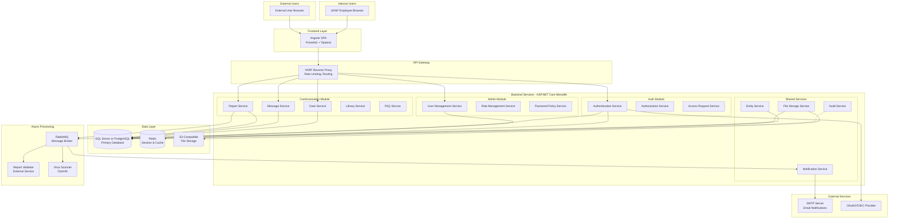
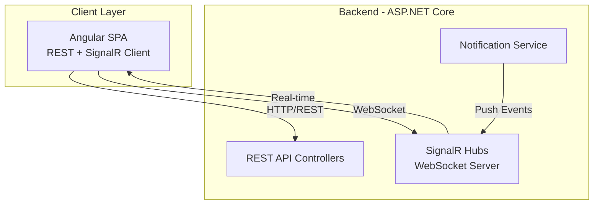
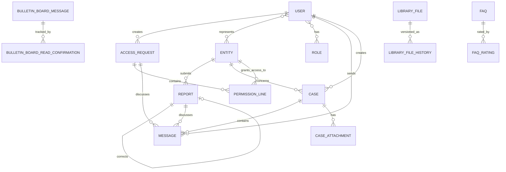
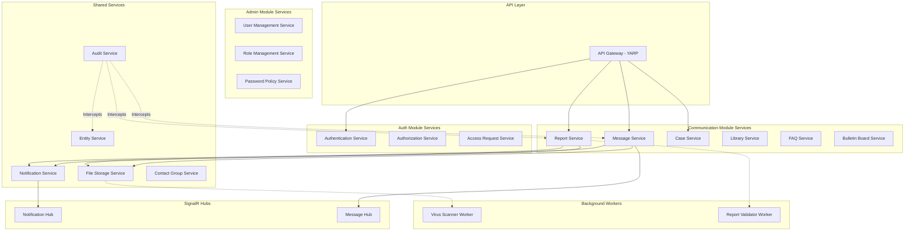
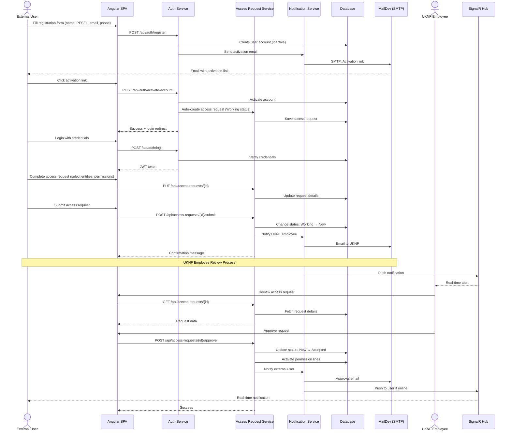
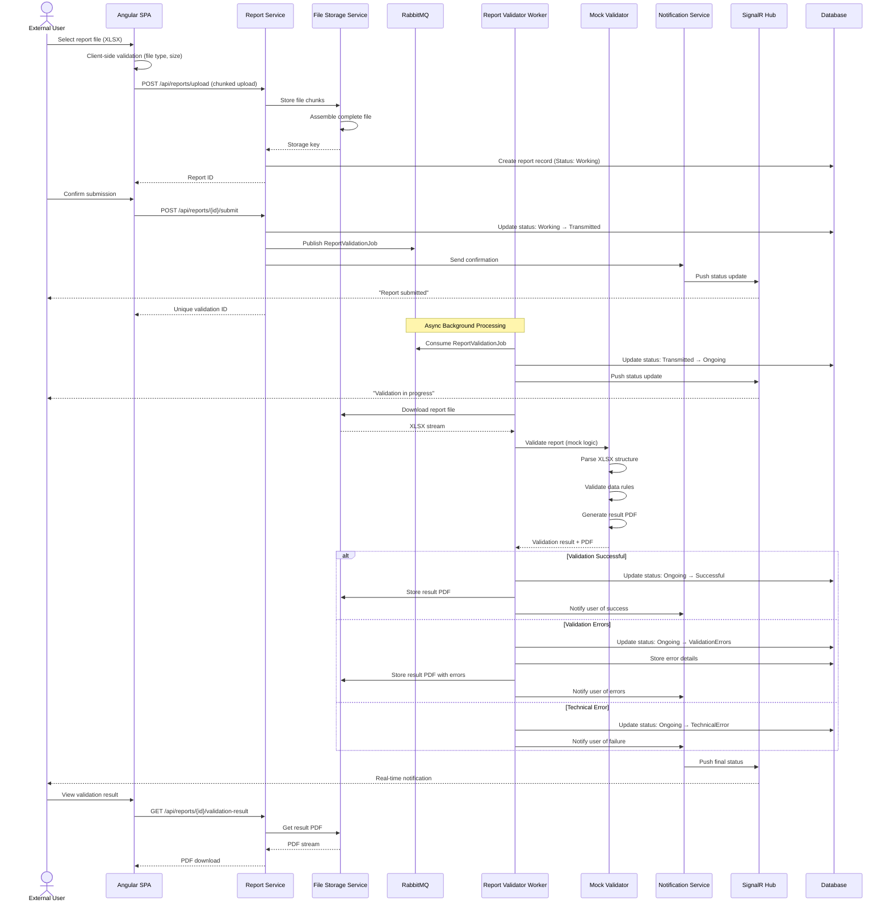
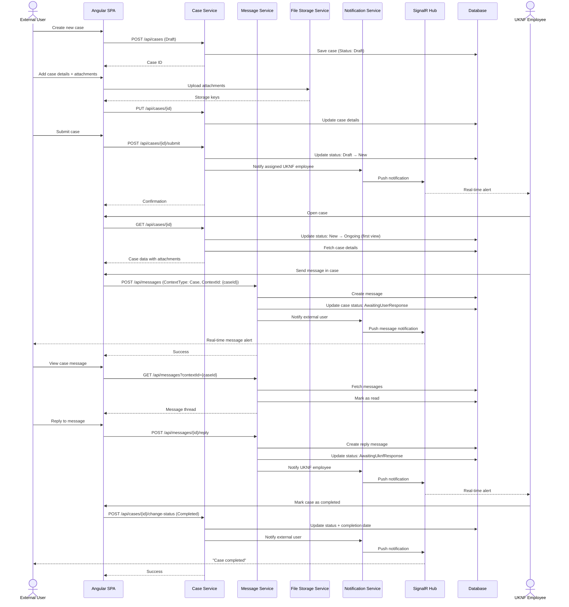
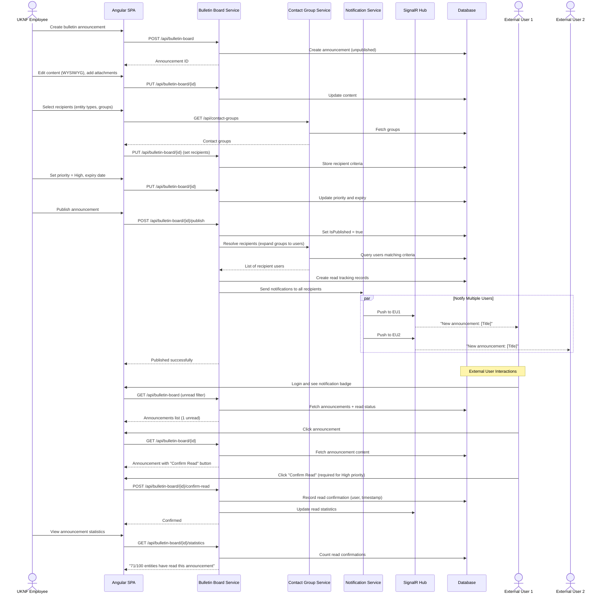
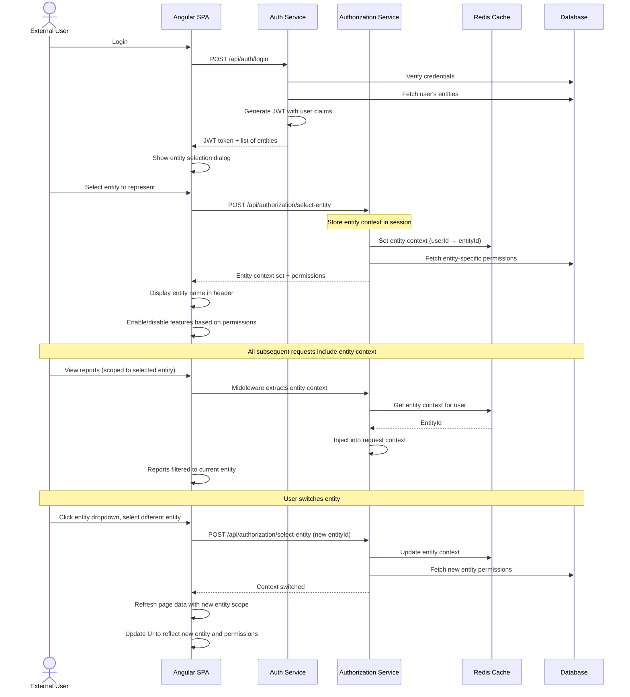
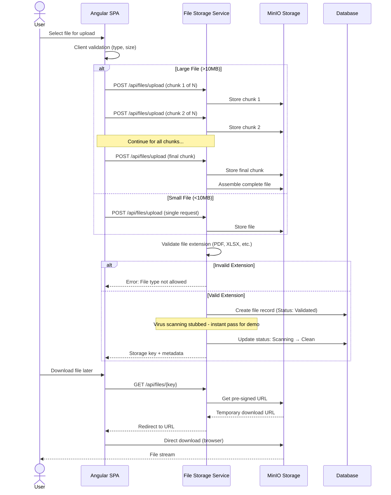

## **Section 2: High Level Architecture**

### **Technical Summary**

The UKNF Communication Platform follows a **modular monolithic architecture** with clear domain boundaries, implemented using **ASP.NET Core Web API (.NET 8/9)** and the CQRS pattern. The system comprises three primary modules (Communication, Authentication/Authorization, and Administration) that share a common infrastructure layer while maintaining logical separation. The platform uses REST API for client communication, PostgreSQL (or MSSQL) for relational data storage, and asynchronous processing via message queues for report validation and file processing. The architecture emphasizes security, audit trails, and scalability to support multiple supervised entities and UKNF employees concurrently, directly addressing the PRD's requirements for secure, efficient communication with proper role-based access control and comprehensive file management.

---

### **High Level Overview**

**Architectural Style**: **Modular Monolith**
- Single deployable unit with clear module boundaries
- Simplified deployment (Docker container) as specified in PRD requirements
- Easier development coordination for AI-assisted coding
- Clear migration path to microservices if needed

**Repository Structure**: **Monorepo**
- Single repository containing backend, frontend, infrastructure code
- Shared type definitions and contracts between frontend/backend
- Simplified version management and cross-cutting changes
- Better for AI-driven development with full context

**Service Architecture**: **Domain-Driven Design with CQRS**
- Three bounded contexts: Communication, Auth/Authorization, Administration
- Command/Query separation for complex operations (report validation, file processing)
- Shared kernel for common entities (User, Entity, Audit)
- Event-driven communication between modules via internal event bus

**Primary User Flow**:
1. External user authenticates → selects entity context → accesses communication features
2. Internal UKNF employee authenticates → manages entities/users → handles reports/messages
3. Asynchronous workflows: Report validation, file scanning, notification delivery
4. Real-time requirements: Message notifications, bulletin board updates

**Key Architectural Decisions**:
- **Modular Monolith over Microservices**: PRD requires Docker Compose deployment; monolith reduces operational complexity while maintaining clear boundaries
- **CQRS with MediatR**: Separates read-heavy operations (dashboards, lists) from write operations (report submission, case management) using MediatR pattern
- **ASP.NET Core Web API**: Clean, modern REST API with built-in dependency injection and middleware pipeline
- **Entity Framework Core**: ORM for data access with migration support and LINQ queries
- **Synchronous REST + Asynchronous Messaging**: REST for user-facing operations, message queue for background processing
- **PostgreSQL or MSSQL**: PRD prefers MSSQL; both supported via EF Core with minimal configuration changes

---

### **High Level Project Diagram**



---

### **Architectural and Design Patterns**

**1. Domain-Driven Design (DDD) with Bounded Contexts**
- Each module (Communication, Auth, Admin) represents a bounded context
- Shared kernel for common entities (User, Entity, Audit logs)
- Anti-corruption layers between contexts
- _Rationale:_ Aligns with PRD's clear module separation; enables parallel AI-assisted development of independent modules; reduces coupling and improves maintainability

**2. Command Query Responsibility Segregation (CQRS) with MediatR**
- Commands: Report submission, message sending, case creation (write-optimized)
- Queries: Dashboard data, report lists, user searches (read-optimized, potentially cached)
- MediatR library for in-process messaging and handler routing
- Separate read models for complex aggregations
- _Rationale:_ Required by PRD; MediatR is the de facto standard for CQRS in .NET; optimizes performance for read-heavy operations; simplifies complex business logic validation

**3. Repository Pattern with Unit of Work**
- Abstract data access behind repository interfaces
- Entity Framework Core DbContext as Unit of Work
- Domain entities mapped to database tables
- _Rationale:_ Standard .NET pattern; enables AI to generate consistent data access code; facilitates testing with in-memory database or mocks

**4. Event-Driven Architecture (Internal)**
- Domain events for cross-module communication (e.g., "ReportValidated", "AccessRequestApproved")
- MediatR notifications for in-process event handling
- Eventual consistency for non-critical operations
- _Rationale:_ Decouples modules; supports audit logging; enables async notifications without tight coupling

**5. API Gateway Pattern with YARP**
- YARP (Yet Another Reverse Proxy) as single entry point
- Centralized authentication, rate limiting, CORS
- Request routing to appropriate endpoints
- _Rationale:_ Microsoft's official reverse proxy for .NET; simplifies frontend integration; centralizes security; provides observability point

**6. Strategy Pattern for File Validation**
- Pluggable validators for different report types
- External virus scanning integration
- Configurable validation rules via FluentValidation
- _Rationale:_ PRD requires flexible report validation; FluentValidation provides clean, testable validation; supports multiple report formats

**7. Saga Pattern for Complex Workflows**
- Orchestration for multi-step processes using MassTransit or custom orchestrators
- Compensation logic for failures
- _Rationale:_ Ensures data consistency in distributed workflows; handles long-running processes like report validation (up to 24 hours per PRD)

**8. Multitenancy Pattern (Entity-Based)**
- Row-level security for entity data isolation
- Middleware for entity context resolution
- Query filters in EF Core for automatic data scoping
- _Rationale:_ PRD requires users to select entity context; EF Core global query filters ensure automatic data isolation; critical for security compliance

**9. Middleware Pipeline Pattern**
- ASP.NET Core middleware for cross-cutting concerns (authentication, logging, exception handling)
- Custom middleware for audit logging and entity context injection
- _Rationale:_ Built-in .NET pattern; clean separation of concerns; easy to test and maintain

---

### **Updated Rationale:**

1. **.NET 8/9 Selection**: Latest LTS version with excellent performance, native Docker support, and modern C# language features. Aligns with PRD's .NET backend option.

2. **MediatR for CQRS**: Industry-standard library in .NET ecosystem for implementing CQRS. Provides clean separation between commands/queries and their handlers, making code generation via AI prompts straightforward.

3. **Entity Framework Core**: Microsoft's official ORM with excellent support for both MSSQL and PostgreSQL. Provides migrations, LINQ queries, and change tracking out of the box.

4. **YARP Gateway**: Microsoft's modern reverse proxy built on ASP.NET Core. Lightweight, performant, and easy to configure. Alternative to Ocelot with better long-term support.

5. **Built-in Dependency Injection**: .NET Core has excellent DI container built-in, eliminating need for third-party solutions. Supports constructor injection, scoped/transient/singleton lifetimes.

## **Section 3: Tech Stack**

This is the **DEFINITIVE technology selection section** - all decisions made here will be the single source of truth for the entire project. Let me work through the key categories and present recommendations based on the PRD requirements.

---

### **Cloud Infrastructure**

- **Provider:** Local/On-Premise Docker Deployment (Development), Azure (Production-Ready Option)
- **Key Services:** 
  - Docker & Docker Compose (required by PRD for containerization)
  - Optional: Azure Container Apps, Azure SQL Database, Azure Blob Storage (production scaling)
- **Deployment Regions:** Configurable (Poland/EU for UKNF compliance)

---

### **Technology Stack Table**

Based on the PRD requirements, here are my specific technology recommendations:

| Category | Technology | Version | Purpose | Rationale |
|----------|-----------|---------|---------|-----------|
| **Language** | C# | 12.0 | Primary development language | Modern C# features (records, pattern matching), excellent tooling, strong typing for AI code generation |
| **Runtime** | .NET | 8.0 (LTS) | Application runtime | Long-term support until Nov 2026, stable, production-ready, excellent Docker support |
| **Framework** | ASP.NET Core Web API | 8.0 | REST API backend framework | Built-in DI, middleware pipeline, OpenAPI/Swagger integration, high performance |
| **ORM** | Entity Framework Core | 8.0 | Database access and migrations | Code-first migrations, LINQ queries, supports MSSQL/PostgreSQL, change tracking |
| **CQRS Library** | MediatR | 12.4.0 | Command/Query separation | De facto standard for CQRS in .NET, clean handler pattern, easy testing |
| **Validation** | FluentValidation | 11.9.0 | Input validation | Strongly typed validation rules, composable validators, better than DataAnnotations for complex scenarios |
| **Database** | PostgreSQL | 16.3 | Primary relational database | Open-source (PRD requirement), excellent Docker support, ACID compliant, can swap for MSSQL easily |
| **Database (Alt)** | SQL Server | 2022 | Alternative database option | PRD preferred option, full EF Core support, enterprise features |
| **Caching** | Redis | 7.2 | Session storage and caching | Distributed cache, session persistence, pub/sub for real-time features |
| **Message Queue** | RabbitMQ | 3.13 | Async processing | Report validation queue, file scanning queue, notification delivery |
| **File Storage** | MinIO | Latest | S3-compatible object storage | Open-source, Docker-friendly, large file handling, versioning support |
| **Authentication** | IdentityServer | Duende IdentityServer 7.0 | OAuth2/OIDC provider | Industry standard, supports JWT, multi-tenancy ready |
| **API Gateway** | YARP | 2.1.0 | Reverse proxy and gateway | Microsoft official reverse proxy, rate limiting, routing, load balancing |
| **Logging** | Serilog | 3.1.1 | Structured logging | Structured logs, multiple sinks (file, console, database), correlation IDs |
| **Background Jobs** | Hangfire | 1.8.9 | Scheduled tasks and job processing | Persistent job queue, dashboard, retry logic, timeout handling |
| **Email** | MailKit | 4.4.0 | Email notifications (SMTP) | Robust SMTP client, attachment support, secure connections |
| **File Processing** | ClosedXML | 0.102.1 | Excel report processing | Read/write XLSX files, PRD requires Excel report handling |
| **PDF Generation** | QuestPDF | 2024.3.0 | PDF report generation | Modern, fluent API, validation result PDFs |
| **API Documentation** | Swashbuckle (Swagger) | 6.5.0 | OpenAPI/Swagger docs | Auto-generate API documentation, test endpoints, PRD requirement |
| **Testing Framework** | xUnit | 2.6.6 | Unit testing | .NET standard, excellent async support, parallel test execution |
| **Mocking** | Moq | 4.20.70 | Test mocking | Mock dependencies, verify interactions, simple API |
| **Integration Testing** | Testcontainers | 3.7.0 | Integration test infrastructure | Docker-based test dependencies, real database/queue testing |
| **Code Analysis** | SonarAnalyzer.CSharp | 9.21.0 | Static code analysis | Code quality, security vulnerabilities, code smells |
| **Containerization** | Docker | 24.x | Application containers | PRD requirement, consistent environments |
| **Container Orchestration** | Docker Compose | 2.x | Multi-container deployment | PRD requirement, defines all services |
| **Virus Scanning** | ClamAV | Latest | File malware scanning | Open-source antivirus, async scanning via queue |
| **HTTP Client** | Refit | 7.0.0 | Typed HTTP clients | Type-safe REST client, external validator service integration |
| **Mapping** | Mapster | 7.4.0 | Object-to-object mapping | High performance, simple configuration, DTO/Entity mapping |
| **Health Checks** | AspNetCore.HealthChecks | 8.0.0 | Service health monitoring | Database, Redis, RabbitMQ health endpoints |
| **Rate Limiting** | AspNetCoreRateLimit | 5.0.0 | API rate limiting | Per-user and global limits, DDoS protection |
| **Correlation** | CorrelationId | 3.0.1 | Request tracking | Track requests across services and logs |

---

### **Key Technology Decisions Summary**

**Before we finalize, let me highlight critical choices:**

1. **Database: PostgreSQL vs SQL Server**
   - **Recommendation: PostgreSQL** for development/demo (open-source, Docker-friendly)
   - Can easily switch to SQL Server for production (just change connection string + provider)
   - EF Core supports both with same code

2. **Authentication: Duende IdentityServer**
   - Free for dev/testing, paid license for production ($1,500/year for commercial)
   - **Alternative**: Auth0, Azure AD B2C, or custom JWT implementation
   - Do you have an existing OAuth/OIDC provider preference?

3. **Message Queue: RabbitMQ**
   - Simple, reliable, Docker-friendly
   - **Alternative**: Apache Kafka (PRD mentions it, but RabbitMQ is simpler for this use case)

4. **API Gateway: YARP**
   - Lightweight, .NET-native
   - **Alternative**: Run without gateway for monolith simplicity (can add later)

5. **Background Jobs: Hangfire**
   - Persistent job queue with dashboard
   - **Alternative**: Built-in .NET BackgroundService (simpler but less features)

---

### **Important Notes:**

⚠️ **This tech stack table is the single source of truth.** All other documents, AI development agents, and developers must use these exact versions and technologies.

⚠️ **Gap Check**: 
- ✅ All PRD requirements covered (REST API, CQRS, Docker, OpenAPI, validation)
- ✅ Open-source preference honored (PostgreSQL, RabbitMQ, MinIO, ClamAV)
- ✅ .NET 8 LTS ensures long-term support

Perfect! Let me add WebSocket support to the tech stack.

---

### **Technology Stack Table (Updated with WebSocket)**

Adding the following row to the table:

| Category | Technology | Version | Purpose | Rationale |
|----------|-----------|---------|---------|-----------|
| **Real-time Communication** | SignalR | 8.0 | WebSocket notifications | Built-in ASP.NET Core, real-time push for bulletin board, message notifications, report status updates |

---

### **Updated Technical Notes:**

✅ **WebSocket/SignalR Integration:**
- SignalR provides WebSocket support with automatic fallback to Server-Sent Events or Long Polling
- Use cases:
  - **Bulletin board notifications** - instant alerts for new announcements
  - **Message notifications** - real-time message delivery indicators
  - **Report status updates** - live validation progress (especially for 24-hour timeout scenarios)
  - **Case updates** - notify when cases change status
- Hub architecture: Separate hubs for different modules (NotificationHub, MessageHub)
- Authentication: JWT bearer token via SignalR hub authorization
- Scalability: Redis backplane for horizontal scaling if needed

✅ **No Existing Infrastructure Dependencies:**
- Self-contained deployment via Docker Compose
- All services (database, cache, queue, storage, SMTP) run in containers
- SMTP: Use simple SMTP relay container (e.g., MailDev for development, configure production SMTP later)
- SSO: Duende IdentityServer included in the stack (or can switch to simpler JWT-only approach)

---

### **Updated High-Level Architecture Diagram**

Adding SignalR to the flow:



---

**Tech stack is now complete and covers all requirements!**

**Proceeding to Data Models section...**

---

## **Section 4: Data Models**

Now let's define the core data models based on the PRD requirements. I'll identify the key business entities across the three modules.

---

### **Core Domain Entities:**

Based on the PRD functional requirements, here are the primary data models:

---

### **1. User**

**Purpose:** Represents both internal (UKNF employees) and external (entity representatives) users in the system.

**Key Attributes:**
- `Id`: Guid - Unique identifier
- `FirstName`: string - User's first name (required)
- `LastName`: string - User's last name (required)
- `Email`: string - Email address (unique, required)
- `Phone`: string - Phone number with international format validation
- `Pesel`: string - National ID (encrypted, last 4 digits visible)
- `UserType`: enum (Internal, External) - Distinguishes UKNF employees from entity users
- `IsActive`: bool - Account status
- `PasswordHash`: string - Securely hashed password
- `MustChangePassword`: bool - Force password change flag
- `LastLoginDate`: DateTime? - Audit trail
- `CreatedDate`: DateTime - Account creation timestamp
- `UpdatedDate`: DateTime - Last modification timestamp

**Relationships:**
- Many-to-Many with `Entity` (via `UserEntity` join table - external users can represent multiple entities)
- One-to-Many with `AccessRequest` (user's access requests)
- Many-to-Many with `Role` (via `UserRole` join table)
- One-to-Many with `Message` (messages sent/received)

---

### **2. Entity**

**Purpose:** Represents supervised financial entities in the UKNF system.

**Key Attributes:**
- `Id`: long - Database identifier
- `UknfCode`: string(250) - UKNF-generated code (immutable, indexed)
- `EntityType`: string(250) - Type of entity (e.g., "Loan Institution")
- `Name`: string(500) - Official entity name (required)
- `Lei`: string(20) - Legal Entity Identifier
- `Nip`: string(10) - Tax identification number
- `Krs`: string(10) - National court register number
- `Street`: string(250) - Address
- `BuildingNumber`: string(250)
- `PremisesNumber`: string(250)
- `PostalCode`: string(250)
- `City`: string(250)
- `Phone`: string(250) - International format validated
- `Email`: string(500) - Contact email
- `UknfRegistrationNumber`: string(100) - UKNF register ID
- `EntityStatus`: string(250) - Status (e.g., "Entered", "Deleted")
- `Category`: string(500) - Entity category
- `Sector`: string(500) - Entity sector
- `SubSector`: string(500) - Entity sub-sector
- `IsCrossBorder`: bool - Cross-border entity flag
- `CreatedDate`: DateTime
- `UpdatedDate`: DateTime

**Relationships:**
- Many-to-Many with `User` (entity representatives)
- One-to-Many with `Report` (entity's reports)
- One-to-Many with `Case` (cases concerning this entity)
- One-to-Many with `EntityHistory` (change versioning)
- One-to-Many with `AccessRequest` (access requests for this entity)

---

### **3. Report**

**Purpose:** Represents financial reports submitted by entities (e.g., quarterly reports in XLSX format).

**Key Attributes:**
- `Id`: Guid - Unique identifier
- `EntityId`: long - Submitting entity (foreign key)
- `UserId`: Guid - User who submitted (foreign key)
- `FileName`: string(500) - Original file name
- `FileStorageKey`: string(500) - Object storage key
- `FileSize`: long - File size in bytes
- `ReportType`: string(250) - Report category (e.g., "Quarterly", "Annual")
- `ReportingPeriod`: string(100) - Period identifier (e.g., "Q1_2025")
- `ValidationStatus`: enum - Status (Working, Transmitted, Ongoing, Successful, ValidationErrors, TechnicalError, TimeoutError, ContestedByUKNF)
- `ValidationResultFileKey`: string(500) - Storage key for validation result PDF
- `UniqueValidationId`: string(100) - Confirmation ID after submission
- `IsArchived`: bool - Archival status
- `IsCorrectionOf`: Guid? - References original report if this is a correction
- `SubmittedDate`: DateTime - Submission timestamp
- `ValidationStartedDate`: DateTime? - Validation process start
- `ValidationCompletedDate`: DateTime? - Validation completion
- `ErrorDescription`: string(max) - Technical/validation error details
- `ContestedDescription`: string(max) - UKNF contest reason
- `CreatedDate`: DateTime
- `UpdatedDate`: DateTime

**Relationships:**
- Many-to-One with `Entity` (report belongs to entity)
- Many-to-One with `User` (submitted by user)
- One-to-Many with `Message` (messages related to report)
- One-to-One with `Report` (correction relationship)

---

### **4. Message**

**Purpose:** Two-way communication between internal and external users, used in multiple contexts.

**Key Attributes:**
- `Id`: Guid - Unique identifier
- `Subject`: string(500) - Message subject
- `Body`: string(max) - Message content
- `SenderId`: Guid - User who sent the message
- `MessageStatus`: enum - Status (AwaitingUknfResponse, AwaitingUserResponse, Closed)
- `ContextType`: enum - Where message is used (AccessRequest, Case, Report, Standalone)
- `ContextId`: Guid? - ID of related context (CaseId, ReportId, etc.)
- `EntityId`: long? - Related entity
- `ParentMessageId`: Guid? - For threaded conversations
- `SentDate`: DateTime
- `ReadDate`: DateTime? - When message was read
- `IsReadByRecipient`: bool

**Relationships:**
- Many-to-One with `User` (sender)
- Many-to-Many with `User` (recipients via `MessageRecipient` join table)
- Many-to-One with `Message` (parent message for threading)
- One-to-Many with `MessageAttachment` (file attachments)
- Polymorphic relationship with context (Case, Report, AccessRequest)

---

### **5. Case**

**Purpose:** Administrative cases concerning supervised entities.

**Key Attributes:**
- `Id`: Guid - Unique identifier
- `CaseNumber`: string(100) - Human-readable case number (auto-generated)
- `Title`: string(500) - Case title
- `Description`: string(max) - Case description
- `EntityId`: long - Entity concerned (foreign key)
- `CreatedByUserId`: Guid - User who created the case
- `AssignedToUserId`: Guid? - UKNF employee handling the case
- `Category`: enum - Category (RegistrationDataChange, StaffChange, EntityCall, SystemEntitlements, Reporting, Other)
- `Priority`: enum - Priority (Low, Medium, High)
- `Status`: enum - Status (Draft, New, Ongoing, ToBeCompleted, Cancelled, Completed)
- `CancellationReason`: string(max) - Reason if cancelled
- `CreatedDate`: DateTime
- `UpdatedDate`: DateTime
- `CompletedDate`: DateTime?

**Relationships:**
- Many-to-One with `Entity` (case concerns entity)
- Many-to-One with `User` (creator)
- Many-to-One with `User` (assigned handler)
- One-to-Many with `Message` (case conversation)
- One-to-Many with `CaseAttachment` (documents)
- One-to-Many with `CaseHistory` (status changes)

---

### **6. AccessRequest**

**Purpose:** Manages external user access requests with permission lines for different entities.

**Key Attributes:**
- `Id`: Guid - Unique identifier
- `UserId`: Guid - Requesting user
- `Status`: enum - Status (Working, New, Accepted, Blocked, Updated)
- `SubmittedDate`: DateTime? - When submitted for approval
- `ReviewedByUserId`: Guid? - UKNF employee or entity admin who reviewed
- `ReviewedDate`: DateTime?
- `CreatedDate`: DateTime
- `UpdatedDate`: DateTime

**Relationships:**
- Many-to-One with `User` (requesting user)
- One-to-Many with `PermissionLine` (multiple entity permissions)
- One-to-Many with `Message` (communication about request)

---

### **7. PermissionLine**

**Purpose:** Individual permission grant for a user-entity combination.

**Key Attributes:**
- `Id`: Guid - Unique identifier
- `AccessRequestId`: Guid - Parent access request
- `EntityId`: long - Entity for which permissions are granted
- `HasReportingAccess`: bool - Reporting module access
- `HasCasesAccess`: bool - Cases module access
- `IsEntityAdministrator`: bool - Entity admin privileges
- `IsBlocked`: bool - Permission blocked status
- `EntityEmailForNotifications`: string(500) - Entity-specific notification email
- `GrantedByUserId`: Guid? - Who granted the permission
- `GrantedDate`: DateTime?

**Relationships:**
- Many-to-One with `AccessRequest`
- Many-to-One with `Entity`

---

### **8. BulletinBoardMessage**

**Purpose:** Announcements published by UKNF to external users.

**Key Attributes:**
- `Id`: Guid - Unique identifier
- `Title`: string(500) - Announcement title
- `Content`: string(max) - HTML content (WYSIWYG editor)
- `Category`: string(250) - Category (e.g., "General Information", "Events")
- `Priority`: enum - Priority (Low, Medium, High)
- `PublishedByUserId`: Guid - UKNF employee who published
- `PublishedDate`: DateTime?
- `ExpiryDate`: DateTime? - When announcement expires
- `RequiresReadConfirmation`: bool - High priority messages require explicit confirmation
- `IsPublished`: bool - Publication status
- `CreatedDate`: DateTime
- `UpdatedDate`: DateTime

**Relationships:**
- Many-to-One with `User` (publisher)
- Many-to-Many with `User` (recipients via `BulletinBoardRecipient`)
- One-to-Many with `BulletinBoardReadConfirmation` (read tracking)
- One-to-Many with `BulletinBoardAttachment`

---

### **9. LibraryFile**

**Purpose:** Local file repository for templates, instructions, and shared documents.

**Key Attributes:**
- `Id`: Guid - Unique identifier
- `FileName`: string(500) - File name
- `FileStorageKey`: string(500) - Object storage key
- `FileSize`: long - File size
- `Description`: string(max) - File description
- `ReportingPeriod`: string(100)? - For report templates
- `Category`: string(250) - File categorization
- `Version`: string(50) - File version
- `IsCurrentVersion`: bool - Active version flag
- `IsArchived`: bool - Archival status
- `UploadedByUserId`: Guid - UKNF employee who uploaded
- `UploadedDate`: DateTime
- `LastUpdatedDate`: DateTime

**Relationships:**
- Many-to-One with `User` (uploader)
- Many-to-Many with `User` and `Entity` (access permissions via junction tables)
- One-to-Many with `LibraryFileHistory` (version history)

---

### **10. FAQ**

**Purpose:** Questions and answers knowledge base.

**Key Attributes:**
- `Id`: Guid - Unique identifier
- `Title`: string(500) - Question title
- `QuestionContent`: string(max) - Full question
- `AnswerContent`: string(max)? - Answer (null if unanswered)
- `Category`: string(250) - Question category
- `Tags`: string(1000) - Comma-separated tags for filtering
- `Status`: enum - Status (Submitted, Answered, Published, Archived)
- `AskedByUserId`: Guid? - Anonymous but tracked internally
- `AnsweredByUserId`: Guid? - UKNF employee who answered
- `AverageRating`: decimal? - Rating 1-5 stars
- `ViewCount`: int - Popularity tracking
- `CreatedDate`: DateTime
- `AnsweredDate`: DateTime?
- `UpdatedDate`: DateTime

**Relationships:**
- Many-to-One with `User` (answerer)
- One-to-Many with `FaqRating` (user ratings)

---

### **Supporting Entities:**

- **Role**: System roles with permissions
- **Permission**: Granular permissions
- **ContactGroup**: Groups for mass messaging
- **Contact**: Non-user contacts for notifications
- **AuditLog**: Comprehensive audit trail for all actions
- **EntityHistory**: Versioned entity data changes
- **Attachment** entities: MessageAttachment, CaseAttachment, BulletinBoardAttachment

---

### **Entity Relationship Diagram (High-Level):**



---

### **Rationale:**

1. **Multi-tenancy via Entity**: The `Entity` model is central to data isolation. Query filters in EF Core will automatically scope queries based on user's entity context.

2. **Polymorphic Relationships**: `Message` can be associated with different contexts (Case, Report, AccessRequest) via `ContextType` and `ContextId` discriminator pattern.

3. **Audit Trail**: All entities have `CreatedDate` and `UpdatedDate`. A separate `AuditLog` table tracks all modifications with before/after values.

4. **Soft Deletes**: Using flags like `IsArchived`, `IsActive` instead of physical deletes to maintain history.

5. **Versioning**: `LibraryFile` and `Entity` have explicit versioning/history tables to track changes over time as required by PRD.

6. **Performance Considerations**: Strategic indexes on foreign keys, status fields, and frequently queried fields (e.g., `UknfCode`, `Email`, `CaseNumber`).

## **Section 5: Components**

Now let's define the major components/services of the system, their responsibilities, interfaces, and dependencies. This will translate the data models and architectural patterns into concrete service boundaries.

---

### **1. Authentication Service**

**Responsibility:** Manages user authentication, JWT token generation, and session management.

**Key Interfaces:**
- `POST /api/auth/login` - User login with credentials
- `POST /api/auth/logout` - User logout and token revocation
- `POST /api/auth/refresh-token` - Refresh JWT access token
- `POST /api/auth/forgot-password` - Initiate password reset
- `POST /api/auth/reset-password` - Complete password reset
- `POST /api/auth/change-password` - Change user password
- `GET /api/auth/me` - Get current authenticated user info

**Dependencies:**
- Entity Framework Core (User repository)
- Redis (session and token blacklist storage)
- Duende IdentityServer (OAuth2/OIDC flows)
- MailKit (password reset emails)
- BCrypt.Net (password hashing)

**Technology Stack:**
- ASP.NET Core Identity for user management
- JWT Bearer authentication
- Cookie-based session for external OIDC flows

---

### **2. Authorization Service**

**Responsibility:** Handles role-based and entity-context-based authorization, permission checks.

**Key Interfaces:**
- `GET /api/authorization/permissions` - Get current user permissions
- `POST /api/authorization/check-permission` - Verify specific permission
- `GET /api/authorization/entities` - Get entities user can represent
- `POST /api/authorization/select-entity` - Select entity context for session

**Dependencies:**
- User Service
- Entity Service
- Redis (entity context caching)
- Custom authorization policies and handlers

**Technology Stack:**
- ASP.NET Core Authorization policies
- Custom middleware for entity context injection
- EF Core global query filters for multi-tenancy

---

### **3. Access Request Service**

**Responsibility:** Manages external user registration and access request workflow.

**Key Interfaces:**
- `POST /api/access-requests/register` - Register new external user
- `POST /api/access-requests` - Create/submit access request
- `PUT /api/access-requests/{id}` - Update access request (draft mode)
- `POST /api/access-requests/{id}/submit` - Submit for approval
- `POST /api/access-requests/{id}/approve` - Approve request (UKNF or Entity Admin)
- `POST /api/access-requests/{id}/block` - Block permission line
- `GET /api/access-requests` - List access requests (filtered by entity, status)
- `GET /api/access-requests/{id}` - Get request details with history

**Dependencies:**
- User Service
- Entity Service
- Message Service (for request communication)
- Notification Service
- Audit Service

**Technology Stack:**
- MediatR commands/queries
- FluentValidation for PESEL, email, phone validation
- State machine pattern for status transitions

---

### **4. Report Service**

**Responsibility:** Handles report submission, validation orchestration, status tracking, and archival.

**Key Interfaces:**
- `POST /api/reports/upload` - Upload report file (chunked upload support)
- `GET /api/reports` - List reports (filtered by entity, status, period, register type)
- `GET /api/reports/{id}` - Get report details
- `GET /api/reports/{id}/validation-result` - Download validation result PDF
- `POST /api/reports/{id}/contest` - UKNF contests report
- `POST /api/reports/{id}/archive` - Archive report
- `POST /api/reports/{id}/correction` - Submit correction to existing report
- `GET /api/reports/calendar` - Get reporting calendar/schedule
- `GET /api/reports/missing-entities` - Entities that haven't submitted for period

**Dependencies:**
- File Storage Service
- RabbitMQ (publish report validation jobs)
- External Report Validator Service (via Refit HTTP client)
- Message Service
- Notification Service
- Entity Service

**Technology Stack:**
- ClosedXML for Excel parsing
- Chunked file upload with resumable uploads
- Hangfire for timeout monitoring (24-hour deadline)
- State machine for validation status transitions

---

### **5. Message Service**

**Responsibility:** Two-way messaging between internal and external users across different contexts.

**Key Interfaces:**
- `POST /api/messages` - Send new message
- `GET /api/messages` - List messages (filtered by context, status, entity)
- `GET /api/messages/{id}` - Get message thread
- `POST /api/messages/{id}/reply` - Reply to message
- `POST /api/messages/{id}/mark-read` - Mark message as read
- `POST /api/messages/{id}/close` - Close message thread
- `POST /api/messages/mass-send` - Send to multiple entities/groups

**Dependencies:**
- File Storage Service (attachments)
- Virus Scanner Service
- Notification Service (email and SignalR)
- Contact Group Service
- Entity Service

**Technology Stack:**
- File attachment validation (PDF, DOC, XLSX, CSV, TXT, MP3, ZIP - max 100MB)
- SignalR for real-time message delivery
- Thread tracking with ParentMessageId

---

### **6. Case Service**

**Responsibility:** Administrative case management for supervised entities.

**Key Interfaces:**
- `POST /api/cases` - Create case (draft or submit)
- `PUT /api/cases/{id}` - Update case
- `POST /api/cases/{id}/submit` - Submit draft case
- `POST /api/cases/{id}/change-status` - Change case status (Ongoing, ToBeCompleted, Completed)
- `POST /api/cases/{id}/cancel` - Cancel case (if not yet opened by entity)
- `GET /api/cases` - List cases (filtered by entity, status, category, priority)
- `GET /api/cases/{id}` - Get case details with history
- `POST /api/cases/{id}/attachments` - Add attachment to case

**Dependencies:**
- Message Service (case conversation)
- File Storage Service (case documents)
- Entity Service
- Notification Service
- Audit Service (case history)

**Technology Stack:**
- State machine for case status transitions
- Cancellation logic with notification checks
- Version tracking for case modifications

---

### **7. Library Service**

**Responsibility:** File repository management for templates, instructions, and shared documents.

**Key Interfaces:**
- `POST /api/library/files` - Upload file (UKNF employees only)
- `PUT /api/library/files/{id}` - Update file metadata
- `DELETE /api/library/files/{id}` - Delete file
- `GET /api/library/files` - List files (filtered by category, version status)
- `GET /api/library/files/{id}/download` - Download file
- `POST /api/library/files/{id}/share` - Share with users/entities/groups
- `GET /api/library/files/{id}/history` - View file version history

**Dependencies:**
- File Storage Service
- Entity Service (access permissions)
- User Service
- Audit Service (version tracking)

**Technology Stack:**
- File versioning with history table
- Access control lists (ACLs) for file permissions
- Metadata indexing for search/filter

---

### **8. Bulletin Board Service**

**Responsibility:** UKNF announcements with read tracking and targeted distribution.

**Key Interfaces:**
- `POST /api/bulletin-board` - Create announcement
- `PUT /api/bulletin-board/{id}` - Edit announcement
- `POST /api/bulletin-board/{id}/publish` - Publish announcement
- `DELETE /api/bulletin-board/{id}` - Remove from publication
- `GET /api/bulletin-board` - List announcements (filtered by category, priority)
- `GET /api/bulletin-board/{id}` - Get announcement details
- `POST /api/bulletin-board/{id}/confirm-read` - User confirms reading (high priority)
- `GET /api/bulletin-board/{id}/statistics` - Read statistics (e.g., 71/100 entities)

**Dependencies:**
- File Storage Service (attachments)
- Contact Group Service (recipient targeting)
- Notification Service (SignalR for new announcements)
- Entity Service

**Technology Stack:**
- WYSIWYG content storage (sanitized HTML)
- Read confirmation tracking with timestamps
- Expiry date handling with automated unpublishing

---

### **9. FAQ Service**

**Responsibility:** Question and answer knowledge base with ratings and search.

**Key Interfaces:**
- `POST /api/faq/questions` - Submit question (anonymous)
- `POST /api/faq/questions/{id}/answer` - Add answer (UKNF employees)
- `PUT /api/faq/questions/{id}` - Edit question/answer
- `DELETE /api/faq/questions/{id}` - Delete Q&A
- `GET /api/faq/questions` - Search/list questions (filtered by category, tags, status)
- `GET /api/faq/questions/{id}` - Get question details
- `POST /api/faq/questions/{id}/rate` - Rate answer (1-5 stars)
- `GET /api/faq/categories` - Get categories and tag cloud

**Dependencies:**
- User Service (for internal tracking of asker)
- Full-text search capability (PostgreSQL full-text or separate search engine)

**Technology Stack:**
- PostgreSQL full-text search with tsvector
- Tag parsing and indexing
- Popularity sorting algorithm (views + ratings)

---

### **10. Entity Service**

**Responsibility:** Supervised entity data management with versioning and update workflows.

**Key Interfaces:**
- `POST /api/entities` - Create entity (System Admin)
- `PUT /api/entities/{id}` - Update entity data
- `GET /api/entities` - List entities (filtered by type, status, sector)
- `GET /api/entities/{id}` - Get entity details
- `GET /api/entities/{id}/users` - List users assigned to entity
- `GET /api/entities/{id}/history` - View entity change history
- `POST /api/entities/{id}/request-data-change` - External user reports data discrepancy (creates Case)
- `POST /api/entities/{id}/verify-data` - UKNF verifies and applies data changes

**Dependencies:**
- Case Service (data change requests)
- Audit Service (versioning)
- User Service

**Technology Stack:**
- Entity versioning table for historical data
- Scheduled alerts for data verification (Hangfire recurring jobs)
- Import capability for test data (CSV/Excel)

---

### **11. User Management Service**

**Responsibility:** Administrative user account management (Admin Module).

**Key Interfaces:**
- `POST /api/admin/users` - Create user account
- `PUT /api/admin/users/{id}` - Edit user account
- `DELETE /api/admin/users/{id}` - Delete user account
- `GET /api/admin/users` - List all users (internal and external)
- `POST /api/admin/users/{id}/reset-password` - Admin resets user password
- `POST /api/admin/users/{id}/force-password-change` - Force password change on next login
- `POST /api/admin/users/{id}/deactivate` - Deactivate user account

**Dependencies:**
- Authentication Service
- Role Management Service
- Notification Service (password reset emails)

**Technology Stack:**
- ASP.NET Core Identity administration
- Password generation utility

---

### **12. Role Management Service**

**Responsibility:** Role and permission management for access control.

**Key Interfaces:**
- `POST /api/admin/roles` - Create role
- `PUT /api/admin/roles/{id}` - Update role
- `DELETE /api/admin/roles/{id}` - Delete role
- `GET /api/admin/roles` - List all roles
- `GET /api/admin/roles/{id}` - Get role details with permissions
- `POST /api/admin/roles/{id}/permissions` - Assign permissions to role
- `POST /api/admin/users/{userId}/roles` - Assign roles to user
- `GET /api/admin/permissions` - List all available permissions

**Dependencies:**
- User Management Service
- Authorization Service (cache invalidation)

**Technology Stack:**
- Role-based access control (RBAC) with permission granularity
- Redis cache invalidation on role changes

---

### **13. Password Policy Service**

**Responsibility:** Configure and enforce password policies.

**Key Interfaces:**
- `GET /api/admin/password-policy` - Get current policy
- `PUT /api/admin/password-policy` - Update policy settings
- `POST /api/admin/password-policy/validate` - Validate password against policy

**Dependencies:**
- User Management Service

**Technology Stack:**
- Configurable policy: min length, complexity, uniqueness, history depth, change frequency
- Password strength validator with regex rules

---

### **14. File Storage Service**

**Responsibility:** Centralized file storage, retrieval, and management.

**Key Interfaces:**
- `POST /api/files/upload` - Upload file with chunked support
- `GET /api/files/{key}` - Download file
- `DELETE /api/files/{key}` - Delete file
- `POST /api/files/{key}/virus-scan` - Queue file for virus scanning

**Dependencies:**
- MinIO (S3-compatible storage)
- RabbitMQ (async virus scanning queue)
- Virus Scanner Service

**Technology Stack:**
- Resumable chunked uploads for large files (>100MB)
- Pre-signed URLs for direct browser downloads
- File metadata indexing

---

### **15. Notification Service**

**Responsibility:** Unified notification delivery via email and real-time push.

**Key Interfaces:**
- `POST /api/notifications/send` - Send notification (internal API)
- `GET /api/notifications/user` - Get user's notifications
- `POST /api/notifications/{id}/mark-read` - Mark notification as read

**Dependencies:**
- MailKit (SMTP email delivery)
- SignalR (real-time push to connected clients)
- Contact Group Service (for mass notifications)
- Template engine for email formatting

**Technology Stack:**
- SignalR NotificationHub
- Email templates with Razor syntax
- Notification queue with retry logic (Hangfire)

---

### **16. Audit Service**

**Responsibility:** Comprehensive audit logging of all system actions.

**Key Interfaces:**
- `POST /api/audit/log` - Log audit event (internal API)
- `GET /api/audit/logs` - Query audit logs (admin only)
- `GET /api/audit/entity/{entityId}/history` - Entity-specific audit trail
- `GET /api/audit/user/{userId}/activity` - User activity log

**Dependencies:**
- All services (audit interceptor)

**Technology Stack:**
- EF Core SaveChanges interceptor for automatic change tracking
- Structured logging with Serilog
- Correlation IDs for request tracing
- Stores: User, Timestamp, Action, Entity Type, Entity ID, Before/After JSON

---

### **17. Contact Group Service**

**Responsibility:** Manage contact groups and contacts for mass communication.

**Key Interfaces:**
- `POST /api/contact-groups` - Create contact group
- `PUT /api/contact-groups/{id}` - Update contact group
- `GET /api/contact-groups` - List contact groups
- `POST /api/contact-groups/{id}/contacts` - Add contact to group
- `DELETE /api/contact-groups/{id}/contacts/{contactId}` - Remove contact
- `POST /api/contacts` - Create contact (non-user recipient)

**Dependencies:**
- Entity Service (entity-based grouping)
- User Service

**Technology Stack:**
- Flexible recipient types: selected entities, contact groups, entity types, selected users

---

### **18. Virus Scanner Service**

**Responsibility:** Async virus scanning for uploaded files.

**Key Interfaces:**
- Internal queue consumer (listens to RabbitMQ)
- Updates file scan status in database

**Dependencies:**
- ClamAV (antivirus engine)
- File Storage Service
- RabbitMQ

**Technology Stack:**
- Background worker (IHostedService)
- ClamAV integration via TCP socket
- Quarantine logic for infected files

---

### **19. Report Validator Worker**

**Responsibility:** Process report validation queue and integrate with external validator.

**Key Interfaces:**
- Internal queue consumer (listens to RabbitMQ)
- Calls external validation service
- Updates report status and generates result PDF

**Dependencies:**
- External Report Validator (via Refit HTTP client)
- Report Service
- File Storage Service (store validation result)
- Notification Service
- Hangfire (24-hour timeout monitoring)

**Technology Stack:**
- Background worker
- Retry policies with Polly
- Timeout tracking with status updates

---

### **Component Diagram**



---

### **Rationale:**

1. **Service Granularity**: Each service aligns with a PRD functional area. Services are cohesive (single responsibility) but not micro-services (avoiding distributed complexity).

2. **Cross-Cutting Concerns**: Audit Service uses EF Core interceptors to automatically log changes across all entities without polluting business logic.

3. **Async Processing**: Report validation and virus scanning are CPU/time-intensive operations that run asynchronously via RabbitMQ workers, keeping API responses fast.

4. **Real-time Updates**: SignalR hubs provide WebSocket connections for instant notifications (bulletin board, messages, report status changes).

5. **Separation of Reads/Writes**: MediatR command handlers perform writes with validation, while query handlers optimize for read performance (potential caching layer).

6. **API Gateway**: YARP provides a single entry point, centralizing concerns like rate limiting and authentication, while allowing future service separation.

Excellent context! Thank you for clarifying. Let me adjust the approach - we're building a **self-contained demo** for the hackathon with **no external UKNF dependencies**. Everything must be mockable/self-hosted.

Let me revise the External APIs section:

---

## **Section 6: External APIs**

For the hackathon demo, all "external" services will be **mocked, simulated, or self-hosted** within the Docker Compose environment.

---

### **1. Report Validation Service (Mock Implementation)**

- **Purpose:** Validate submitted financial reports - **we'll build a simple mock validator**
- **Implementation:** Internal service in the monolith that simulates validation
- **Base URL(s):** Internal service call (no external API)
- **Authentication:** Not applicable (internal)

**Mock Validation Logic:**
- Parse XLSX file structure (validate it's a proper Excel file)
- Check for required worksheets/columns based on report type
- Use provided test files (G. RIP100000_Q1_2025.xlsx = pass, G. RIP100000_Q2_2025.xlsx = fail)
- Generate PDF result with UKNF format (QuestPDF library)
- Simulate processing delay (5-10 seconds) to show async workflow
- Return validation statuses as per PRD requirements

**Integration Notes:**
- No external API needed - just async processing via RabbitMQ
- Simplified for demo but follows all PRD status requirements
- Can easily be replaced with real external API later by implementing Refit interface

---

### **2. Email Service (Mock/Dev Container)**

- **Purpose:** Email notifications - **use MailDev for demo**
- **Implementation:** MailDev Docker container (catches all emails, provides web UI)
- **Base URL(s):** `smtp://maildev:1025` (SMTP), `http://maildev:1080` (Web UI to view emails)
- **Authentication:** None required for MailDev

**Integration Notes:**
- MailDev catches all outgoing emails and displays them in a web interface
- No emails actually sent outside the system (perfect for demo)
- Shows all notification flows work correctly
- Zero external dependencies

---

### **3. Authentication (Self-Hosted, Simplified)**

- **Purpose:** User authentication with JWT tokens
- **Implementation:** **Simplified custom JWT implementation** (no Duende IdentityServer licensing needed)
- **Base URL(s):** Internal service (`/api/auth/*`)
- **Authentication:** JWT Bearer tokens

**Integration Notes:**
- Use ASP.NET Core Identity + custom JWT generation (no external IdP)
- Simpler than Duende IdentityServer (which requires license for commercial use)
- OAuth2/OIDC mentioned in PRD but simple JWT is sufficient for demo
- All authentication logic in Authentication Service

---

### **4. Virus Scanning (Optional for Demo)**

- **Purpose:** Scan uploaded files for malware
- **Implementation Options:**
  1. **Skip for demo** - just validate file extensions and sizes
  2. **ClamAV container** - if you want to show the feature (self-hosted, free)

**Recommendation:** **Skip actual virus scanning for hackathon** - just implement file type/size validation
- Validates allowed extensions (PDF, DOC, XLSX, CSV, TXT, MP3, ZIP)
- Checks file size (max 100MB for attachments)
- Simulates "scanning" with instant pass
- Can add ClamAV later if time permits

---

### **5. Object Storage (Self-Hosted MinIO)**

- **Purpose:** Store files (reports, attachments, library files)
- **Implementation:** MinIO Docker container (S3-compatible, fully open-source)
- **Base URL(s):** `http://minio:9000` (API), `http://localhost:9001` (Web Console)
- **Authentication:** Access Key + Secret Key (configured in docker-compose)

**Integration Notes:**
- Fully self-contained in Docker Compose
- No cloud provider account needed
- Works identically to AWS S3 (same API)
- Web console available for browsing uploaded files

---

### **Revised External Dependencies Summary**

| Service | Implementation | Why |
|---------|---------------|-----|
| Report Validator | **Mock service (internal)** | No access to actual UKNF validator; build simple validator logic |
| Email/SMTP | **MailDev container** | Catch emails in web UI for demo; no external SMTP needed |
| Authentication | **Custom JWT (ASP.NET Identity)** | Avoid Duende licensing; simpler for demo |
| Virus Scanner | **Skip or stub** | Not critical for demo; validate file types only |
| Object Storage | **MinIO container** | Self-hosted S3-compatible storage; fully contained |
| Database | **PostgreSQL container** | Self-hosted; no cloud needed |
| Cache/Session | **Redis container** | Self-hosted; standard Docker image |
| Message Queue | **RabbitMQ container** | Self-hosted; standard Docker image |

**Result: 100% self-contained demo with zero external API dependencies**

## **Section 7: Core Workflows**

Let me illustrate the key system workflows using sequence diagrams to show how components interact for critical user journeys.

---

### **Workflow 1: External User Registration and Access Request**

This workflow shows the complete onboarding process for a new external user (entity representative).



---

### **Workflow 2: Report Submission and Validation**

This demonstrates the async report validation process with status updates.



---

### **Workflow 3: Case Management with Messages**

Shows the case lifecycle with integrated messaging.



---

### **Workflow 4: Bulletin Board with Read Confirmation**

Demonstrates mass announcement distribution with read tracking.



---

### **Workflow 5: Entity Context Selection (Multi-tenancy)**

Shows how users representing multiple entities switch context.



---

### **Workflow 6: File Upload with Virus Scanning (Simplified)**

Shows file handling with validation (virus scanning stubbed for hackathon).



---

### **Rationale:**

1. **Real-time Updates**: SignalR hub integration shown in multiple workflows - critical for UX (report status, messages, notifications)

2. **Async Processing**: Report validation and file operations are queued via RabbitMQ, keeping API responses fast

3. **Multi-tenancy**: Entity context selection workflow demonstrates how row-level security works

4. **Error Handling**: Alternative paths shown (validation failures, technical errors) to demonstrate robust error handling

5. **Security**: All workflows go through authentication/authorization layers with JWT tokens

6. **Hackathon-Appropriate**: Workflows focus on demonstrating PRD requirements without unnecessary complexity

## **Section 8: REST API Spec**

Now let's define the REST API specification using OpenAPI 3.0. This will serve as the contract between frontend and backend.

---

```yaml
openapi: 3.0.0
info:
  title: UKNF Communication Platform API
  version: 1.0.0
  description: |
    REST API for the UKNF Communication Platform - a secure system for communication 
    between UKNF (Polish Financial Supervision Authority) and supervised financial entities.
    
    ## Modules
    - **Communication Module**: Reports, messages, cases, library, FAQ, bulletin board
    - **Authentication & Authorization Module**: User registration, access requests, entity context
    - **Administrative Module**: User management, roles, password policies
    
    ## Authentication
    All endpoints (except registration and login) require JWT Bearer token authentication.
    Include the token in the Authorization header: `Authorization: Bearer <token>`
    
  contact:
    name: UKNF Development Team
    email: support@uknf.gov.pl

servers:
  - url: http://localhost:5000/api
    description: Local development server
  - url: https://api.uknf-demo.example.com/api
    description: Demo/staging server

security:
  - BearerAuth: []

tags:
  - name: Authentication
    description: User authentication and session management
  - name: Authorization
    description: Authorization and entity context management
  - name: Access Requests
    description: External user registration and access requests
  - name: Reports
    description: Financial report submission and validation
  - name: Messages
    description: Two-way communication between users
  - name: Cases
    description: Administrative case management
  - name: Library
    description: File repository and template management
  - name: FAQ
    description: Questions and answers knowledge base
  - name: Bulletin Board
    description: Announcements and notifications
  - name: Entities
    description: Supervised entity management
  - name: Users (Admin)
    description: User account management (Admin only)
  - name: Roles (Admin)
    description: Role and permission management (Admin only)

paths:
  # Authentication Endpoints
  /auth/register:
    post:
      tags: [Authentication]
      summary: Register new external user
      security: []
      requestBody:
        required: true
        content:
          application/json:
            schema:
              type: object
              required: [firstName, lastName, pesel, email, phone]
              properties:
                firstName:
                  type: string
                  example: Jan
                lastName:
                  type: string
                  example: Kowalski
                pesel:
                  type: string
                  description: National ID (will be masked, last 4 digits visible)
                  example: "12345678901"
                email:
                  type: string
                  format: email
                  example: jan.kowalski@example.com
                phone:
                  type: string
                  pattern: '^\+(?:[0-9] ?){6,14}[0-9]$'
                  example: "+48123456789"
      responses:
        '201':
          description: User registered successfully, activation email sent
          content:
            application/json:
              schema:
                type: object
                properties:
                  userId:
                    type: string
                    format: uuid
                  message:
                    type: string
                    example: Registration successful. Please check your email to activate your account.
        '400':
          $ref: '#/components/responses/BadRequest'
        '409':
          description: Email or PESEL already exists

  /auth/login:
    post:
      tags: [Authentication]
      summary: User login
      security: []
      requestBody:
        required: true
        content:
          application/json:
            schema:
              type: object
              required: [email, password]
              properties:
                email:
                  type: string
                  format: email
                password:
                  type: string
                  format: password
      responses:
        '200':
          description: Login successful
          content:
            application/json:
              schema:
                type: object
                properties:
                  accessToken:
                    type: string
                    description: JWT access token
                  refreshToken:
                    type: string
                    description: Refresh token for obtaining new access tokens
                  expiresIn:
                    type: integer
                    description: Token expiration time in seconds
                  user:
                    $ref: '#/components/schemas/UserInfo'
                  entities:
                    type: array
                    description: List of entities the user can represent
                    items:
                      $ref: '#/components/schemas/EntitySummary'
        '401':
          $ref: '#/components/responses/Unauthorized'

  /auth/logout:
    post:
      tags: [Authentication]
      summary: User logout (invalidate token)
      responses:
        '204':
          description: Logout successful

  /auth/me:
    get:
      tags: [Authentication]
      summary: Get current authenticated user info
      responses:
        '200':
          description: User information
          content:
            application/json:
              schema:
                $ref: '#/components/schemas/UserInfo'

  # Authorization Endpoints
  /authorization/select-entity:
    post:
      tags: [Authorization]
      summary: Select entity context for session
      requestBody:
        required: true
        content:
          application/json:
            schema:
              type: object
              required: [entityId]
              properties:
                entityId:
                  type: integer
                  format: int64
      responses:
        '200':
          description: Entity context selected
          content:
            application/json:
              schema:
                type: object
                properties:
                  entityId:
                    type: integer
                    format: int64
                  entityName:
                    type: string
                  permissions:
                    type: array
                    items:
                      type: string
        '403':
          $ref: '#/components/responses/Forbidden'

  /authorization/permissions:
    get:
      tags: [Authorization]
      summary: Get current user's permissions in selected entity context
      responses:
        '200':
          description: User permissions
          content:
            application/json:
              schema:
                type: object
                properties:
                  entityId:
                    type: integer
                    format: int64
                  permissions:
                    type: array
                    items:
                      type: string
                      example: reporting.submit

  # Access Requests
  /access-requests:
    post:
      tags: [Access Requests]
      summary: Create access request (draft)
      requestBody:
        required: true
        content:
          application/json:
            schema:
              $ref: '#/components/schemas/AccessRequestCreate'
      responses:
        '201':
          description: Access request created
          content:
            application/json:
              schema:
                $ref: '#/components/schemas/AccessRequest'
        '400':
          $ref: '#/components/responses/BadRequest'
    
    get:
      tags: [Access Requests]
      summary: List access requests
      parameters:
        - name: status
          in: query
          schema:
            type: string
            enum: [Working, New, Accepted, Blocked, Updated]
        - name: entityId
          in: query
          schema:
            type: integer
            format: int64
        - name: myEntities
          in: query
          description: Filter by entities assigned to current UKNF employee
          schema:
            type: boolean
        - $ref: '#/components/parameters/PageNumber'
        - $ref: '#/components/parameters/PageSize'
      responses:
        '200':
          description: List of access requests
          content:
            application/json:
              schema:
                $ref: '#/components/schemas/AccessRequestList'

  /access-requests/{id}:
    get:
      tags: [Access Requests]
      summary: Get access request details
      parameters:
        - $ref: '#/components/parameters/Id'
      responses:
        '200':
          description: Access request details
          content:
            application/json:
              schema:
                $ref: '#/components/schemas/AccessRequest'
        '404':
          $ref: '#/components/responses/NotFound'
    
    put:
      tags: [Access Requests]
      summary: Update access request (draft only)
      parameters:
        - $ref: '#/components/parameters/Id'
      requestBody:
        required: true
        content:
          application/json:
            schema:
              $ref: '#/components/schemas/AccessRequestUpdate'
      responses:
        '200':
          description: Access request updated
          content:
            application/json:
              schema:
                $ref: '#/components/schemas/AccessRequest'

  /access-requests/{id}/submit:
    post:
      tags: [Access Requests]
      summary: Submit access request for approval
      parameters:
        - $ref: '#/components/parameters/Id'
      responses:
        '200':
          description: Access request submitted
        '400':
          description: Request incomplete or already submitted

  /access-requests/{id}/approve:
    post:
      tags: [Access Requests]
      summary: Approve access request (UKNF or Entity Admin)
      parameters:
        - $ref: '#/components/parameters/Id'
      responses:
        '200':
          description: Access request approved
        '403':
          $ref: '#/components/responses/Forbidden'

  # Reports
  /reports/upload:
    post:
      tags: [Reports]
      summary: Upload report file (supports chunked upload)
      requestBody:
        required: true
        content:
          multipart/form-data:
            schema:
              type: object
              properties:
                file:
                  type: string
                  format: binary
                entityId:
                  type: integer
                  format: int64
                reportType:
                  type: string
                  example: Quarterly
                reportingPeriod:
                  type: string
                  example: Q1_2025
                chunkNumber:
                  type: integer
                  description: For chunked uploads
                totalChunks:
                  type: integer
                  description: For chunked uploads
      responses:
        '201':
          description: Report uploaded
          content:
            application/json:
              schema:
                $ref: '#/components/schemas/Report'
        '400':
          $ref: '#/components/responses/BadRequest'

  /reports:
    get:
      tags: [Reports]
      summary: List reports
      parameters:
        - name: entityId
          in: query
          schema:
            type: integer
            format: int64
        - name: status
          in: query
          schema:
            type: string
            enum: [Working, Transmitted, Ongoing, Successful, ValidationErrors, TechnicalError, TimeoutError, ContestedByUKNF]
        - name: reportType
          in: query
          schema:
            type: string
        - name: reportingPeriod
          in: query
          schema:
            type: string
        - name: isArchived
          in: query
          schema:
            type: boolean
        - name: myEntities
          in: query
          schema:
            type: boolean
        - $ref: '#/components/parameters/PageNumber'
        - $ref: '#/components/parameters/PageSize'
      responses:
        '200':
          description: List of reports
          content:
            application/json:
              schema:
                $ref: '#/components/schemas/ReportList'

  /reports/{id}:
    get:
      tags: [Reports]
      summary: Get report details
      parameters:
        - $ref: '#/components/parameters/Id'
      responses:
        '200':
          description: Report details
          content:
            application/json:
              schema:
                $ref: '#/components/schemas/Report'
        '404':
          $ref: '#/components/responses/NotFound'

  /reports/{id}/submit:
    post:
      tags: [Reports]
      summary: Submit report for validation
      parameters:
        - $ref: '#/components/parameters/Id'
      responses:
        '200':
          description: Report submitted for validation
          content:
            application/json:
              schema:
                type: object
                properties:
                  uniqueValidationId:
                    type: string
                  status:
                    type: string
                    example: Transmitted

  /reports/{id}/validation-result:
    get:
      tags: [Reports]
      summary: Download validation result PDF
      parameters:
        - $ref: '#/components/parameters/Id'
      responses:
        '200':
          description: Validation result file
          content:
            application/pdf:
              schema:
                type: string
                format: binary
        '404':
          description: Validation result not available yet

  /reports/{id}/contest:
    post:
      tags: [Reports]
      summary: UKNF contests report (UKNF employees only)
      parameters:
        - $ref: '#/components/parameters/Id'
      requestBody:
        required: true
        content:
          application/json:
            schema:
              type: object
              required: [contestDescription]
              properties:
                contestDescription:
                  type: string
      responses:
        '200':
          description: Report contested
        '403':
          $ref: '#/components/responses/Forbidden'

  /reports/{id}/archive:
    post:
      tags: [Reports]
      summary: Archive report (UKNF employees only)
      parameters:
        - $ref: '#/components/parameters/Id'
      responses:
        '200':
          description: Report archived

  # Messages
  /messages:
    post:
      tags: [Messages]
      summary: Send new message
      requestBody:
        required: true
        content:
          multipart/form-data:
            schema:
              type: object
              required: [subject, body, recipientIds]
              properties:
                subject:
                  type: string
                body:
                  type: string
                recipientIds:
                  type: array
                  items:
                    type: string
                    format: uuid
                contextType:
                  type: string
                  enum: [AccessRequest, Case, Report, Standalone]
                contextId:
                  type: string
                  format: uuid
                attachments:
                  type: array
                  items:
                    type: string
                    format: binary
      responses:
        '201':
          description: Message sent
          content:
            application/json:
              schema:
                $ref: '#/components/schemas/Message'
    
    get:
      tags: [Messages]
      summary: List messages
      parameters:
        - name: contextType
          in: query
          schema:
            type: string
        - name: contextId
          in: query
          schema:
            type: string
            format: uuid
        - name: status
          in: query
          schema:
            type: string
            enum: [AwaitingUknfResponse, AwaitingUserResponse, Closed]
        - name: myEntities
          in: query
          schema:
            type: boolean
        - $ref: '#/components/parameters/PageNumber'
        - $ref: '#/components/parameters/PageSize'
      responses:
        '200':
          description: List of messages
          content:
            application/json:
              schema:
                $ref: '#/components/schemas/MessageList'

  /messages/{id}:
    get:
      tags: [Messages]
      summary: Get message thread
      parameters:
        - $ref: '#/components/parameters/Id'
      responses:
        '200':
          description: Message with replies
          content:
            application/json:
              schema:
                $ref: '#/components/schemas/MessageThread'

  /messages/{id}/reply:
    post:
      tags: [Messages]
      summary: Reply to message
      parameters:
        - $ref: '#/components/parameters/Id'
      requestBody:
        required: true
        content:
          multipart/form-data:
            schema:
              type: object
              required: [body]
              properties:
                body:
                  type: string
                attachments:
                  type: array
                  items:
                    type: string
                    format: binary
      responses:
        '201':
          description: Reply sent

  /messages/{id}/mark-read:
    post:
      tags: [Messages]
      summary: Mark message as read
      parameters:
        - $ref: '#/components/parameters/Id'
      responses:
        '204':
          description: Message marked as read

  /messages/{id}/close:
    post:
      tags: [Messages]
      summary: Close message thread
      parameters:
        - $ref: '#/components/parameters/Id'
      responses:
        '200':
          description: Message closed

  # Cases
  /cases:
    post:
      tags: [Cases]
      summary: Create case
      requestBody:
        required: true
        content:
          application/json:
            schema:
              $ref: '#/components/schemas/CaseCreate'
      responses:
        '201':
          description: Case created
          content:
            application/json:
              schema:
                $ref: '#/components/schemas/Case'
    
    get:
      tags: [Cases]
      summary: List cases
      parameters:
        - name: entityId
          in: query
          schema:
            type: integer
            format: int64
        - name: status
          in: query
          schema:
            type: string
            enum: [Draft, New, Ongoing, ToBeCompleted, Cancelled, Completed]
        - name: category
          in: query
          schema:
            type: string
            enum: [RegistrationDataChange, StaffChange, EntityCall, SystemEntitlements, Reporting, Other]
        - name: priority
          in: query
          schema:
            type: string
            enum: [Low, Medium, High]
        - $ref: '#/components/parameters/PageNumber'
        - $ref: '#/components/parameters/PageSize'
      responses:
        '200':
          description: List of cases
          content:
            application/json:
              schema:
                $ref: '#/components/schemas/CaseList'

  /cases/{id}:
    get:
      tags: [Cases]
      summary: Get case details
      parameters:
        - $ref: '#/components/parameters/Id'
      responses:
        '200':
          description: Case details
          content:
            application/json:
              schema:
                $ref: '#/components/schemas/Case'
    
    put:
      tags: [Cases]
      summary: Update case
      parameters:
        - $ref: '#/components/parameters/Id'
      requestBody:
        required: true
        content:
          application/json:
            schema:
              $ref: '#/components/schemas/CaseUpdate'
      responses:
        '200':
          description: Case updated

  /cases/{id}/submit:
    post:
      tags: [Cases]
      summary: Submit draft case
      parameters:
        - $ref: '#/components/parameters/Id'
      responses:
        '200':
          description: Case submitted

  /cases/{id}/change-status:
    post:
      tags: [Cases]
      summary: Change case status
      parameters:
        - $ref: '#/components/parameters/Id'
      requestBody:
        required: true
        content:
          application/json:
            schema:
              type: object
              required: [status]
              properties:
                status:
                  type: string
                  enum: [Ongoing, ToBeCompleted, Completed]
                notes:
                  type: string
      responses:
        '200':
          description: Status changed

  /cases/{id}/cancel:
    post:
      tags: [Cases]
      summary: Cancel case (only if not opened by entity yet)
      parameters:
        - $ref: '#/components/parameters/Id'
      requestBody:
        required: true
        content:
          application/json:
            schema:
              type: object
              required: [cancellationReason]
              properties:
                cancellationReason:
                  type: string
      responses:
        '200':
          description: Case cancelled
        '400':
          description: Case already opened, cannot cancel

  # Library
  /library/files:
    post:
      tags: [Library]
      summary: Upload file to library (UKNF employees only)
      requestBody:
        required: true
        content:
          multipart/form-data:
            schema:
              type: object
              required: [file, fileName]
              properties:
                file:
                  type: string
                  format: binary
                fileName:
                  type: string
                description:
                  type: string
                reportingPeriod:
                  type: string
                category:
                  type: string
                version:
                  type: string
      responses:
        '201':
          description: File uploaded
          content:
            application/json:
              schema:
                $ref: '#/components/schemas/LibraryFile'
    
    get:
      tags: [Library]
      summary: List library files
      parameters:
        - name: category
          in: query
          schema:
            type: string
        - name: isCurrentVersion
          in: query
          schema:
            type: boolean
        - name: isArchived
          in: query
          schema:
            type: boolean
        - $ref: '#/components/parameters/PageNumber'
        - $ref: '#/components/parameters/PageSize'
      responses:
        '200':
          description: List of library files
          content:
            application/json:
              schema:
                $ref: '#/components/schemas/LibraryFileList'

  /library/files/{id}/download:
    get:
      tags: [Library]
      summary: Download library file
      parameters:
        - $ref: '#/components/parameters/Id'
      responses:
        '200':
          description: File download
          content:
            application/octet-stream:
              schema:
                type: string
                format: binary

  # FAQ
  /faq/questions:
    post:
      tags: [FAQ]
      summary: Submit question (anonymous)
      requestBody:
        required: true
        content:
          application/json:
            schema:
              type: object
              required: [title, questionContent, category]
              properties:
                title:
                  type: string
                questionContent:
                  type: string
                category:
                  type: string
                tags:
                  type: string
                  description: Comma-separated tags
      responses:
        '201':
          description: Question submitted
          content:
            application/json:
              schema:
                $ref: '#/components/schemas/FAQ'
    
    get:
      tags: [FAQ]
      summary: Search/list questions
      parameters:
        - name: search
          in: query
          schema:
            type: string
        - name: category
          in: query
          schema:
            type: string
        - name: tags
          in: query
          schema:
            type: string
        - name: status
          in: query
          schema:
            type: string
            enum: [Submitted, Answered, Published, Archived]
        - name: sortBy
          in: query
          schema:
            type: string
            enum: [popularity, date, rating]
        - $ref: '#/components/parameters/PageNumber'
        - $ref: '#/components/parameters/PageSize'
      responses:
        '200':
          description: List of questions
          content:
            application/json:
              schema:
                $ref: '#/components/schemas/FAQList'

  /faq/questions/{id}/answer:
    post:
      tags: [FAQ]
      summary: Add answer to question (UKNF employees only)
      parameters:
        - $ref: '#/components/parameters/Id'
      requestBody:
        required: true
        content:
          application/json:
            schema:
              type: object
              required: [answerContent]
              properties:
                answerContent:
                  type: string
      responses:
        '200':
          description: Answer added

  /faq/questions/{id}/rate:
    post:
      tags: [FAQ]
      summary: Rate answer (1-5 stars)
      parameters:
        - $ref: '#/components/parameters/Id'
      requestBody:
        required: true
        content:
          application/json:
            schema:
              type: object
              required: [rating]
              properties:
                rating:
                  type: integer
                  minimum: 1
                  maximum: 5
      responses:
        '200':
          description: Rating submitted

  # Bulletin Board
  /bulletin-board:
    post:
      tags: [Bulletin Board]
      summary: Create announcement (UKNF employees only)
      requestBody:
        required: true
        content:
          application/json:
            schema:
              $ref: '#/components/schemas/BulletinBoardCreate'
      responses:
        '201':
          description: Announcement created
          content:
            application/json:
              schema:
                $ref: '#/components/schemas/BulletinBoard'
    
    get:
      tags: [Bulletin Board]
      summary: List announcements
      parameters:
        - name: category
          in: query
          schema:
            type: string
        - name: priority
          in: query
          schema:
            type: string
            enum: [Low, Medium, High]
        - name: unreadOnly
          in: query
          schema:
            type: boolean
        - $ref: '#/components/parameters/PageNumber'
        - $ref: '#/components/parameters/PageSize'
      responses:
        '200':
          description: List of announcements
          content:
            application/json:
              schema:
                $ref: '#/components/schemas/BulletinBoardList'

  /bulletin-board/{id}/publish:
    post:
      tags: [Bulletin Board]
      summary: Publish announcement
      parameters:
        - $ref: '#/components/parameters/Id'
      responses:
        '200':
          description: Announcement published

  /bulletin-board/{id}/confirm-read:
    post:
      tags: [Bulletin Board]
      summary: Confirm reading announcement (required for high priority)
      parameters:
        - $ref: '#/components/parameters/Id'
      responses:
        '200':
          description: Read confirmation recorded

  /bulletin-board/{id}/statistics:
    get:
      tags: [Bulletin Board]
      summary: Get read statistics for announcement
      parameters:
        - $ref: '#/components/parameters/Id'
      responses:
        '200':
          description: Read statistics
          content:
            application/json:
              schema:
                type: object
                properties:
                  totalRecipients:
                    type: integer
                  readCount:
                    type: integer
                  readPercentage:
                    type: number
                  readByEntities:
                    type: integer
                  totalEntities:
                    type: integer

  # Entities
  /entities:
    get:
      tags: [Entities]
      summary: List entities
      parameters:
        - name: entityType
          in: query
          schema:
            type: string
        - name: status
          in: query
          schema:
            type: string
        - name: sector
          in: query
          schema:
            type: string
        - $ref: '#/components/parameters/PageNumber'
        - $ref: '#/components/parameters/PageSize'
      responses:
        '200':
          description: List of entities
          content:
            application/json:
              schema:
                $ref: '#/components/schemas/EntityList'

  /entities/{id}:
    get:
      tags: [Entities]
      summary: Get entity details
      parameters:
        - name: id
          in: path
          required: true
          schema:
            type: integer
            format: int64
      responses:
        '200':
          description: Entity details
          content:
            application/json:
              schema:
                $ref: '#/components/schemas/Entity'

components:
  securitySchemes:
    BearerAuth:
      type: http
      scheme: bearer
      bearerFormat: JWT

  parameters:
    Id:
      name: id
      in: path
      required: true
      schema:
        type: string
        format: uuid
    PageNumber:
      name: page
      in: query
      schema:
        type: integer
        minimum: 1
        default: 1
    PageSize:
      name: pageSize
      in: query
      schema:
        type: integer
        minimum: 1
        maximum: 100
        default: 20

  responses:
    BadRequest:
      description: Bad request - validation errors
      content:
        application/json:
          schema:
            $ref: '#/components/schemas/ErrorResponse'
    Unauthorized:
      description: Unauthorized - invalid or missing token
      content:
        application/json:
          schema:
            $ref: '#/components/schemas/ErrorResponse'
    Forbidden:
      description: Forbidden - insufficient permissions
      content:
        application/json:
          schema:
            $ref: '#/components/schemas/ErrorResponse'
    NotFound:
      description: Resource not found
      content:
        application/json:
          schema:
            $ref: '#/components/schemas/ErrorResponse'

  schemas:
    # Common schemas
    ErrorResponse:
      type: object
      properties:
        message:
          type: string
        errors:
          type: object
          additionalProperties:
            type: array
            items:
              type: string
        correlationId:
          type: string

    UserInfo:
      type: object
      properties:
        id:
          type: string
          format: uuid
        firstName:
          type: string
        lastName:
          type: string
        email:
          type: string
        userType:
          type: string
          enum: [Internal, External]
        isActive:
          type: boolean

    EntitySummary:
      type: object
      properties:
        id:
          type: integer
          format: int64
        uknfCode:
          type: string
        name:
          type: string
        entityType:
          type: string

    Entity:
      allOf:
        - $ref: '#/components/schemas/EntitySummary'
        - type: object
          properties:
            lei:
              type: string
            nip:
              type: string
            krs:
              type: string
            street:
              type: string
            buildingNumber:
              type: string
            postalCode:
              type: string
            city:
              type: string
            phone:
              type: string
            email:
              type: string
            entityStatus:
              type: string
            category:
              type: string
            sector:
              type: string
            createdDate:
              type: string
              format: date-time

    # Access Request schemas
    AccessRequestCreate:
      type: object
      properties:
        permissionLines:
          type: array
          items:
            $ref: '#/components/schemas/PermissionLineCreate'

    PermissionLineCreate:
      type: object
      required: [entityId]
      properties:
        entityId:
          type: integer
          format: int64
        hasReportingAccess:
          type: boolean
        hasCasesAccess:
          type: boolean
        isEntityAdministrator:
          type: boolean
        entityEmailForNotifications:
          type: string

    AccessRequestUpdate:
      type: object
      properties:
        permissionLines:
          type: array
          items:
            $ref: '#/components/schemas/PermissionLineCreate'

    AccessRequest:
      type: object
      properties:
        id:
          type: string
          format: uuid
        userId:
          type: string
          format: uuid
        status:
          type: string
          enum: [Working, New, Accepted, Blocked, Updated]
        permissionLines:
          type: array
          items:
            $ref: '#/components/schemas/PermissionLine'
        submittedDate:
          type: string
          format: date-time
        createdDate:
          type: string
          format: date-time

    PermissionLine:
      type: object
      properties:
        id:
          type: string
          format: uuid
        entityId:
          type: integer
          format: int64
        entityName:
          type: string
        hasReportingAccess:
          type: boolean
        hasCasesAccess:
          type: boolean
        isEntityAdministrator:
          type: boolean
        isBlocked:
          type: boolean
        grantedDate:
          type: string
          format: date-time

    AccessRequestList:
      type: object
      properties:
        items:
          type: array
          items:
            $ref: '#/components/schemas/AccessRequest'
        totalCount:
          type: integer
        page:
          type: integer
        pageSize:
          type: integer

    # Report schemas
    Report:
      type: object
      properties:
        id:
          type: string
          format: uuid
        entityId:
          type: integer
          format: int64
        entityName:
          type: string
        fileName:
          type: string
        fileSize:
          type: integer
          format: int64
        reportType:
          type: string
        reportingPeriod:
          type: string
        validationStatus:
          type: string
          enum: [Working, Transmitted, Ongoing, Successful, ValidationErrors, TechnicalError, TimeoutError, ContestedByUKNF]
        uniqueValidationId:
          type: string
        isArchived:
          type: boolean
        isCorrectionOf:
          type: string
          format: uuid
        submittedDate:
          type: string
          format: date-time
        validationCompletedDate:
          type: string
          format: date-time
        errorDescription:
          type: string

    ReportList:
      type: object
      properties:
        items:
          type: array
          items:
            $ref: '#/components/schemas/Report'
        totalCount:
          type: integer
        page:
          type: integer
        pageSize:
          type: integer

    # Message schemas
    Message:
      type: object
      properties:
        id:
          type: string
          format: uuid
        subject:
          type: string
        body:
          type: string
        senderId:
          type: string
          format: uuid
        senderName:
          type: string
        messageStatus:
          type: string
          enum: [AwaitingUknfResponse, AwaitingUserResponse, Closed]
        contextType:
          type: string
        contextId:
          type: string
          format: uuid
        sentDate:
          type: string
          format: date-time
        readDate:
          type: string
          format: date-time
        attachments:
          type: array
          items:
            $ref: '#/components/schemas/Attachment'

    MessageThread:
      type: object
      properties:
        parentMessage:
          $ref: '#/components/schemas/Message'
        replies:
          type: array
          items:
            $ref: '#/components/schemas/Message'

    MessageList:
      type: object
      properties:
        items:
          type: array
          items:
            $ref: '#/components/schemas/Message'
        totalCount:
          type: integer
        page:
          type: integer
        pageSize:
          type: integer

    Attachment:
      type: object
      properties:
        id:
          type: string
          format: uuid
        fileName:
          type: string
        fileSize:
          type: integer
          format: int64
        contentType:
          type: string
        uploadedDate:
          type: string
          format: date-time

    # Case schemas
    CaseCreate:
      type: object
      required: [title, entityId, category]
      properties:
        title:
          type: string
        description:
          type: string
        entityId:
          type: integer
          format: int64
        category:
          type: string
          enum: [RegistrationDataChange, StaffChange, EntityCall, SystemEntitlements, Reporting, Other]
        priority:
          type: string
          enum: [Low, Medium, High]
        isDraft:
          type: boolean

    CaseUpdate:
      type: object
      properties:
        title:
          type: string
        description:
          type: string
        priority:
          type: string

    Case:
      type: object
      properties:
        id:
          type: string
          format: uuid
        caseNumber:
          type: string
        title:
          type: string
        description:
          type: string
        entityId:
          type: integer
          format: int64
        entityName:
          type: string
        category:
          type: string
        priority:
          type: string
        status:
          type: string
          enum: [Draft, New, Ongoing, ToBeCompleted, Cancelled, Completed]
        createdDate:
          type: string
          format: date-time
        completedDate:
          type: string
          format: date-time

    CaseList:
      type: object
      properties:
        items:
          type: array
          items:
            $ref: '#/components/schemas/Case'
        totalCount:
          type: integer
        page:
          type: integer
        pageSize:
          type: integer

    # Library schemas
    LibraryFile:
      type: object
      properties:
        id:
          type: string
          format: uuid
        fileName:
          type: string
        description:
          type: string
        reportingPeriod:
          type: string
        category:
          type: string
        version:
          type: string
        isCurrentVersion:
          type: boolean
        isArchived:
          type: boolean
        fileSize:
          type: integer
          format: int64
        uploadedDate:
          type: string
          format: date-time

    LibraryFileList:
      type: object
      properties:
        items:
          type: array
          items:
            $ref: '#/components/schemas/LibraryFile'
        totalCount:
          type: integer
        page:
          type: integer
        pageSize:
          type: integer

    # FAQ schemas
    FAQ:
      type: object
      properties:
        id:
          type: string
          format: uuid
        title:
          type: string
        questionContent:
          type: string
        answerContent:
          type: string
        category:
          type: string
        tags:
          type: string
        status:
          type: string
          enum: [Submitted, Answered, Published, Archived]
        averageRating:
          type: number
        viewCount:
          type: integer
        createdDate:
          type: string
          format: date-time
        answeredDate:
          type: string
          format: date-time

    FAQList:
      type: object
      properties:
        items:
          type: array
          items:
            $ref: '#/components/schemas/FAQ'
        totalCount:
          type: integer
        page:
          type: integer
        pageSize:
          type: integer

    # Bulletin Board schemas
    BulletinBoardCreate:
      type: object
      required: [title, content, category, priority]
      properties:
        title:
          type: string
        content:
          type: string
          description: HTML content from WYSIWYG editor
        category:
          type: string
        priority:
          type: string
          enum: [Low, Medium, High]
        expiryDate:
          type: string
          format: date-time
        requiresReadConfirmation:
          type: boolean
        recipientCriteria:
          type: object
          description: Defines who receives the announcement

    BulletinBoard:
      type: object
      properties:
        id:
          type: string
          format: uuid
        title:
          type: string
        content:
          type: string
        category:
          type: string
        priority:
          type: string
        publishedDate:
          type: string
          format: date-time
        expiryDate:
          type: string
          format: date-time
        requiresReadConfirmation:
          type: boolean
        isPublished:
          type: boolean
        hasRead:
          type: boolean
          description: Whether current user has read this announcement

    BulletinBoardList:
      type: object
      properties:
        items:
          type: array
          items:
            $ref: '#/components/schemas/BulletinBoard'
        totalCount:
          type: integer
        page:
          type: integer
        pageSize:
          type: integer

    EntityList:
      type: object
      properties:
        items:
          type: array
          items:
            $ref: '#/components/schemas/Entity'
        totalCount:
          type: integer
        page:
          type: integer
        pageSize:
          type: integer
```

---

### **Rationale:**

1. **OpenAPI 3.0 Standard**: Industry-standard API documentation format, auto-generates client SDKs and Swagger UI for testing

2. **Complete Coverage**: All modules from PRD covered - Communication (Reports, Messages, Cases, Library, FAQ, Bulletin Board), Auth/Authorization, and Admin

3. **JWT Authentication**: Simple bearer token authentication appropriate for hackathon (Bearer Auth security scheme)

4. **Pagination**: All list endpoints support pagination (page, pageSize parameters) as required by PRD for large datasets

5. **Filtering**: List endpoints include relevant filters (status, entity, dates) for the PRD's advanced table filtering requirements

6. **File Uploads**: Proper multipart/form-data for file uploads with chunked upload support for large files

7. **Error Responses**: Standardized error response schema with validation details and correlation IDs for debugging

8. **Hackathon-Ready**: Focused on demonstrating PRD requirements without over-engineering; can be extended later

## **Section 9: Database Schema**

Let me define the concrete database schema based on the data models, using SQL DDL that works with both PostgreSQL and SQL Server (EF Core will handle minor dialect differences).

---

### **Database Schema Overview**

The database follows a **normalized relational design** with the following characteristics:

- **Primary Keys**: GUIDs for most entities (better for distributed systems, harder to enumerate)
- **Foreign Keys**: Enforced referential integrity
- **Indexes**: Strategic indexes on foreign keys and frequently queried fields
- **Audit Columns**: CreatedDate, UpdatedDate on all tables
- **Soft Deletes**: IsActive, IsArchived flags instead of physical deletes
- **Row-Level Security**: Entity-based data isolation via query filters

---

### **Core Tables**

```sql
-- ============================================
-- Users Table
-- ============================================
CREATE TABLE Users (
    Id UUID PRIMARY KEY DEFAULT gen_random_uuid(),
    FirstName NVARCHAR(100) NOT NULL,
    LastName NVARCHAR(100) NOT NULL,
    Email NVARCHAR(256) NOT NULL UNIQUE,
    Phone NVARCHAR(20) NOT NULL,
    PeselEncrypted NVARCHAR(500) NOT NULL, -- Encrypted, searchable by last 4 digits
    PeselLast4 NVARCHAR(4) NOT NULL, -- For display purposes
    PasswordHash NVARCHAR(500) NOT NULL,
    UserType NVARCHAR(20) NOT NULL CHECK (UserType IN ('Internal', 'External')),
    IsActive BIT NOT NULL DEFAULT 1,
    MustChangePassword BIT NOT NULL DEFAULT 0,
    LastLoginDate DATETIME2 NULL,
    CreatedDate DATETIME2 NOT NULL DEFAULT GETUTCDATE(),
    UpdatedDate DATETIME2 NOT NULL DEFAULT GETUTCDATE(),
    
    INDEX IX_Users_Email (Email),
    INDEX IX_Users_UserType (UserType),
    INDEX IX_Users_IsActive (IsActive)
);

-- ============================================
-- Entities Table (Supervised Financial Entities)
-- ============================================
CREATE TABLE Entities (
    Id BIGINT PRIMARY KEY IDENTITY(1,1),
    UknfCode NVARCHAR(250) NOT NULL UNIQUE,
    EntityType NVARCHAR(250) NOT NULL,
    Name NVARCHAR(500) NOT NULL,
    Lei NVARCHAR(20) NULL,
    Nip NVARCHAR(10) NULL,
    Krs NVARCHAR(10) NULL,
    Street NVARCHAR(250) NULL,
    BuildingNumber NVARCHAR(250) NULL,
    PremisesNumber NVARCHAR(250) NULL,
    PostalCode NVARCHAR(250) NULL,
    City NVARCHAR(250) NULL,
    Phone NVARCHAR(250) NULL,
    Email NVARCHAR(500) NULL,
    UknfRegistrationNumber NVARCHAR(100) NULL,
    EntityStatus NVARCHAR(250) NOT NULL,
    Category NVARCHAR(500) NULL,
    Sector NVARCHAR(500) NULL,
    SubSector NVARCHAR(500) NULL,
    IsCrossBorder BIT NOT NULL DEFAULT 0,
    CreatedDate DATETIME2 NOT NULL DEFAULT GETUTCDATE(),
    UpdatedDate DATETIME2 NOT NULL DEFAULT GETUTCDATE(),
    
    INDEX IX_Entities_UknfCode (UknfCode),
    INDEX IX_Entities_EntityType (EntityType),
    INDEX IX_Entities_EntityStatus (EntityStatus),
    INDEX IX_Entities_Name (Name)
);

-- ============================================
-- Entity History (Versioning)
-- ============================================
CREATE TABLE EntityHistory (
    Id UUID PRIMARY KEY DEFAULT gen_random_uuid(),
    EntityId BIGINT NOT NULL,
    ChangeType NVARCHAR(50) NOT NULL, -- Created, Updated, DataChangeRequested
    ChangedByUserId UUID NOT NULL,
    PreviousValues NVARCHAR(MAX) NULL, -- JSON snapshot of previous state
    NewValues NVARCHAR(MAX) NULL, -- JSON snapshot of new state
    ChangeDate DATETIME2 NOT NULL DEFAULT GETUTCDATE(),
    
    FOREIGN KEY (EntityId) REFERENCES Entities(Id),
    FOREIGN KEY (ChangedByUserId) REFERENCES Users(Id),
    INDEX IX_EntityHistory_EntityId (EntityId),
    INDEX IX_EntityHistory_ChangeDate (ChangeDate)
);

-- ============================================
-- User-Entity Mapping (Many-to-Many)
-- ============================================
CREATE TABLE UserEntities (
    UserId UUID NOT NULL,
    EntityId BIGINT NOT NULL,
    AssignedDate DATETIME2 NOT NULL DEFAULT GETUTCDATE(),
    
    PRIMARY KEY (UserId, EntityId),
    FOREIGN KEY (UserId) REFERENCES Users(Id) ON DELETE CASCADE,
    FOREIGN KEY (EntityId) REFERENCES Entities(Id) ON DELETE CASCADE
);

-- ============================================
-- Roles
-- ============================================
CREATE TABLE Roles (
    Id UUID PRIMARY KEY DEFAULT gen_random_uuid(),
    Name NVARCHAR(100) NOT NULL UNIQUE,
    Description NVARCHAR(500) NULL,
    IsSystemRole BIT NOT NULL DEFAULT 0, -- System roles can't be deleted
    CreatedDate DATETIME2 NOT NULL DEFAULT GETUTCDATE(),
    UpdatedDate DATETIME2 NOT NULL DEFAULT GETUTCDATE()
);

-- ============================================
-- Permissions
-- ============================================
CREATE TABLE Permissions (
    Id UUID PRIMARY KEY DEFAULT gen_random_uuid(),
    Name NVARCHAR(100) NOT NULL UNIQUE,
    Description NVARCHAR(500) NULL,
    Module NVARCHAR(50) NOT NULL, -- Communication, Auth, Admin
    Resource NVARCHAR(100) NOT NULL, -- Reports, Messages, Cases, etc.
    Action NVARCHAR(50) NOT NULL -- Create, Read, Update, Delete, Approve, etc.
);

-- ============================================
-- Role-Permission Mapping
-- ============================================
CREATE TABLE RolePermissions (
    RoleId UUID NOT NULL,
    PermissionId UUID NOT NULL,
    
    PRIMARY KEY (RoleId, PermissionId),
    FOREIGN KEY (RoleId) REFERENCES Roles(Id) ON DELETE CASCADE,
    FOREIGN KEY (PermissionId) REFERENCES Permissions(Id) ON DELETE CASCADE
);

-- ============================================
-- User-Role Mapping
-- ============================================
CREATE TABLE UserRoles (
    UserId UUID NOT NULL,
    RoleId UUID NOT NULL,
    AssignedDate DATETIME2 NOT NULL DEFAULT GETUTCDATE(),
    AssignedByUserId UUID NULL,
    
    PRIMARY KEY (UserId, RoleId),
    FOREIGN KEY (UserId) REFERENCES Users(Id) ON DELETE CASCADE,
    FOREIGN KEY (RoleId) REFERENCES Roles(Id) ON DELETE CASCADE,
    FOREIGN KEY (AssignedByUserId) REFERENCES Users(Id)
);

-- ============================================
-- Access Requests
-- ============================================
CREATE TABLE AccessRequests (
    Id UUID PRIMARY KEY DEFAULT gen_random_uuid(),
    UserId UUID NOT NULL,
    Status NVARCHAR(20) NOT NULL CHECK (Status IN ('Working', 'New', 'Accepted', 'Blocked', 'Updated')),
    SubmittedDate DATETIME2 NULL,
    ReviewedByUserId UUID NULL,
    ReviewedDate DATETIME2 NULL,
    CreatedDate DATETIME2 NOT NULL DEFAULT GETUTCDATE(),
    UpdatedDate DATETIME2 NOT NULL DEFAULT GETUTCDATE(),
    
    FOREIGN KEY (UserId) REFERENCES Users(Id),
    FOREIGN KEY (ReviewedByUserId) REFERENCES Users(Id),
    INDEX IX_AccessRequests_UserId (UserId),
    INDEX IX_AccessRequests_Status (Status)
);

-- ============================================
-- Permission Lines (Entity-specific permissions in Access Request)
-- ============================================
CREATE TABLE PermissionLines (
    Id UUID PRIMARY KEY DEFAULT gen_random_uuid(),
    AccessRequestId UUID NOT NULL,
    EntityId BIGINT NOT NULL,
    HasReportingAccess BIT NOT NULL DEFAULT 0,
    HasCasesAccess BIT NOT NULL DEFAULT 0,
    IsEntityAdministrator BIT NOT NULL DEFAULT 0,
    IsBlocked BIT NOT NULL DEFAULT 0,
    EntityEmailForNotifications NVARCHAR(500) NULL,
    GrantedByUserId UUID NULL,
    GrantedDate DATETIME2 NULL,
    
    FOREIGN KEY (AccessRequestId) REFERENCES AccessRequests(Id) ON DELETE CASCADE,
    FOREIGN KEY (EntityId) REFERENCES Entities(Id),
    FOREIGN KEY (GrantedByUserId) REFERENCES Users(Id),
    INDEX IX_PermissionLines_AccessRequestId (AccessRequestId),
    INDEX IX_PermissionLines_EntityId (EntityId)
);

-- ============================================
-- Reports
-- ============================================
CREATE TABLE Reports (
    Id UUID PRIMARY KEY DEFAULT gen_random_uuid(),
    EntityId BIGINT NOT NULL,
    UserId UUID NOT NULL,
    FileName NVARCHAR(500) NOT NULL,
    FileStorageKey NVARCHAR(500) NOT NULL,
    FileSize BIGINT NOT NULL,
    ReportType NVARCHAR(250) NOT NULL,
    ReportingPeriod NVARCHAR(100) NOT NULL,
    ValidationStatus NVARCHAR(50) NOT NULL CHECK (ValidationStatus IN (
        'Working', 'Transmitted', 'Ongoing', 'Successful', 
        'ValidationErrors', 'TechnicalError', 'TimeoutError', 'ContestedByUKNF'
    )),
    ValidationResultFileKey NVARCHAR(500) NULL,
    UniqueValidationId NVARCHAR(100) NULL,
    IsArchived BIT NOT NULL DEFAULT 0,
    IsCorrectionOfReportId UUID NULL,
    SubmittedDate DATETIME2 NOT NULL,
    ValidationStartedDate DATETIME2 NULL,
    ValidationCompletedDate DATETIME2 NULL,
    ErrorDescription NVARCHAR(MAX) NULL,
    ContestedDescription NVARCHAR(MAX) NULL,
    ContestedByUserId UUID NULL,
    ContestedDate DATETIME2 NULL,
    CreatedDate DATETIME2 NOT NULL DEFAULT GETUTCDATE(),
    UpdatedDate DATETIME2 NOT NULL DEFAULT GETUTCDATE(),
    
    FOREIGN KEY (EntityId) REFERENCES Entities(Id),
    FOREIGN KEY (UserId) REFERENCES Users(Id),
    FOREIGN KEY (IsCorrectionOfReportId) REFERENCES Reports(Id),
    FOREIGN KEY (ContestedByUserId) REFERENCES Users(Id),
    INDEX IX_Reports_EntityId (EntityId),
    INDEX IX_Reports_ValidationStatus (ValidationStatus),
    INDEX IX_Reports_ReportingPeriod (ReportingPeriod),
    INDEX IX_Reports_SubmittedDate (SubmittedDate),
    INDEX IX_Reports_IsArchived (IsArchived)
);

-- ============================================
-- Messages
-- ============================================
CREATE TABLE Messages (
    Id UUID PRIMARY KEY DEFAULT gen_random_uuid(),
    Subject NVARCHAR(500) NOT NULL,
    Body NVARCHAR(MAX) NOT NULL,
    SenderId UUID NOT NULL,
    MessageStatus NVARCHAR(50) NOT NULL CHECK (MessageStatus IN (
        'AwaitingUknfResponse', 'AwaitingUserResponse', 'Closed'
    )),
    ContextType NVARCHAR(50) NULL CHECK (ContextType IN (
        'AccessRequest', 'Case', 'Report', 'Standalone'
    )),
    ContextId UUID NULL,
    EntityId BIGINT NULL,
    ParentMessageId UUID NULL,
    SentDate DATETIME2 NOT NULL DEFAULT GETUTCDATE(),
    
    FOREIGN KEY (SenderId) REFERENCES Users(Id),
    FOREIGN KEY (EntityId) REFERENCES Entities(Id),
    FOREIGN KEY (ParentMessageId) REFERENCES Messages(Id),
    INDEX IX_Messages_SenderId (SenderId),
    INDEX IX_Messages_ContextType_ContextId (ContextType, ContextId),
    INDEX IX_Messages_EntityId (EntityId),
    INDEX IX_Messages_ParentMessageId (ParentMessageId),
    INDEX IX_Messages_SentDate (SentDate)
);

-- ============================================
-- Message Recipients (Many-to-Many)
-- ============================================
CREATE TABLE MessageRecipients (
    MessageId UUID NOT NULL,
    RecipientId UUID NOT NULL,
    ReadDate DATETIME2 NULL,
    IsRead BIT NOT NULL DEFAULT 0,
    
    PRIMARY KEY (MessageId, RecipientId),
    FOREIGN KEY (MessageId) REFERENCES Messages(Id) ON DELETE CASCADE,
    FOREIGN KEY (RecipientId) REFERENCES Users(Id),
    INDEX IX_MessageRecipients_RecipientId_IsRead (RecipientId, IsRead)
);

-- ============================================
-- Message Attachments
-- ============================================
CREATE TABLE MessageAttachments (
    Id UUID PRIMARY KEY DEFAULT gen_random_uuid(),
    MessageId UUID NOT NULL,
    FileName NVARCHAR(500) NOT NULL,
    FileStorageKey NVARCHAR(500) NOT NULL,
    FileSize BIGINT NOT NULL,
    ContentType NVARCHAR(200) NOT NULL,
    UploadedDate DATETIME2 NOT NULL DEFAULT GETUTCDATE(),
    
    FOREIGN KEY (MessageId) REFERENCES Messages(Id) ON DELETE CASCADE,
    INDEX IX_MessageAttachments_MessageId (MessageId)
);

-- ============================================
-- Cases
-- ============================================
CREATE TABLE Cases (
    Id UUID PRIMARY KEY DEFAULT gen_random_uuid(),
    CaseNumber NVARCHAR(100) NOT NULL UNIQUE,
    Title NVARCHAR(500) NOT NULL,
    Description NVARCHAR(MAX) NULL,
    EntityId BIGINT NOT NULL,
    CreatedByUserId UUID NOT NULL,
    AssignedToUserId UUID NULL,
    Category NVARCHAR(50) NOT NULL CHECK (Category IN (
        'RegistrationDataChange', 'StaffChange', 'EntityCall', 
        'SystemEntitlements', 'Reporting', 'Other'
    )),
    Priority NVARCHAR(20) NOT NULL CHECK (Priority IN ('Low', 'Medium', 'High')),
    Status NVARCHAR(20) NOT NULL CHECK (Status IN (
        'Draft', 'New', 'Ongoing', 'ToBeCompleted', 'Cancelled', 'Completed'
    )),
    CancellationReason NVARCHAR(MAX) NULL,
    CreatedDate DATETIME2 NOT NULL DEFAULT GETUTCDATE(),
    UpdatedDate DATETIME2 NOT NULL DEFAULT GETUTCDATE(),
    CompletedDate DATETIME2 NULL,
    
    FOREIGN KEY (EntityId) REFERENCES Entities(Id),
    FOREIGN KEY (CreatedByUserId) REFERENCES Users(Id),
    FOREIGN KEY (AssignedToUserId) REFERENCES Users(Id),
    INDEX IX_Cases_EntityId (EntityId),
    INDEX IX_Cases_Status (Status),
    INDEX IX_Cases_Category (Category),
    INDEX IX_Cases_CaseNumber (CaseNumber),
    INDEX IX_Cases_CreatedDate (CreatedDate)
);

-- ============================================
-- Case Attachments
-- ============================================
CREATE TABLE CaseAttachments (
    Id UUID PRIMARY KEY DEFAULT gen_random_uuid(),
    CaseId UUID NOT NULL,
    FileName NVARCHAR(500) NOT NULL,
    FileStorageKey NVARCHAR(500) NOT NULL,
    FileSize BIGINT NOT NULL,
    ContentType NVARCHAR(200) NOT NULL,
    UploadedByUserId UUID NOT NULL,
    UploadedDate DATETIME2 NOT NULL DEFAULT GETUTCDATE(),
    
    FOREIGN KEY (CaseId) REFERENCES Cases(Id) ON DELETE CASCADE,
    FOREIGN KEY (UploadedByUserId) REFERENCES Users(Id),
    INDEX IX_CaseAttachments_CaseId (CaseId)
);

-- ============================================
-- Case History (Status changes and modifications)
-- ============================================
CREATE TABLE CaseHistory (
    Id UUID PRIMARY KEY DEFAULT gen_random_uuid(),
    CaseId UUID NOT NULL,
    ChangedByUserId UUID NOT NULL,
    ChangeType NVARCHAR(50) NOT NULL, -- StatusChange, Update, Comment
    PreviousStatus NVARCHAR(20) NULL,
    NewStatus NVARCHAR(20) NULL,
    Notes NVARCHAR(MAX) NULL,
    ChangeDate DATETIME2 NOT NULL DEFAULT GETUTCDATE(),
    
    FOREIGN KEY (CaseId) REFERENCES Cases(Id) ON DELETE CASCADE,
    FOREIGN KEY (ChangedByUserId) REFERENCES Users(Id),
    INDEX IX_CaseHistory_CaseId (CaseId),
    INDEX IX_CaseHistory_ChangeDate (ChangeDate)
);

-- ============================================
-- Library Files
-- ============================================
CREATE TABLE LibraryFiles (
    Id UUID PRIMARY KEY DEFAULT gen_random_uuid(),
    FileName NVARCHAR(500) NOT NULL,
    FileStorageKey NVARCHAR(500) NOT NULL,
    FileSize BIGINT NOT NULL,
    Description NVARCHAR(MAX) NULL,
    ReportingPeriod NVARCHAR(100) NULL,
    Category NVARCHAR(250) NULL,
    Version NVARCHAR(50) NOT NULL,
    IsCurrentVersion BIT NOT NULL DEFAULT 1,
    IsArchived BIT NOT NULL DEFAULT 0,
    UploadedByUserId UUID NOT NULL,
    UploadedDate DATETIME2 NOT NULL DEFAULT GETUTCDATE(),
    LastUpdatedDate DATETIME2 NOT NULL DEFAULT GETUTCDATE(),
    
    FOREIGN KEY (UploadedByUserId) REFERENCES Users(Id),
    INDEX IX_LibraryFiles_Category (Category),
    INDEX IX_LibraryFiles_IsCurrentVersion (IsCurrentVersion),
    INDEX IX_LibraryFiles_IsArchived (IsArchived)
);

-- ============================================
-- Library File History (Versioning)
-- ============================================
CREATE TABLE LibraryFileHistory (
    Id UUID PRIMARY KEY DEFAULT gen_random_uuid(),
    LibraryFileId UUID NOT NULL,
    PreviousFileStorageKey NVARCHAR(500) NOT NULL,
    PreviousVersion NVARCHAR(50) NOT NULL,
    ChangedByUserId UUID NOT NULL,
    ChangeDate DATETIME2 NOT NULL DEFAULT GETUTCDATE(),
    ChangeNotes NVARCHAR(MAX) NULL,
    
    FOREIGN KEY (LibraryFileId) REFERENCES LibraryFiles(Id) ON DELETE CASCADE,
    FOREIGN KEY (ChangedByUserId) REFERENCES Users(Id),
    INDEX IX_LibraryFileHistory_LibraryFileId (LibraryFileId)
);

-- ============================================
-- Library File Access (Who can access which files)
-- ============================================
CREATE TABLE LibraryFileAccess (
    Id UUID PRIMARY KEY DEFAULT gen_random_uuid(),
    LibraryFileId UUID NOT NULL,
    AccessType NVARCHAR(20) NOT NULL CHECK (AccessType IN ('User', 'Entity', 'ContactGroup', 'All')),
    TargetId NVARCHAR(100) NULL, -- UserId, EntityId, or ContactGroupId depending on AccessType
    GrantedByUserId UUID NOT NULL,
    GrantedDate DATETIME2 NOT NULL DEFAULT GETUTCDATE(),
    
    FOREIGN KEY (LibraryFileId) REFERENCES LibraryFiles(Id) ON DELETE CASCADE,
    FOREIGN KEY (GrantedByUserId) REFERENCES Users(Id),
    INDEX IX_LibraryFileAccess_LibraryFileId (LibraryFileId),
    INDEX IX_LibraryFileAccess_AccessType_TargetId (AccessType, TargetId)
);

-- ============================================
-- FAQ
-- ============================================
CREATE TABLE FAQs (
    Id UUID PRIMARY KEY DEFAULT gen_random_uuid(),
    Title NVARCHAR(500) NOT NULL,
    QuestionContent NVARCHAR(MAX) NOT NULL,
    AnswerContent NVARCHAR(MAX) NULL,
    Category NVARCHAR(250) NOT NULL,
    Tags NVARCHAR(1000) NULL, -- Comma-separated tags
    Status NVARCHAR(20) NOT NULL CHECK (Status IN ('Submitted', 'Answered', 'Published', 'Archived')),
    AskedByUserId UUID NULL, -- Anonymous but tracked internally
    AnsweredByUserId UUID NULL,
    AverageRating DECIMAL(3,2) NULL,
    ViewCount INT NOT NULL DEFAULT 0,
    CreatedDate DATETIME2 NOT NULL DEFAULT GETUTCDATE(),
    AnsweredDate DATETIME2 NULL,
    UpdatedDate DATETIME2 NOT NULL DEFAULT GETUTCDATE(),
    
    FOREIGN KEY (AskedByUserId) REFERENCES Users(Id),
    FOREIGN KEY (AnsweredByUserId) REFERENCES Users(Id),
    INDEX IX_FAQs_Category (Category),
    INDEX IX_FAQs_Status (Status),
    INDEX IX_FAQs_CreatedDate (CreatedDate)
);

-- ============================================
-- FAQ Ratings
-- ============================================
CREATE TABLE FaqRatings (
    Id UUID PRIMARY KEY DEFAULT gen_random_uuid(),
    FaqId UUID NOT NULL,
    UserId UUID NOT NULL,
    Rating INT NOT NULL CHECK (Rating >= 1 AND Rating <= 5),
    RatedDate DATETIME2 NOT NULL DEFAULT GETUTCDATE(),
    
    FOREIGN KEY (FaqId) REFERENCES FAQs(Id) ON DELETE CASCADE,
    FOREIGN KEY (UserId) REFERENCES Users(Id),
    UNIQUE (FaqId, UserId), -- One rating per user per FAQ
    INDEX IX_FaqRatings_FaqId (FaqId)
);

-- ============================================
-- Bulletin Board Messages
-- ============================================
CREATE TABLE BulletinBoardMessages (
    Id UUID PRIMARY KEY DEFAULT gen_random_uuid(),
    Title NVARCHAR(500) NOT NULL,
    Content NVARCHAR(MAX) NOT NULL, -- HTML from WYSIWYG
    Category NVARCHAR(250) NOT NULL,
    Priority NVARCHAR(20) NOT NULL CHECK (Priority IN ('Low', 'Medium', 'High')),
    PublishedByUserId UUID NOT NULL,
    PublishedDate DATETIME2 NULL,
    ExpiryDate DATETIME2 NULL,
    RequiresReadConfirmation BIT NOT NULL DEFAULT 0,
    IsPublished BIT NOT NULL DEFAULT 0,
    CreatedDate DATETIME2 NOT NULL DEFAULT GETUTCDATE(),
    UpdatedDate DATETIME2 NOT NULL DEFAULT GETUTCDATE(),
    
    FOREIGN KEY (PublishedByUserId) REFERENCES Users(Id),
    INDEX IX_BulletinBoard_IsPublished (IsPublished),
    INDEX IX_BulletinBoard_PublishedDate (PublishedDate),
    INDEX IX_BulletinBoard_Category (Category)
);

-- ============================================
-- Bulletin Board Attachments
-- ============================================
CREATE TABLE BulletinBoardAttachments (
    Id UUID PRIMARY KEY DEFAULT gen_random_uuid(),
    BulletinBoardMessageId UUID NOT NULL,
    FileName NVARCHAR(500) NOT NULL,
    FileStorageKey NVARCHAR(500) NOT NULL,
    FileSize BIGINT NOT NULL,
    ContentType NVARCHAR(200) NOT NULL,
    UploadedDate DATETIME2 NOT NULL DEFAULT GETUTCDATE(),
    
    FOREIGN KEY (BulletinBoardMessageId) REFERENCES BulletinBoardMessages(Id) ON DELETE CASCADE,
    INDEX IX_BulletinBoardAttachments_MessageId (BulletinBoardMessageId)
);

-- ============================================
-- Bulletin Board Recipients (Who should receive the announcement)
-- ============================================
CREATE TABLE BulletinBoardRecipients (
    Id UUID PRIMARY KEY DEFAULT gen_random_uuid(),
    BulletinBoardMessageId UUID NOT NULL,
    RecipientType NVARCHAR(20) NOT NULL CHECK (RecipientType IN ('User', 'Entity', 'EntityType', 'ContactGroup', 'All')),
    TargetId NVARCHAR(100) NULL, -- Depends on RecipientType
    
    FOREIGN KEY (BulletinBoardMessageId) REFERENCES BulletinBoardMessages(Id) ON DELETE CASCADE,
    INDEX IX_BulletinBoardRecipients_MessageId (BulletinBoardMessageId)
);

-- ============================================
-- Bulletin Board Read Confirmations
-- ============================================
CREATE TABLE BulletinBoardReadConfirmations (
    Id UUID PRIMARY KEY DEFAULT gen_random_uuid(),
    BulletinBoardMessageId UUID NOT NULL,
    UserId UUID NOT NULL,
    EntityId BIGINT NOT NULL, -- User was representing this entity when they read it
    ReadDate DATETIME2 NOT NULL DEFAULT GETUTCDATE(),
    
    FOREIGN KEY (BulletinBoardMessageId) REFERENCES BulletinBoardMessages(Id) ON DELETE CASCADE,
    FOREIGN KEY (UserId) REFERENCES Users(Id),
    FOREIGN KEY (EntityId) REFERENCES Entities(Id),
    UNIQUE (BulletinBoardMessageId, UserId, EntityId),
    INDEX IX_BulletinBoardReadConfirmations_MessageId (BulletinBoardMessageId)
);

-- ============================================
-- Contact Groups
-- ============================================
CREATE TABLE ContactGroups (
    Id UUID PRIMARY KEY DEFAULT gen_random_uuid(),
    Name NVARCHAR(250) NOT NULL,
    Description NVARCHAR(500) NULL,
    CreatedByUserId UUID NOT NULL,
    CreatedDate DATETIME2 NOT NULL DEFAULT GETUTCDATE(),
    UpdatedDate DATETIME2 NOT NULL DEFAULT GETUTCDATE(),
    
    FOREIGN KEY (CreatedByUserId) REFERENCES Users(Id),
    INDEX IX_ContactGroups_Name (Name)
);

-- ============================================
-- Contacts (Non-user email recipients)
-- ============================================
CREATE TABLE Contacts (
    Id UUID PRIMARY KEY DEFAULT gen_random_uuid(),
    FirstName NVARCHAR(100) NOT NULL,
    LastName NVARCHAR(100) NOT NULL,
    Email NVARCHAR(256) NOT NULL,
    Phone NVARCHAR(20) NULL,
    EntityId BIGINT NULL,
    CreatedByUserId UUID NOT NULL,
    CreatedDate DATETIME2 NOT NULL DEFAULT GETUTCDATE(),
    
    FOREIGN KEY (EntityId) REFERENCES Entities(Id),
    FOREIGN KEY (CreatedByUserId) REFERENCES Users(Id),
    INDEX IX_Contacts_Email (Email),
    INDEX IX_Contacts_EntityId (EntityId)
);

-- ============================================
-- Contact Group Members
-- ============================================
CREATE TABLE ContactGroupMembers (
    ContactGroupId UUID NOT NULL,
    MemberType NVARCHAR(20) NOT NULL CHECK (MemberType IN ('User', 'Contact')),
    MemberId UUID NOT NULL, -- UserId or ContactId
    AddedDate DATETIME2 NOT NULL DEFAULT GETUTCDATE(),
    
    PRIMARY KEY (ContactGroupId, MemberType, MemberId),
    FOREIGN KEY (ContactGroupId) REFERENCES ContactGroups(Id) ON DELETE CASCADE
);

-- ============================================
-- Audit Log (Comprehensive audit trail)
-- ============================================
CREATE TABLE AuditLogs (
    Id UUID PRIMARY KEY DEFAULT gen_random_uuid(),
    UserId UUID NULL,
    EntityId BIGINT NULL, -- Entity context if applicable
    EntityType NVARCHAR(100) NOT NULL, -- Report, Message, Case, etc.
    EntityPrimaryKey NVARCHAR(100) NOT NULL,
    Action NVARCHAR(50) NOT NULL, -- Create, Update, Delete, View, etc.
    Timestamp DATETIME2 NOT NULL DEFAULT GETUTCDATE(),
    IpAddress NVARCHAR(50) NULL,
    UserAgent NVARCHAR(500) NULL,
    CorrelationId NVARCHAR(100) NULL,
    BeforeState NVARCHAR(MAX) NULL, -- JSON snapshot before change
    AfterState NVARCHAR(MAX) NULL, -- JSON snapshot after change
    
    FOREIGN KEY (UserId) REFERENCES Users(Id),
    FOREIGN KEY (EntityId) REFERENCES Entities(Id),
    INDEX IX_AuditLogs_UserId (UserId),
    INDEX IX_AuditLogs_EntityType_EntityPrimaryKey (EntityType, EntityPrimaryKey),
    INDEX IX_AuditLogs_Timestamp (Timestamp),
    INDEX IX_AuditLogs_CorrelationId (CorrelationId)
);

-- ============================================
-- Password Policy
-- ============================================
CREATE TABLE PasswordPolicy (
    Id UUID PRIMARY KEY DEFAULT gen_random_uuid(),
    MinLength INT NOT NULL DEFAULT 8,
    RequireUppercase BIT NOT NULL DEFAULT 1,
    RequireLowercase BIT NOT NULL DEFAULT 1,
    RequireDigit BIT NOT NULL DEFAULT 1,
    RequireSpecialChar BIT NOT NULL DEFAULT 1,
    PasswordHistoryDepth INT NOT NULL DEFAULT 5, -- Prevent reuse of last N passwords
    MaxPasswordAge INT NULL, -- Days until password must be changed
    UpdatedByUserId UUID NOT NULL,
    UpdatedDate DATETIME2 NOT NULL DEFAULT GETUTCDATE(),
    
    FOREIGN KEY (UpdatedByUserId) REFERENCES Users(Id)
);

-- ============================================
-- Password History (Prevent password reuse)
-- ============================================
CREATE TABLE PasswordHistory (
    Id UUID PRIMARY KEY DEFAULT gen_random_uuid(),
    UserId UUID NOT NULL,
    PasswordHash NVARCHAR(500) NOT NULL,
    CreatedDate DATETIME2 NOT NULL DEFAULT GETUTCDATE(),
    
    FOREIGN KEY (UserId) REFERENCES Users(Id) ON DELETE CASCADE,
    INDEX IX_PasswordHistory_UserId (UserId)
);
```

---

### **Entity Framework Core Configuration Notes**

Since we're using EF Core, here are key configuration points:

1. **Global Query Filters** (Multi-tenancy):
```csharp
// Applied automatically to queries
modelBuilder.Entity<Report>()
    .HasQueryFilter(r => r.EntityId == _currentEntityContext.EntityId);
```

2. **Soft Delete Filter**:
```csharp
modelBuilder.Entity<LibraryFile>()
    .HasQueryFilter(lf => !lf.IsArchived);
```

3. **Computed Columns**:
- `CaseNumber` auto-generated: `CASE-{Year}-{SequentialNumber}`
- Indexes on foreign keys created automatically by EF Core

4. **JSON Columns** (EF Core 7+):
- `BeforeState`, `AfterState` in AuditLogs can use JSON column type for better querying

5. **Concurrency Control**:
- Add `RowVersion` (timestamp) columns for optimistic concurrency on critical tables

---

### **Rationale:**

1. **GUID Primary Keys**: Better for distributed systems, prevents enumeration attacks, easier for import/export

2. **Comprehensive Indexes**: Strategic indexes on foreign keys and frequently queried columns (status fields, dates, entity IDs)

3. **Audit Trail**: Separate AuditLogs table with before/after JSON snapshots for complete change tracking

4. **Versioning**: EntityHistory and LibraryFileHistory tables track changes over time as required by PRD

5. **Multi-tenancy**: EntityId columns throughout enable row-level security via EF Core query filters

6. **Soft Deletes**: IsActive, IsArchived flags preserve data for audit purposes

7. **Flexible Relationships**: Polymorphic patterns (ContextType/ContextId, RecipientType/TargetId) for flexible associations

8. **Performance**: Strategic indexes on commonly queried fields, normalized design to avoid data duplication

9. **Data Integrity**: Foreign keys with appropriate CASCADE rules, CHECK constraints for enums

10. **Hackathon-Ready**: Schema covers all PRD requirements without over-engineering; can be refined later

## **Section 10: Source Tree**

Let me define the project folder structure that reflects the modular monolith architecture, CQRS pattern, and monorepo approach.

---

```plaintext
uknf-communication-platform/
├── .github/
│   └── workflows/
│       ├── backend-ci.yml                 # Backend CI/CD pipeline
│       └── frontend-ci.yml                # Frontend CI/CD pipeline
│
├── docs/
│   ├── architecture.md                    # This architecture document
│   ├── prd.md                             # Product requirements
│   ├── api/                               # API documentation
│   │   └── swagger.json                   # Generated OpenAPI spec
│   └── diagrams/                          # Architecture diagrams
│
├── src/
│   ├── Backend/
│   │   ├── UknfPlatform.sln               # Main solution file
│   │   │
│   │   ├── Api/                           # API Gateway layer
│   │   │   ├── UknfPlatform.Api/
│   │   │   │   ├── Controllers/           # REST API controllers
│   │   │   │   │   ├── AuthController.cs
│   │   │   │   │   ├── AuthorizationController.cs
│   │   │   │   │   ├── ReportsController.cs
│   │   │   │   │   ├── MessagesController.cs
│   │   │   │   │   ├── CasesController.cs
│   │   │   │   │   ├── LibraryController.cs
│   │   │   │   │   ├── FaqController.cs
│   │   │   │   │   ├── BulletinBoardController.cs
│   │   │   │   │   └── EntitiesController.cs
│   │   │   │   ├── Hubs/                  # SignalR hubs
│   │   │   │   │   ├── NotificationHub.cs
│   │   │   │   │   └── MessageHub.cs
│   │   │   │   ├── Middleware/            # Custom middleware
│   │   │   │   │   ├── EntityContextMiddleware.cs
│   │   │   │   │   ├── ExceptionHandlingMiddleware.cs
│   │   │   │   │   ├── CorrelationIdMiddleware.cs
│   │   │   │   │   └── AuditLoggingMiddleware.cs
│   │   │   │   ├── Filters/               # Action filters
│   │   │   │   │   └── ValidateModelStateAttribute.cs
│   │   │   │   ├── Program.cs             # Application entry point
│   │   │   │   ├── appsettings.json       # Configuration
│   │   │   │   ├── appsettings.Development.json
│   │   │   │   └── UknfPlatform.Api.csproj
│   │   │   │
│   │   │   └── UknfPlatform.Api.Gateway/  # Optional: YARP Gateway (if separate)
│   │   │       ├── appsettings.json
│   │   │       ├── Program.cs
│   │   │       └── UknfPlatform.Api.Gateway.csproj
│   │   │
│   │   ├── Application/                   # Application layer (CQRS handlers)
│   │   │   ├── UknfPlatform.Application.Communication/
│   │   │   │   ├── Reports/
│   │   │   │   │   ├── Commands/
│   │   │   │   │   │   ├── UploadReportCommand.cs
│   │   │   │   │   │   ├── UploadReportCommandHandler.cs
│   │   │   │   │   │   ├── SubmitReportCommand.cs
│   │   │   │   │   │   ├── ContestReportCommand.cs
│   │   │   │   │   │   └── ArchiveReportCommand.cs
│   │   │   │   │   ├── Queries/
│   │   │   │   │   │   ├── GetReportsQuery.cs
│   │   │   │   │   │   ├── GetReportsQueryHandler.cs
│   │   │   │   │   │   ├── GetReportDetailsQuery.cs
│   │   │   │   │   │   └── GetMissingEntitiesQuery.cs
│   │   │   │   │   ├── Events/
│   │   │   │   │   │   ├── ReportSubmittedEvent.cs
│   │   │   │   │   │   ├── ReportValidatedEvent.cs
│   │   │   │   │   │   └── ReportValidationFailedEvent.cs
│   │   │   │   │   └── Validators/
│   │   │   │   │       ├── UploadReportCommandValidator.cs
│   │   │   │   │       └── SubmitReportCommandValidator.cs
│   │   │   │   ├── Messages/
│   │   │   │   │   ├── Commands/
│   │   │   │   │   ├── Queries/
│   │   │   │   │   ├── Events/
│   │   │   │   │   └── Validators/
│   │   │   │   ├── Cases/
│   │   │   │   │   ├── Commands/
│   │   │   │   │   ├── Queries/
│   │   │   │   │   ├── Events/
│   │   │   │   │   └── Validators/
│   │   │   │   ├── Library/
│   │   │   │   ├── FAQ/
│   │   │   │   ├── BulletinBoard/
│   │   │   │   └── UknfPlatform.Application.Communication.csproj
│   │   │   │
│   │   │   ├── UknfPlatform.Application.Auth/
│   │   │   │   ├── Authentication/
│   │   │   │   │   ├── Commands/
│   │   │   │   │   │   ├── RegisterUserCommand.cs
│   │   │   │   │   │   ├── LoginCommand.cs
│   │   │   │   │   │   └── ChangePasswordCommand.cs
│   │   │   │   │   ├── Queries/
│   │   │   │   │   └── Validators/
│   │   │   │   ├── Authorization/
│   │   │   │   │   ├── Commands/
│   │   │   │   │   ├── Queries/
│   │   │   │   │   └── Policies/
│   │   │   │   ├── AccessRequests/
│   │   │   │   │   ├── Commands/
│   │   │   │   │   ├── Queries/
│   │   │   │   │   ├── Events/
│   │   │   │   │   └── Validators/
│   │   │   │   └── UknfPlatform.Application.Auth.csproj
│   │   │   │
│   │   │   ├── UknfPlatform.Application.Admin/
│   │   │   │   ├── Users/
│   │   │   │   ├── Roles/
│   │   │   │   ├── PasswordPolicy/
│   │   │   │   └── UknfPlatform.Application.Admin.csproj
│   │   │   │
│   │   │   └── UknfPlatform.Application.Shared/
│   │   │       ├── Behaviors/              # MediatR pipeline behaviors
│   │   │       │   ├── ValidationBehavior.cs
│   │   │       │   ├── LoggingBehavior.cs
│   │   │       │   └── TransactionBehavior.cs
│   │   │       ├── DTOs/                   # Shared data transfer objects
│   │   │       ├── Mappings/               # Mapster configurations
│   │   │       │   └── MappingConfig.cs
│   │   │       ├── Interfaces/
│   │   │       │   ├── ICommand.cs
│   │   │       │   ├── IQuery.cs
│   │   │       │   └── IEventHandler.cs
│   │   │       └── UknfPlatform.Application.Shared.csproj
│   │   │
│   │   ├── Domain/                         # Domain layer (business logic)
│   │   │   ├── UknfPlatform.Domain.Communication/
│   │   │   │   ├── Entities/
│   │   │   │   │   ├── Report.cs
│   │   │   │   │   ├── Message.cs
│   │   │   │   │   ├── Case.cs
│   │   │   │   │   ├── LibraryFile.cs
│   │   │   │   │   ├── FAQ.cs
│   │   │   │   │   └── BulletinBoardMessage.cs
│   │   │   │   ├── Enums/
│   │   │   │   │   ├── ValidationStatus.cs
│   │   │   │   │   ├── MessageStatus.cs
│   │   │   │   │   ├── CaseStatus.cs
│   │   │   │   │   └── CaseCategory.cs
│   │   │   │   ├── ValueObjects/
│   │   │   │   │   ├── ReportingPeriod.cs
│   │   │   │   │   └── ValidationResult.cs
│   │   │   │   ├── Specifications/         # Business rules
│   │   │   │   │   └── ReportValidationSpec.cs
│   │   │   │   └── UknfPlatform.Domain.Communication.csproj
│   │   │   │
│   │   │   ├── UknfPlatform.Domain.Auth/
│   │   │   │   ├── Entities/
│   │   │   │   │   ├── User.cs
│   │   │   │   │   ├── Role.cs
│   │   │   │   │   ├── Permission.cs
│   │   │   │   │   ├── AccessRequest.cs
│   │   │   │   │   └── PermissionLine.cs
│   │   │   │   ├── Enums/
│   │   │   │   │   ├── UserType.cs
│   │   │   │   │   └── AccessRequestStatus.cs
│   │   │   │   └── UknfPlatform.Domain.Auth.csproj
│   │   │   │
│   │   │   ├── UknfPlatform.Domain.Admin/
│   │   │   │   └── UknfPlatform.Domain.Admin.csproj
│   │   │   │
│   │   │   └── UknfPlatform.Domain.Shared/
│   │   │       ├── Common/
│   │   │       │   ├── BaseEntity.cs
│   │   │       │   ├── AuditableEntity.cs
│   │   │       │   └── IAggregateRoot.cs
│   │   │       ├── Entities/
│   │   │       │   ├── Entity.cs          # Supervised entity (shared across modules)
│   │   │       │   ├── ContactGroup.cs
│   │   │       │   └── Contact.cs
│   │   │       ├── Events/
│   │   │       │   └── IDomainEvent.cs
│   │   │       └── UknfPlatform.Domain.Shared.csproj
│   │   │
│   │   ├── Infrastructure/                 # Infrastructure layer
│   │   │   ├── UknfPlatform.Infrastructure.Persistence/
│   │   │   │   ├── Contexts/
│   │   │   │   │   ├── ApplicationDbContext.cs
│   │   │   │   │   └── ApplicationDbContextFactory.cs  # For migrations
│   │   │   │   ├── Configurations/         # EF Core entity configurations
│   │   │   │   │   ├── UserConfiguration.cs
│   │   │   │   │   ├── EntityConfiguration.cs
│   │   │   │   │   ├── ReportConfiguration.cs
│   │   │   │   │   └── ... (one per entity)
│   │   │   │   ├── Migrations/             # EF Core migrations
│   │   │   │   ├── Repositories/
│   │   │   │   │   ├── ReportRepository.cs
│   │   │   │   │   ├── MessageRepository.cs
│   │   │   │   │   ├── CaseRepository.cs
│   │   │   │   │   └── GenericRepository.cs
│   │   │   │   ├── Interceptors/
│   │   │   │   │   ├── AuditInterceptor.cs
│   │   │   │   │   └── SoftDeleteInterceptor.cs
│   │   │   │   ├── Seeds/                  # Database seeding
│   │   │   │   │   ├── EntitySeed.cs
│   │   │   │   │   ├── UserSeed.cs
│   │   │   │   │   └── RoleSeed.cs
│   │   │   │   └── UknfPlatform.Infrastructure.Persistence.csproj
│   │   │   │
│   │   │   ├── UknfPlatform.Infrastructure.Identity/
│   │   │   │   ├── Services/
│   │   │   │   │   ├── JwtTokenService.cs
│   │   │   │   │   ├── PasswordHasher.cs
│   │   │   │   │   └── AuthenticationService.cs
│   │   │   │   ├── Configurations/
│   │   │   │   │   └── JwtSettings.cs
│   │   │   │   └── UknfPlatform.Infrastructure.Identity.csproj
│   │   │   │
│   │   │   ├── UknfPlatform.Infrastructure.FileStorage/
│   │   │   │   ├── Services/
│   │   │   │   │   ├── MinioFileStorageService.cs
│   │   │   │   │   └── IFileStorageService.cs
│   │   │   │   ├── Configurations/
│   │   │   │   │   └── MinioSettings.cs
│   │   │   │   └── UknfPlatform.Infrastructure.FileStorage.csproj
│   │   │   │
│   │   │   ├── UknfPlatform.Infrastructure.Messaging/
│   │   │   │   ├── RabbitMQ/
│   │   │   │   │   ├── RabbitMqPublisher.cs
│   │   │   │   │   ├── RabbitMqConsumer.cs
│   │   │   │   │   └── RabbitMqSettings.cs
│   │   │   │   └── UknfPlatform.Infrastructure.Messaging.csproj
│   │   │   │
│   │   │   ├── UknfPlatform.Infrastructure.Caching/
│   │   │   │   ├── Services/
│   │   │   │   │   ├── RedisCacheService.cs
│   │   │   │   │   └── ICacheService.cs
│   │   │   │   └── UknfPlatform.Infrastructure.Caching.csproj
│   │   │   │
│   │   │   ├── UknfPlatform.Infrastructure.Email/
│   │   │   │   ├── Services/
│   │   │   │   │   └── EmailService.cs
│   │   │   │   ├── Templates/              # Email templates
│   │   │   │   │   ├── WelcomeEmail.cshtml
│   │   │   │   │   ├── PasswordResetEmail.cshtml
│   │   │   │   │   └── AccessRequestApprovedEmail.cshtml
│   │   │   │   └── UknfPlatform.Infrastructure.Email.csproj
│   │   │   │
│   │   │   ├── UknfPlatform.Infrastructure.Logging/
│   │   │   │   ├── Services/
│   │   │   │   │   └── SerilogConfiguration.cs
│   │   │   │   └── UknfPlatform.Infrastructure.Logging.csproj
│   │   │   │
│   │   │   └── UknfPlatform.Infrastructure.ExternalServices/
│   │   │       ├── ReportValidator/
│   │   │       │   ├── MockReportValidatorService.cs
│   │   │       │   ├── IReportValidatorService.cs
│   │   │       │   └── ReportValidatorSettings.cs
│   │   │       └── UknfPlatform.Infrastructure.ExternalServices.csproj
│   │   │
│   │   ├── Workers/                        # Background workers
│   │   │   ├── UknfPlatform.Workers/
│   │   │   │   ├── ReportValidationWorker.cs
│   │   │   │   ├── VirusScanWorker.cs
│   │   │   │   ├── NotificationWorker.cs
│   │   │   │   ├── ReportTimeoutMonitor.cs  # Hangfire job
│   │   │   │   ├── Program.cs
│   │   │   │   └── UknfPlatform.Workers.csproj
│   │   │   │
│   │   │   └── UknfPlatform.Workers.Jobs/
│   │   │       ├── Jobs/                   # Hangfire recurring jobs
│   │   │       │   ├── DataVerificationReminderJob.cs
│   │   │       │   └── ExpiredAnnouncementCleanupJob.cs
│   │   │       └── UknfPlatform.Workers.Jobs.csproj
│   │   │
│   │   └── Tests/
│   │       ├── UknfPlatform.UnitTests/
│   │       │   ├── Application/
│   │       │   │   ├── Reports/
│   │       │   │   │   └── UploadReportCommandHandlerTests.cs
│   │       │   │   └── Auth/
│   │       │   ├── Domain/
│   │       │   └── Infrastructure/
│   │       │
│   │       ├── UknfPlatform.IntegrationTests/
│   │       │   ├── Controllers/
│   │       │   │   ├── ReportsControllerTests.cs
│   │       │   │   └── AuthControllerTests.cs
│   │       │   ├── Fixtures/
│   │       │   │   ├── WebApplicationFactory.cs
│   │       │   │   └── TestcontainersFixture.cs
│   │       │   └── TestData/
│   │       │       └── SampleReports/
│   │       │           ├── RIP100000_Q1_2025.xlsx  # Valid report
│   │       │           └── RIP100000_Q2_2025.xlsx  # Invalid report
│   │       │
│   │       └── UknfPlatform.E2ETests/
│   │           └── Scenarios/
│   │               ├── UserRegistrationE2ETests.cs
│   │               └── ReportSubmissionE2ETests.cs
│   │
│   └── Frontend/
│       ├── uknf-platform-ui/              # Angular application
│       │   ├── src/
│       │   │   ├── app/
│       │   │   │   ├── core/              # Singleton services, guards
│       │   │   │   │   ├── services/
│       │   │   │   │   │   ├── auth.service.ts
│       │   │   │   │   │   ├── api.service.ts
│       │   │   │   │   │   ├── signalr.service.ts
│       │   │   │   │   │   └── entity-context.service.ts
│       │   │   │   │   ├── guards/
│       │   │   │   │   │   ├── auth.guard.ts
│       │   │   │   │   │   └── role.guard.ts
│       │   │   │   │   ├── interceptors/
│       │   │   │   │   │   ├── auth.interceptor.ts
│       │   │   │   │   │   ├── error.interceptor.ts
│       │   │   │   │   │   └── entity-context.interceptor.ts
│       │   │   │   │   └── models/        # TypeScript interfaces/types
│       │   │   │   │       ├── user.model.ts
│       │   │   │   │       ├── report.model.ts
│       │   │   │   │       └── entity.model.ts
│       │   │   │   │
│       │   │   │   ├── shared/            # Shared components, directives, pipes
│       │   │   │   │   ├── components/
│       │   │   │   │   │   ├── data-table/
│       │   │   │   │   │   ├── file-upload/
│       │   │   │   │   │   └── entity-selector/
│       │   │   │   │   ├── directives/
│       │   │   │   │   └── pipes/
│       │   │   │   │
│       │   │   │   ├── features/          # Feature modules
│       │   │   │   │   ├── auth/
│       │   │   │   │   │   ├── login/
│       │   │   │   │   │   ├── register/
│       │   │   │   │   │   └── auth.module.ts
│       │   │   │   │   ├── reports/
│       │   │   │   │   │   ├── report-list/
│       │   │   │   │   │   ├── report-details/
│       │   │   │   │   │   ├── report-upload/
│       │   │   │   │   │   └── reports.module.ts
│       │   │   │   │   ├── messages/
│       │   │   │   │   ├── cases/
│       │   │   │   │   ├── library/
│       │   │   │   │   ├── faq/
│       │   │   │   │   ├── bulletin-board/
│       │   │   │   │   ├── dashboard/
│       │   │   │   │   └── admin/
│       │   │   │   │
│       │   │   │   ├── layouts/           # Layout components
│       │   │   │   │   ├── main-layout/
│       │   │   │   │   └── auth-layout/
│       │   │   │   │
│       │   │   │   ├── app.component.ts
│       │   │   │   ├── app.routes.ts
│       │   │   │   └── app.config.ts
│       │   │   │
│       │   │   ├── assets/
│       │   │   │   ├── images/
│       │   │   │   └── i18n/              # Internationalization files
│       │   │   │       ├── en.json
│       │   │   │       └── pl.json
│       │   │   │
│       │   │   ├── environments/
│       │   │   │   ├── environment.ts
│       │   │   │   └── environment.development.ts
│       │   │   │
│       │   │   ├── index.html
│       │   │   ├── main.ts
│       │   │   └── styles.scss            # Global styles
│       │   │
│       │   ├── angular.json
│       │   ├── package.json
│       │   ├── tsconfig.json
│       │   ├── tailwind.config.js
│       │   └── README.md
│       │
│       └── e2e/                           # Frontend E2E tests (if separate)
│           └── cypress/
│
├── infrastructure/                        # Infrastructure as Code
│   ├── docker/
│   │   ├── backend.Dockerfile
│   │   ├── frontend.Dockerfile
│   │   └── workers.Dockerfile
│   │
│   ├── docker-compose.yml                 # Main compose file (REQUIRED by PRD)
│   ├── docker-compose.dev.yml             # Development overrides
│   └── docker-compose.prod.yml            # Production configuration
│
├── scripts/
│   ├── seed-database.sh                   # Import test data
│   ├── run-migrations.sh                  # Run EF Core migrations
│   ├── generate-swagger.sh                # Generate OpenAPI spec
│   └── setup-dev-env.sh                   # One-command dev setup
│
├── test-data/                             # Test data provided by PRD
│   ├── entities.csv                       # Supervised entities to import
│   └── reports/
│       ├── RIP100000_Q1_2025.xlsx         # Valid report (PRD provided)
│       └── RIP100000_Q2_2025.xlsx         # Invalid report (PRD provided)
│
├── prompts.md                             # REQUIRED: Chronological prompts log
├── .gitignore
├── .dockerignore
├── README.md                              # Setup and run instructions
└── LICENSE

```

---

### **Key Directory Explanations**

#### **Backend Structure (Modular Monolith)**

1. **`Api/`** - API Gateway Layer
   - Controllers: Thin controllers that delegate to MediatR
   - SignalR Hubs: WebSocket connections for real-time features
   - Middleware: Cross-cutting concerns (auth, logging, entity context)

2. **`Application/`** - Application Layer (CQRS)
   - Organized by module (Communication, Auth, Admin)
   - Commands: Write operations with validation
   - Queries: Read operations (optimized for performance)
   - Events: Domain events for cross-module communication
   - Validators: FluentValidation rules

3. **`Domain/`** - Domain Layer
   - Entities: Business entities with behavior
   - Enums: Strong typing for status values
   - Value Objects: Immutable domain concepts
   - Specifications: Complex business rules

4. **`Infrastructure/`** - Infrastructure Layer
   - Persistence: EF Core, repositories, migrations
   - Identity: JWT, authentication, authorization
   - FileStorage: MinIO/S3 integration
   - Messaging: RabbitMQ pub/sub
   - Caching: Redis integration
   - Email: MailKit SMTP
   - ExternalServices: Report validator, etc.

5. **`Workers/`** - Background Processing
   - Standalone console apps for queue consumers
   - Hangfire jobs for scheduled tasks

6. **`Tests/`** - All test projects
   - Unit tests: Domain and application logic
   - Integration tests: API endpoints with Testcontainers
   - E2E tests: Full workflow scenarios

#### **Frontend Structure (Angular 20)**

- **`core/`**: Singleton services, guards, interceptors
- **`shared/`**: Reusable components, directives, pipes
- **`features/`**: Feature modules (one per PRD module)
- **`layouts/`**: Application shells
- Follows Angular style guide and best practices

#### **Infrastructure**

- **`docker/`**: Dockerfiles for each deployable unit
- **`docker-compose.yml`**: **REQUIRED by PRD** - defines all services
- Includes: Backend API, Workers, Frontend, PostgreSQL, Redis, RabbitMQ, MinIO, MailDev

#### **Hackathon Requirements**

- **`prompts.md`**: **REQUIRED by PRD** - chronological log of all AI prompts used
- **`test-data/`**: PRD-provided test files
- **`README.md`**: Quick setup instructions
- **`scripts/`**: One-command setup for judges

---

### **Solution Structure (.NET)**

```
UknfPlatform.sln
├── Api
│   └── UknfPlatform.Api
├── Application
│   ├── UknfPlatform.Application.Communication
│   ├── UknfPlatform.Application.Auth
│   ├── UknfPlatform.Application.Admin
│   └── UknfPlatform.Application.Shared
├── Domain
│   ├── UknfPlatform.Domain.Communication
│   ├── UknfPlatform.Domain.Auth
│   ├── UknfPlatform.Domain.Admin
│   └── UknfPlatform.Domain.Shared
├── Infrastructure
│   ├── UknfPlatform.Infrastructure.Persistence
│   ├── UknfPlatform.Infrastructure.Identity
│   ├── UknfPlatform.Infrastructure.FileStorage
│   ├── UknfPlatform.Infrastructure.Messaging
│   ├── UknfPlatform.Infrastructure.Caching
│   ├── UknfPlatform.Infrastructure.Email
│   ├── UknfPlatform.Infrastructure.Logging
│   └── UknfPlatform.Infrastructure.ExternalServices
├── Workers
│   ├── UknfPlatform.Workers
│   └── UknfPlatform.Workers.Jobs
└── Tests
    ├── UknfPlatform.UnitTests
    ├── UknfPlatform.IntegrationTests
    └── UknfPlatform.E2ETests
```

---

### **Rationale:**

1. **Clean Architecture**: Clear separation between API, Application, Domain, and Infrastructure layers

2. **Modular Organization**: Each module (Communication, Auth, Admin) is isolated but shares common infrastructure

3. **CQRS Structure**: Commands and Queries in separate folders make the pattern obvious and easy to follow

4. **Monorepo**: Frontend and backend in one repository for easier development and version management (hackathon-friendly)

5. **Testability**: Test projects mirror source structure; Testcontainers for realistic integration tests

6. **Docker-First**: All Dockerfiles and compose files at root level for easy deployment

7. **PRD Compliance**: 
   - `docker-compose.yml` at root (required)
   - `prompts.md` for AI development documentation (required)
   - Test data included (required)

8. **Developer Experience**: Scripts for common tasks, clear naming conventions, self-documenting structure

9. **Scalability**: Easy to extract modules into separate services later if needed

10. **Hackathon-Ready**: Judges can run `docker-compose up` and have everything working

## **Section 11: Infrastructure and Deployment**

Let me define the deployment architecture, containerization strategy, and CI/CD approach for the hackathon demo.

---

### **Infrastructure as Code**

- **Tool:** Docker Compose 2.x
- **Location:** `infrastructure/docker-compose.yml`
- **Approach:** Container-based deployment with all services defined in compose files

---

### **Deployment Strategy**

- **Strategy:** Container orchestration with Docker Compose
- **CI/CD Platform:** GitHub Actions (optional for hackathon, but recommended for demonstration)
- **Pipeline Configuration:** `.github/workflows/backend-ci.yml` and `frontend-ci.yml`

---

### **Docker Compose Configuration**

```yaml
# infrastructure/docker-compose.yml
version: '3.9'

services:
  # ============================================
  # Database
  # ============================================
  postgres:
    image: postgres:16.3-alpine
    container_name: uknf-postgres
    environment:
      POSTGRES_DB: uknf_platform
      POSTGRES_USER: uknf_admin
      POSTGRES_PASSWORD: UknfP@ssw0rd2025
    ports:
      - "5432:5432"
    volumes:
      - postgres_data:/var/lib/postgresql/data
    healthcheck:
      test: ["CMD-SHELL", "pg_isready -U uknf_admin"]
      interval: 10s
      timeout: 5s
      retries: 5
    networks:
      - uknf-network

  # ============================================
  # Redis Cache
  # ============================================
  redis:
    image: redis:7.2-alpine
    container_name: uknf-redis
    ports:
      - "6379:6379"
    command: redis-server --appendonly yes
    volumes:
      - redis_data:/data
    healthcheck:
      test: ["CMD", "redis-cli", "ping"]
      interval: 10s
      timeout: 5s
      retries: 5
    networks:
      - uknf-network

  # ============================================
  # RabbitMQ Message Broker
  # ============================================
  rabbitmq:
    image: rabbitmq:3.13-management-alpine
    container_name: uknf-rabbitmq
    environment:
      RABBITMQ_DEFAULT_USER: uknf
      RABBITMQ_DEFAULT_PASS: rabbitmq_pass
    ports:
      - "5672:5672"    # AMQP port
      - "15672:15672"  # Management UI
    volumes:
      - rabbitmq_data:/var/lib/rabbitmq
    healthcheck:
      test: ["CMD", "rabbitmq-diagnostics", "ping"]
      interval: 10s
      timeout: 5s
      retries: 5
    networks:
      - uknf-network

  # ============================================
  # MinIO Object Storage
  # ============================================
  minio:
    image: minio/minio:latest
    container_name: uknf-minio
    environment:
      MINIO_ROOT_USER: minio_admin
      MINIO_ROOT_PASSWORD: MinioP@ssw0rd2025
    ports:
      - "9000:9000"  # API
      - "9001:9001"  # Console
    volumes:
      - minio_data:/data
    command: server /data --console-address ":9001"
    healthcheck:
      test: ["CMD", "curl", "-f", "http://localhost:9000/minio/health/live"]
      interval: 10s
      timeout: 5s
      retries: 5
    networks:
      - uknf-network

  # ============================================
  # MailDev (Email Testing)
  # ============================================
  maildev:
    image: maildev/maildev:latest
    container_name: uknf-maildev
    ports:
      - "1080:1080"  # Web UI
      - "1025:1025"  # SMTP
    networks:
      - uknf-network

  # ============================================
  # Backend API
  # ============================================
  backend-api:
    build:
      context: ../src/Backend
      dockerfile: ../../infrastructure/docker/backend.Dockerfile
    container_name: uknf-backend-api
    environment:
      ASPNETCORE_ENVIRONMENT: Development
      ASPNETCORE_URLS: http://+:5000
      ConnectionStrings__DefaultConnection: "Host=postgres;Port=5432;Database=uknf_platform;Username=uknf_admin;Password=UknfP@ssw0rd2025"
      Redis__ConnectionString: "redis:6379"
      RabbitMQ__Host: rabbitmq
      RabbitMQ__Username: uknf
      RabbitMQ__Password: rabbitmq_pass
      MinIO__Endpoint: minio:9000
      MinIO__AccessKey: minio_admin
      MinIO__SecretKey: MinioP@ssw0rd2025
      Email__SmtpHost: maildev
      Email__SmtpPort: 1025
      JWT__SecretKey: "SuperSecretKeyForJWTTokenGeneration2025!@#"
      JWT__Issuer: "UknfPlatform"
      JWT__Audience: "UknfPlatformUsers"
      JWT__ExpirationMinutes: 60
    ports:
      - "5000:5000"
    depends_on:
      postgres:
        condition: service_healthy
      redis:
        condition: service_healthy
      rabbitmq:
        condition: service_healthy
      minio:
        condition: service_healthy
    healthcheck:
      test: ["CMD", "curl", "-f", "http://localhost:5000/health"]
      interval: 30s
      timeout: 10s
      retries: 3
      start_period: 40s
    networks:
      - uknf-network

  # ============================================
  # Background Workers
  # ============================================
  workers:
    build:
      context: ../src/Backend
      dockerfile: ../../infrastructure/docker/workers.Dockerfile
    container_name: uknf-workers
    environment:
      ASPNETCORE_ENVIRONMENT: Development
      ConnectionStrings__DefaultConnection: "Host=postgres;Port=5432;Database=uknf_platform;Username=uknf_admin;Password=UknfP@ssw0rd2025"
      Redis__ConnectionString: "redis:6379"
      RabbitMQ__Host: rabbitmq
      RabbitMQ__Username: uknf
      RabbitMQ__Password: rabbitmq_pass
      MinIO__Endpoint: minio:9000
      MinIO__AccessKey: minio_admin
      MinIO__SecretKey: MinioP@ssw0rd2025
    depends_on:
      postgres:
        condition: service_healthy
      redis:
        condition: service_healthy
      rabbitmq:
        condition: service_healthy
      backend-api:
        condition: service_healthy
    networks:
      - uknf-network

  # ============================================
  # Frontend (Angular)
  # ============================================
  frontend:
    build:
      context: ../src/Frontend/uknf-platform-ui
      dockerfile: ../../../infrastructure/docker/frontend.Dockerfile
    container_name: uknf-frontend
    environment:
      API_URL: http://backend-api:5000/api
    ports:
      - "4200:80"
    depends_on:
      - backend-api
    networks:
      - uknf-network

volumes:
  postgres_data:
  redis_data:
  rabbitmq_data:
  minio_data:

networks:
  uknf-network:
    driver: bridge
```

---

### **Dockerfiles**

#### **Backend API Dockerfile**

```dockerfile
# infrastructure/docker/backend.Dockerfile
FROM mcr.microsoft.com/dotnet/aspnet:8.0 AS base
WORKDIR /app
EXPOSE 5000

FROM mcr.microsoft.com/dotnet/sdk:8.0 AS build
WORKDIR /src

# Copy solution and project files
COPY ["UknfPlatform.sln", "./"]
COPY ["Api/UknfPlatform.Api/UknfPlatform.Api.csproj", "Api/UknfPlatform.Api/"]
COPY ["Application/UknfPlatform.Application.Communication/UknfPlatform.Application.Communication.csproj", "Application/UknfPlatform.Application.Communication/"]
COPY ["Application/UknfPlatform.Application.Auth/UknfPlatform.Application.Auth.csproj", "Application/UknfPlatform.Application.Auth/"]
COPY ["Application/UknfPlatform.Application.Admin/UknfPlatform.Application.Admin.csproj", "Application/UknfPlatform.Application.Admin/"]
COPY ["Application/UknfPlatform.Application.Shared/UknfPlatform.Application.Shared.csproj", "Application/UknfPlatform.Application.Shared/"]
COPY ["Domain/UknfPlatform.Domain.Communication/UknfPlatform.Domain.Communication.csproj", "Domain/UknfPlatform.Domain.Communication/"]
COPY ["Domain/UknfPlatform.Domain.Auth/UknfPlatform.Domain.Auth.csproj", "Domain/UknfPlatform.Domain.Auth/"]
COPY ["Domain/UknfPlatform.Domain.Admin/UknfPlatform.Domain.Admin.csproj", "Domain/UknfPlatform.Domain.Admin/"]
COPY ["Domain/UknfPlatform.Domain.Shared/UknfPlatform.Domain.Shared.csproj", "Domain/UknfPlatform.Domain.Shared/"]
COPY ["Infrastructure/UknfPlatform.Infrastructure.Persistence/UknfPlatform.Infrastructure.Persistence.csproj", "Infrastructure/UknfPlatform.Infrastructure.Persistence/"]
COPY ["Infrastructure/UknfPlatform.Infrastructure.Identity/UknfPlatform.Infrastructure.Identity.csproj", "Infrastructure/UknfPlatform.Infrastructure.Identity/"]
COPY ["Infrastructure/UknfPlatform.Infrastructure.FileStorage/UknfPlatform.Infrastructure.FileStorage.csproj", "Infrastructure/UknfPlatform.Infrastructure.FileStorage/"]
COPY ["Infrastructure/UknfPlatform.Infrastructure.Messaging/UknfPlatform.Infrastructure.Messaging.csproj", "Infrastructure/UknfPlatform.Infrastructure.Messaging/"]
COPY ["Infrastructure/UknfPlatform.Infrastructure.Caching/UknfPlatform.Infrastructure.Caching.csproj", "Infrastructure/UknfPlatform.Infrastructure.Caching/"]
COPY ["Infrastructure/UknfPlatform.Infrastructure.Email/UknfPlatform.Infrastructure.Email.csproj", "Infrastructure/UknfPlatform.Infrastructure.Email/"]
COPY ["Infrastructure/UknfPlatform.Infrastructure.Logging/UknfPlatform.Infrastructure.Logging.csproj", "Infrastructure/UknfPlatform.Infrastructure.Logging/"]
COPY ["Infrastructure/UknfPlatform.Infrastructure.ExternalServices/UknfPlatform.Infrastructure.ExternalServices.csproj", "Infrastructure/UknfPlatform.Infrastructure.ExternalServices/"]

# Restore dependencies
RUN dotnet restore "Api/UknfPlatform.Api/UknfPlatform.Api.csproj"

# Copy remaining source code
COPY . .

# Build
WORKDIR "/src/Api/UknfPlatform.Api"
RUN dotnet build "UknfPlatform.Api.csproj" -c Release -o /app/build

FROM build AS publish
RUN dotnet publish "UknfPlatform.Api.csproj" -c Release -o /app/publish /p:UseAppHost=false

FROM base AS final
WORKDIR /app
COPY --from=publish /app/publish .

# Run migrations on startup (for demo purposes)
ENTRYPOINT ["dotnet", "UknfPlatform.Api.dll"]
```

#### **Workers Dockerfile**

```dockerfile
# infrastructure/docker/workers.Dockerfile
FROM mcr.microsoft.com/dotnet/aspnet:8.0 AS base
WORKDIR /app

FROM mcr.microsoft.com/dotnet/sdk:8.0 AS build
WORKDIR /src

# Copy solution and project files (similar to backend)
COPY ["UknfPlatform.sln", "./"]
# ... (same project copies as backend)

RUN dotnet restore "Workers/UknfPlatform.Workers/UknfPlatform.Workers.csproj"
COPY . .

WORKDIR "/src/Workers/UknfPlatform.Workers"
RUN dotnet build "UknfPlatform.Workers.csproj" -c Release -o /app/build

FROM build AS publish
RUN dotnet publish "UknfPlatform.Workers.csproj" -c Release -o /app/publish /p:UseAppHost=false

FROM base AS final
WORKDIR /app
COPY --from=publish /app/publish .
ENTRYPOINT ["dotnet", "UknfPlatform.Workers.dll"]
```

#### **Frontend Dockerfile**

```dockerfile
# infrastructure/docker/frontend.Dockerfile
FROM node:20-alpine AS build
WORKDIR /app

# Copy package files
COPY package*.json ./
RUN npm ci

# Copy source code
COPY . .

# Build Angular app
RUN npm run build -- --configuration production

# Production stage
FROM nginx:alpine
COPY --from=build /app/dist/uknf-platform-ui/browser /usr/share/nginx/html
COPY nginx.conf /etc/nginx/conf.d/default.conf

EXPOSE 80
CMD ["nginx", "-g", "daemon off;"]
```

---

### **Environments**

| Environment | Purpose | Configuration |
|-------------|---------|---------------|
| **Development** | Local development on developer machines | docker-compose.dev.yml, hot reload enabled, verbose logging |
| **Demo** | Hackathon demonstration | docker-compose.yml, seeded with test data, optimized for judges |
| **Production** (future) | Production deployment | docker-compose.prod.yml, environment secrets, monitoring enabled |

---

### **Environment Promotion Flow**

```
Developer Workstation
         ↓
    [git push]
         ↓
GitHub Repository
         ↓
  [GitHub Actions CI]
         ↓
   Build & Test
         ↓
  Docker Images
         ↓
   Demo Environment (docker-compose up)
```

---

### **Rollback Strategy**

- **Primary Method:** Docker Compose down/up with previous image tags
- **Trigger Conditions:** 
  - Health check failures
  - Critical bugs discovered during demo
  - Database migration failures
- **Recovery Time Objective:** < 5 minutes (stop containers, revert to previous image, restart)

**For Hackathon Demo:**
- Keep previous working state in a separate branch
- Tag working Docker images
- Volume backups for database state
- Quick rollback script: `scripts/rollback.sh`

---

### **Setup and Deployment Scripts**

#### **One-Command Setup**

```bash
#!/bin/bash
# scripts/setup-dev-env.sh

echo "🚀 Setting up UKNF Communication Platform..."

# Check prerequisites
command -v docker >/dev/null 2>&1 || { echo "❌ Docker is required but not installed. Aborting." >&2; exit 1; }
command -v docker-compose >/dev/null 2>&1 || { echo "❌ Docker Compose is required but not installed. Aborting." >&2; exit 1; }

# Pull base images
echo "📦 Pulling Docker images..."
docker-compose pull

# Build application images
echo "🔨 Building application images..."
docker-compose build

# Start infrastructure services first
echo "🗄️  Starting infrastructure services..."
docker-compose up -d postgres redis rabbitmq minio maildev

# Wait for services to be healthy
echo "⏳ Waiting for services to be ready..."
sleep 15

# Run database migrations
echo "🔄 Running database migrations..."
docker-compose run --rm backend-api dotnet ef database update

# Seed database with test data
echo "🌱 Seeding database with test data..."
docker-compose run --rm backend-api dotnet run --project Infrastructure/UknfPlatform.Infrastructure.Persistence/DbSeeder

# Start application services
echo "🚀 Starting application services..."
docker-compose up -d backend-api workers frontend

# Display access information
echo ""
echo "✅ Setup complete!"
echo ""
echo "📍 Access the application:"
echo "   Frontend:        http://localhost:4200"
echo "   Backend API:     http://localhost:5000"
echo "   Swagger UI:      http://localhost:5000/swagger"
echo "   RabbitMQ UI:     http://localhost:15672 (uknf/rabbitmq_pass)"
echo "   MinIO Console:   http://localhost:9001 (minio_admin/MinioP@ssw0rd2025)"
echo "   MailDev:         http://localhost:1080"
echo ""
echo "👤 Default Credentials:"
echo "   UKNF Admin:      admin@uknf.gov.pl / Admin@123"
echo "   External User:   user@entity.com / User@123"
echo ""
echo "📋 View logs: docker-compose logs -f"
echo "🛑 Stop all:  docker-compose down"
```

#### **Quick Start for Judges**

```bash
#!/bin/bash
# scripts/quick-start.sh

echo "🎯 UKNF Platform - Hackathon Demo Quick Start"
echo ""

# One command to rule them all
docker-compose up --build -d

echo ""
echo "⏳ Waiting for application to be ready (this may take 1-2 minutes)..."
sleep 60

echo ""
echo "✅ Application is ready!"
echo ""
echo "🌐 Open in browser: http://localhost:4200"
echo ""
echo "📖 See README.md for demo credentials and walkthrough"
```

---

### **Health Checks and Monitoring**

#### **Application Health Endpoint**

```csharp
// Backend health check endpoint
app.MapHealthChecks("/health", new HealthCheckOptions
{
    ResponseWriter = async (context, report) =>
    {
        context.Response.ContentType = "application/json";
        var result = JsonSerializer.Serialize(new
        {
            status = report.Status.ToString(),
            checks = report.Entries.Select(e => new
            {
                name = e.Key,
                status = e.Value.Status.ToString(),
                description = e.Value.Description,
                duration = e.Value.Duration.ToString()
            }),
            totalDuration = report.TotalDuration.ToString()
        });
        await context.Response.WriteAsync(result);
    }
});

// Health checks configuration
builder.Services.AddHealthChecks()
    .AddNpgSql(connectionString, name: "PostgreSQL")
    .AddRedis(redisConnectionString, name: "Redis")
    .AddRabbitMQ(rabbitMqConnectionString, name: "RabbitMQ")
    .AddCheck<MinioHealthCheck>("MinIO");
```

#### **Service Dependencies**

```
Frontend
   ↓ depends on
Backend API
   ↓ depends on
PostgreSQL (healthy)
Redis (healthy)
RabbitMQ (healthy)
MinIO (healthy)
```

---

### **Backup and Data Persistence**

**Volumes for Data Persistence:**
- `postgres_data`: Database data
- `redis_data`: Session and cache data
- `rabbitmq_data`: Message queue data
- `minio_data`: Uploaded files

**Backup Strategy (for demo):**
```bash
# Backup all volumes
docker run --rm -v uknf_postgres_data:/data -v $(pwd)/backups:/backup alpine tar czf /backup/postgres-backup.tar.gz /data

# Restore from backup
docker run --rm -v uknf_postgres_data:/data -v $(pwd)/backups:/backup alpine tar xzf /backup/postgres-backup.tar.gz -C /
```

---

### **CI/CD Pipeline (Optional for Hackathon)**

```yaml
# .github/workflows/backend-ci.yml
name: Backend CI

on:
  push:
    branches: [ main, develop ]
  pull_request:
    branches: [ main ]

jobs:
  build-and-test:
    runs-on: ubuntu-latest
    
    steps:
    - uses: actions/checkout@v4
    
    - name: Setup .NET
      uses: actions/setup-dotnet@v4
      with:
        dotnet-version: 8.0.x
    
    - name: Restore dependencies
      run: dotnet restore src/Backend/UknfPlatform.sln
    
    - name: Build
      run: dotnet build src/Backend/UknfPlatform.sln --no-restore
    
    - name: Run unit tests
      run: dotnet test src/Backend/Tests/UknfPlatform.UnitTests --no-build --verbosity normal
    
    - name: Run integration tests
      run: dotnet test src/Backend/Tests/UknfPlatform.IntegrationTests --no-build --verbosity normal
    
    - name: Build Docker image
      run: docker build -f infrastructure/docker/backend.Dockerfile -t uknf-backend:${{ github.sha }} src/Backend
    
    - name: Generate OpenAPI spec
      run: |
        dotnet run --project src/Backend/Api/UknfPlatform.Api -- swagger tofile --output docs/api/swagger.json
```

---

### **Resource Requirements**

**Minimum System Requirements for Demo:**
- **CPU:** 4 cores
- **RAM:** 8 GB
- **Disk:** 10 GB free space
- **OS:** Linux, macOS, or Windows with WSL2

**Docker Resources:**
- PostgreSQL: 512 MB RAM
- Redis: 256 MB RAM
- RabbitMQ: 512 MB RAM
- MinIO: 512 MB RAM
- Backend API: 1 GB RAM
- Workers: 512 MB RAM
- Frontend: 256 MB RAM

**Total:** ~3.5 GB RAM allocated to containers

---

### **Rationale:**

1. **Docker Compose**: PRD requires `docker-compose.yml` - using standard compose for simplicity and portability

2. **Service Dependencies**: Health checks ensure services start in correct order (database before API, etc.)

3. **Self-Contained**: Everything runs in containers - no external dependencies needed for hackathon demo

4. **One-Command Setup**: `docker-compose up` is all judges need to run (per PRD requirement)

5. **Developer Experience**: Additional scripts for convenient development (migrations, seeding, etc.)

6. **Volume Persistence**: Data survives container restarts - important for demo continuity

7. **Environment Variables**: All configuration via environment variables - easy to change without rebuilding

8. **Health Monitoring**: Health checks provide visibility into service status

9. **Rollback Strategy**: Simple rollback for hackathon demo (stop/start with different tags)

10. **Future-Ready**: Structure supports future migration to Kubernetes or cloud services

## **Section 12: Error Handling Strategy**

Let me define a comprehensive error handling approach for the platform that ensures consistent, secure, and debuggable error management across all layers.

---

### **General Approach**

- **Error Model:** Exception-based error handling with global exception middleware
- **Exception Hierarchy:** Custom exception types that map to HTTP status codes
- **Error Propagation:** Exceptions bubble up to middleware layer which formats consistent API responses

---

### **Exception Hierarchy**

```csharp
// Base application exception
public abstract class ApplicationException : Exception
{
    public string ErrorCode { get; }
    public int StatusCode { get; }
    public Dictionary<string, string[]> ValidationErrors { get; }

    protected ApplicationException(
        string message, 
        string errorCode, 
        int statusCode,
        Exception innerException = null) 
        : base(message, innerException)
    {
        ErrorCode = errorCode;
        StatusCode = statusCode;
        ValidationErrors = new Dictionary<string, string[]>();
    }
}

// Domain exceptions
public class ValidationException : ApplicationException
{
    public ValidationException(string message, Dictionary<string, string[]> errors)
        : base(message, "VALIDATION_ERROR", 400)
    {
        ValidationErrors = errors;
    }
}

public class NotFoundException : ApplicationException
{
    public NotFoundException(string entityName, object entityId)
        : base($"{entityName} with id {entityId} not found", "NOT_FOUND", 404)
    {
    }
}

public class UnauthorizedException : ApplicationException
{
    public UnauthorizedException(string message = "Unauthorized access")
        : base(message, "UNAUTHORIZED", 401)
    {
    }
}

public class ForbiddenException : ApplicationException
{
    public ForbiddenException(string message = "Access forbidden")
        : base(message, "FORBIDDEN", 403)
    {
    }
}

public class ConflictException : ApplicationException
{
    public ConflictException(string message)
        : base(message, "CONFLICT", 409)
    {
    }
}

public class BusinessRuleViolationException : ApplicationException
{
    public BusinessRuleViolationException(string message)
        : base(message, "BUSINESS_RULE_VIOLATION", 422)
    {
    }
}

// Infrastructure exceptions
public class ExternalServiceException : ApplicationException
{
    public ExternalServiceException(string serviceName, string message, Exception innerException = null)
        : base($"External service {serviceName} failed: {message}", "EXTERNAL_SERVICE_ERROR", 502, innerException)
    {
    }
}

public class FileStorageException : ApplicationException
{
    public FileStorageException(string message, Exception innerException = null)
        : base(message, "FILE_STORAGE_ERROR", 500, innerException)
    {
    }
}
```

---

### **Global Exception Middleware**

```csharp
public class ExceptionHandlingMiddleware
{
    private readonly RequestDelegate _next;
    private readonly ILogger<ExceptionHandlingMiddleware> _logger;

    public ExceptionHandlingMiddleware(
        RequestDelegate next,
        ILogger<ExceptionHandlingMiddleware> logger)
    {
        _next = next;
        _logger = logger;
    }

    public async Task InvokeAsync(HttpContext context)
    {
        try
        {
            await _next(context);
        }
        catch (Exception exception)
        {
            await HandleExceptionAsync(context, exception);
        }
    }

    private async Task HandleExceptionAsync(HttpContext context, Exception exception)
    {
        var correlationId = context.Items["CorrelationId"]?.ToString() ?? Guid.NewGuid().ToString();
        var entityContext = context.Items["EntityId"]?.ToString();
        var userId = context.User?.FindFirst("sub")?.Value;

        // Log exception with context
        _logger.LogError(exception,
            "Unhandled exception. CorrelationId: {CorrelationId}, UserId: {UserId}, EntityId: {EntityId}, Path: {Path}",
            correlationId, userId, entityContext, context.Request.Path);

        // Prepare response
        var (statusCode, errorResponse) = exception switch
        {
            ApplicationException appEx => (appEx.StatusCode, new ErrorResponse
            {
                Message = appEx.Message,
                ErrorCode = appEx.ErrorCode,
                Errors = appEx.ValidationErrors.Any() ? appEx.ValidationErrors : null,
                CorrelationId = correlationId
            }),
            
            FluentValidation.ValidationException validationEx => (400, new ErrorResponse
            {
                Message = "Validation failed",
                ErrorCode = "VALIDATION_ERROR",
                Errors = validationEx.Errors
                    .GroupBy(e => e.PropertyName)
                    .ToDictionary(g => g.Key, g => g.Select(e => e.ErrorMessage).ToArray()),
                CorrelationId = correlationId
            }),
            
            _ => (500, new ErrorResponse
            {
                Message = "An internal server error occurred",
                ErrorCode = "INTERNAL_ERROR",
                CorrelationId = correlationId
            })
        };

        // Don't expose internal error details in production
        if (context.RequestServices.GetRequiredService<IWebHostEnvironment>().IsProduction() 
            && statusCode == 500)
        {
            errorResponse.Message = "An error occurred while processing your request";
        }

        context.Response.StatusCode = statusCode;
        context.Response.ContentType = "application/json";
        
        await context.Response.WriteAsJsonAsync(errorResponse);
    }
}

public class ErrorResponse
{
    public string Message { get; set; }
    public string ErrorCode { get; set; }
    public Dictionary<string, string[]> Errors { get; set; }
    public string CorrelationId { get; set; }
}
```

---

### **Logging Standards**

- **Library:** Serilog 3.1.1
- **Format:** JSON structured logging
- **Levels:** 
  - **Trace**: Detailed diagnostic information (disabled in production)
  - **Debug**: Internal system events (disabled in production)
  - **Information**: General application flow (startup, requests, significant events)
  - **Warning**: Abnormal but expected events (validation failures, missing data)
  - **Error**: Errors and exceptions that require attention
  - **Critical**: Critical failures requiring immediate action

- **Required Context:**
  - **Correlation ID:** Unique ID per request (format: `GUID`)
  - **Service Context:** Service name, version, environment
  - **User Context:** User ID (never log PII like email/name), entity ID, user type

**Serilog Configuration:**

```csharp
Log.Logger = new LoggerConfiguration()
    .MinimumLevel.Information()
    .MinimumLevel.Override("Microsoft", LogEventLevel.Warning)
    .MinimumLevel.Override("Microsoft.EntityFrameworkCore.Database.Command", LogEventLevel.Warning)
    .Enrich.FromLogContext()
    .Enrich.WithProperty("Application", "UknfPlatform")
    .Enrich.WithProperty("Environment", builder.Environment.EnvironmentName)
    .Enrich.WithMachineName()
    .WriteTo.Console(new JsonFormatter())
    .WriteTo.File(
        formatter: new JsonFormatter(),
        path: "logs/uknf-platform-.log",
        rollingInterval: RollingInterval.Day,
        retainedFileCountLimit: 7)
    .WriteTo.Conditional(
        condition: _ => builder.Environment.IsProduction(),
        configureSink: sink => sink.Seq("http://seq:5341")) // Optional: Seq for production
    .CreateLogger();
```

**Log Entry Example:**

```json
{
  "@t": "2025-10-04T12:34:56.7890123Z",
  "@l": "Error",
  "@m": "Report validation failed",
  "CorrelationId": "3fa85f64-5717-4562-b3fc-2c963f66afa6",
  "UserId": "c8a5d9e2-1234-5678-9abc-def012345678",
  "EntityId": 1001,
  "ReportId": "a1b2c3d4-5678-90ab-cdef-1234567890ab",
  "ValidationStatus": "ValidationErrors",
  "ErrorCount": 3,
  "Application": "UknfPlatform",
  "Environment": "Development",
  "MachineName": "uknf-backend-api"
}
```

---

### **Error Handling Patterns**

#### **External API Errors (Report Validator, SMTP, etc.)**

- **Retry Policy:** Exponential backoff (1s, 2s, 4s, 8s, 16s max)
- **Circuit Breaker:** Open after 5 consecutive failures, half-open after 30s
- **Timeout Configuration:** 
  - Report validation: 30 seconds per HTTP request (24-hour overall timeout tracked separately)
  - SMTP: 10 seconds
  - File storage: 60 seconds for large files
- **Error Translation:** Map external errors to internal exception types

**Using Polly for Resilience:**

```csharp
// HTTP client with retry and circuit breaker
services.AddHttpClient<IReportValidatorService, MockReportValidatorService>()
    .AddPolicyHandler(GetRetryPolicy())
    .AddPolicyHandler(GetCircuitBreakerPolicy())
    .AddPolicyHandler(GetTimeoutPolicy());

static IAsyncPolicy<HttpResponseMessage> GetRetryPolicy()
{
    return HttpPolicyExtensions
        .HandleTransientHttpError()
        .WaitAndRetryAsync(
            retryCount: 3,
            sleepDurationProvider: retryAttempt => TimeSpan.FromSeconds(Math.Pow(2, retryAttempt)),
            onRetry: (outcome, timespan, retryCount, context) =>
            {
                Log.Warning("Retry {RetryCount} after {Delay}s due to {Error}",
                    retryCount, timespan.TotalSeconds, outcome.Exception?.Message ?? outcome.Result?.StatusCode.ToString());
            });
}

static IAsyncPolicy<HttpResponseMessage> GetCircuitBreakerPolicy()
{
    return HttpPolicyExtensions
        .HandleTransientHttpError()
        .CircuitBreakerAsync(
            handledEventsAllowedBeforeBreaking: 5,
            durationOfBreak: TimeSpan.FromSeconds(30),
            onBreak: (outcome, duration) =>
            {
                Log.Error("Circuit breaker opened for {Duration}s due to {Error}",
                    duration.TotalSeconds, outcome.Exception?.Message ?? outcome.Result?.StatusCode.ToString());
            },
            onReset: () => Log.Information("Circuit breaker reset"));
}

static IAsyncPolicy<HttpResponseMessage> GetTimeoutPolicy()
{
    return Policy.TimeoutAsync<HttpResponseMessage>(TimeSpan.FromSeconds(30));
}
```

#### **Business Logic Errors**

- **Custom Exceptions:** Throw domain-specific exceptions (e.g., `ReportAlreadySubmittedException`, `CaseAlreadyClosedException`)
- **User-Facing Errors:** Clear, actionable error messages (localized if needed)
- **Error Codes:** Consistent error code system for frontend handling

**Example:**

```csharp
public class SubmitReportCommandHandler : IRequestHandler<SubmitReportCommand, ReportDto>
{
    public async Task<ReportDto> Handle(SubmitReportCommand request, CancellationToken cancellationToken)
    {
        var report = await _reportRepository.GetByIdAsync(request.ReportId);
        
        if (report == null)
            throw new NotFoundException(nameof(Report), request.ReportId);
        
        if (report.ValidationStatus != ValidationStatus.Working)
            throw new BusinessRuleViolationException(
                $"Report cannot be submitted. Current status: {report.ValidationStatus}. Only reports with 'Working' status can be submitted.");
        
        // Update report status
        report.Submit();
        await _reportRepository.UpdateAsync(report);
        
        // Publish event for async validation
        await _eventBus.PublishAsync(new ReportSubmittedEvent(report.Id));
        
        return _mapper.Map<ReportDto>(report);
    }
}
```

#### **Data Consistency**

- **Transaction Strategy:** Use EF Core transactions for multi-entity operations
- **Compensation Logic:** Saga pattern for long-running workflows (report validation)
- **Idempotency:** Idempotent API endpoints using idempotency keys

**Transaction Example:**

```csharp
public async Task<Result> ApproveAccessRequestAsync(Guid accessRequestId, Guid reviewerId)
{
    using var transaction = await _context.Database.BeginTransactionAsync();
    
    try
    {
        // Update access request
        var accessRequest = await _context.AccessRequests
            .Include(ar => ar.PermissionLines)
            .FirstOrDefaultAsync(ar => ar.Id == accessRequestId);
        
        if (accessRequest == null)
            throw new NotFoundException(nameof(AccessRequest), accessRequestId);
        
        accessRequest.Approve(reviewerId);
        
        // Grant permissions to user
        foreach (var permissionLine in accessRequest.PermissionLines)
        {
            await _userEntityRepository.AddUserEntityMappingAsync(
                accessRequest.UserId, 
                permissionLine.EntityId,
                permissionLine);
        }
        
        // Save changes
        await _context.SaveChangesAsync();
        await transaction.CommitAsync();
        
        // Publish event (outside transaction)
        await _eventBus.PublishAsync(new AccessRequestApprovedEvent(accessRequestId));
        
        return Result.Success();
    }
    catch (Exception ex)
    {
        await transaction.RollbackAsync();
        _logger.LogError(ex, "Failed to approve access request {AccessRequestId}", accessRequestId);
        throw;
    }
}
```

**Idempotency for Report Submission:**

```csharp
[HttpPost("{id}/submit")]
[ProducesResponseType(typeof(ReportDto), 200)]
[ProducesResponseType(typeof(ErrorResponse), 400)]
public async Task<IActionResult> SubmitReport(
    Guid id,
    [FromHeader(Name = "Idempotency-Key")] string idempotencyKey = null)
{
    // Check if this submission was already processed
    if (!string.IsNullOrEmpty(idempotencyKey))
    {
        var cachedResult = await _cache.GetAsync<ReportDto>($"submit-report:{idempotencyKey}");
        if (cachedResult != null)
        {
            _logger.LogInformation("Idempotent request detected for key {IdempotencyKey}", idempotencyKey);
            return Ok(cachedResult);
        }
    }
    
    var command = new SubmitReportCommand { ReportId = id };
    var result = await _mediator.Send(command);
    
    // Cache result for idempotency (24 hours)
    if (!string.IsNullOrEmpty(idempotencyKey))
    {
        await _cache.SetAsync($"submit-report:{idempotencyKey}", result, TimeSpan.FromHours(24));
    }
    
    return Ok(result);
}
```

---

### **Validation Strategy**

**FluentValidation for Input Validation:**

```csharp
public class UploadReportCommandValidator : AbstractValidator<UploadReportCommand>
{
    public UploadReportCommandValidator()
    {
        RuleFor(x => x.File)
            .NotNull().WithMessage("Report file is required")
            .Must(BeValidFileType).WithMessage("Only XLSX files are allowed")
            .Must(BeValidFileSize).WithMessage("File size must not exceed 100 MB");
        
        RuleFor(x => x.EntityId)
            .GreaterThan(0).WithMessage("Valid entity ID is required");
        
        RuleFor(x => x.ReportingPeriod)
            .NotEmpty().WithMessage("Reporting period is required")
            .Matches(@"^Q[1-4]_\d{4}$|^Y_\d{4}$").WithMessage("Invalid reporting period format");
    }
    
    private bool BeValidFileType(IFormFile file)
    {
        var allowedExtensions = new[] { ".xlsx" };
        var extension = Path.GetExtension(file.FileName).ToLowerInvariant();
        return allowedExtensions.Contains(extension);
    }
    
    private bool BeValidFileSize(IFormFile file)
    {
        const long maxSize = 100 * 1024 * 1024; // 100 MB
        return file.Length <= maxSize;
    }
}

// MediatR pipeline behavior for automatic validation
public class ValidationBehavior<TRequest, TResponse> : IPipelineBehavior<TRequest, TResponse>
    where TRequest : IRequest<TResponse>
{
    private readonly IEnumerable<IValidator<TRequest>> _validators;

    public ValidationBehavior(IEnumerable<IValidator<TRequest>> validators)
    {
        _validators = validators;
    }

    public async Task<TResponse> Handle(
        TRequest request,
        RequestHandlerDelegate<TResponse> next,
        CancellationToken cancellationToken)
    {
        if (!_validators.Any())
            return await next();

        var context = new ValidationContext<TRequest>(request);
        var validationResults = await Task.WhenAll(
            _validators.Select(v => v.ValidateAsync(context, cancellationToken)));

        var failures = validationResults
            .SelectMany(r => r.Errors)
            .Where(f => f != null)
            .ToList();

        if (failures.Any())
        {
            var errors = failures
                .GroupBy(f => f.PropertyName)
                .ToDictionary(g => g.Key, g => g.Select(e => e.ErrorMessage).ToArray());
            
            throw new ValidationException("Validation failed", errors);
        }

        return await next();
    }
}
```

---

### **Security Considerations**

**What NOT to Log:**
- ❌ Passwords (even hashed)
- ❌ JWT tokens or refresh tokens
- ❌ PESEL numbers (log only last 4 digits)
- ❌ Full email addresses in error messages visible to users
- ❌ Database connection strings
- ❌ API keys or secrets
- ❌ File contents (log file names and sizes only)
- ❌ Sensitive entity data (financial details)

**Safe to Log:**
- ✅ User ID (GUID)
- ✅ Entity ID (numeric ID)
- ✅ Correlation IDs
- ✅ Request paths and methods
- ✅ Status codes
- ✅ Execution times
- ✅ Validation error types (not values)
- ✅ Exception types and stack traces (in development)

**Error Messages in Production:**
```csharp
// Development: Detailed error
"Database connection failed: Connection timeout to postgres:5432"

// Production: Generic error
"An error occurred while processing your request. Please try again later. (CorrelationId: 3fa85f64-5717-4562-b3fc-2c963f66afa6)"
```

---

### **Frontend Error Handling**

**HTTP Interceptor:**

```typescript
// Angular error interceptor
export class ErrorInterceptor implements HttpInterceptor {
  constructor(
    private notificationService: NotificationService,
    private router: Router
  ) {}

  intercept(request: HttpRequest<any>, next: HttpHandler): Observable<HttpEvent<any>> {
    return next.handle(request).pipe(
      catchError((error: HttpErrorResponse) => {
        let errorMessage = 'An unexpected error occurred';
        let errorCode = 'UNKNOWN_ERROR';

        if (error.error instanceof ErrorEvent) {
          // Client-side error
          errorMessage = error.error.message;
        } else {
          // Server-side error
          if (error.error?.message) {
            errorMessage = error.error.message;
            errorCode = error.error.errorCode || 'SERVER_ERROR';
            
            // Handle specific error types
            switch (error.status) {
              case 401:
                this.router.navigate(['/login']);
                break;
              case 403:
                this.notificationService.showError('You do not have permission to perform this action');
                break;
              case 404:
                this.notificationService.showError('The requested resource was not found');
                break;
              case 422:
                // Business rule violation - show specific message
                this.notificationService.showWarning(errorMessage);
                break;
              case 500:
                this.notificationService.showError('A server error occurred. Please try again later.');
                break;
            }
            
            // Show validation errors
            if (error.error.errors) {
              Object.keys(error.error.errors).forEach(field => {
                error.error.errors[field].forEach((msg: string) => {
                  this.notificationService.showValidationError(field, msg);
                });
              });
            }
          }
        }

        // Log to console in development
        if (!environment.production) {
          console.error('HTTP Error:', {
            status: error.status,
            message: errorMessage,
            correlationId: error.error?.correlationId,
            url: request.url
          });
        }

        return throwError(() => ({
          message: errorMessage,
          code: errorCode,
          correlationId: error.error?.correlationId
        }));
      })
    );
  }
}
```

---

### **Monitoring and Alerting (Future Enhancement)**

For production deployment beyond hackathon:

- **Application Insights / OpenTelemetry**: Distributed tracing
- **Prometheus + Grafana**: Metrics and dashboards
- **Sentry / Raygun**: Error tracking and alerting
- **Health Check Dashboard**: Real-time service status

---

### **Rationale:**

1. **Consistent Error Format**: All API errors follow the same JSON structure with correlation IDs for debugging

2. **Layered Exception Handling**: Exceptions defined at domain level, caught and formatted at API level

3. **Security First**: Never expose sensitive data or internal details in error messages (especially production)

4. **Debuggability**: Correlation IDs tie logs across services; structured logging enables efficient querying

5. **Resilience**: Retry policies and circuit breakers handle transient failures gracefully

6. **Developer Experience**: Clear error messages and validation feedback help developers build correct integrations

7. **User Experience**: Friendly, actionable error messages for end users; technical details only in logs

8. **Idempotency**: Prevents duplicate submissions and ensures safe retries

9. **Transaction Management**: ACID guarantees for critical operations

10. **Hackathon-Ready**: Error handling is comprehensive but not over-engineered; focuses on common scenarios

## **Section 13: Coding Standards**

**⚠️ CRITICAL: These standards directly control AI agent behavior during development.**

These are **MANDATORY** rules. Focus is on project-specific conventions and critical rules to prevent bad code. Assume AI knows general best practices - only document what's unique or critical to this project.

---

### **Core Standards**

- **Languages & Runtimes:** 
  - Backend: C# 12.0 with .NET 8.0 LTS
  - Frontend: TypeScript 5.3+ with Angular 20.x
  
- **Style & Linting:**
  - Backend: EditorConfig + StyleCop analyzers (enforce on build)
  - Frontend: ESLint + Prettier (auto-format on save)
  - **Rule:** Code MUST pass linter checks before commit
  
- **Test Organization:**
  - Test file naming: `{ClassName}Tests.cs` (e.g., `ReportServiceTests.cs`)
  - Test location: Mirror source structure in Tests/ directory
  - Test method naming: `MethodName_Scenario_ExpectedBehavior` (e.g., `SubmitReport_WhenAlreadySubmitted_ThrowsBusinessRuleViolation`)

---

### **Naming Conventions**

| Element | Convention | Example |
|---------|-----------|---------|
| Classes | PascalCase | `ReportService`, `UserRepository` |
| Interfaces | IPascalCase | `IReportService`, `IUserRepository` |
| Methods | PascalCase | `GetReportById`, `SubmitReport` |
| Private fields | _camelCase | `_reportRepository`, `_logger` |
| Parameters | camelCase | `reportId`, `userId` |
| Constants | UPPER_SNAKE_CASE | `MAX_FILE_SIZE`, `DEFAULT_PAGE_SIZE` |
| Enums | PascalCase (singular) | `ValidationStatus`, `UserType` |
| Enum values | PascalCase | `ValidationStatus.Successful` |
| Database tables | PascalCase (plural) | `Reports`, `Users`, `AccessRequests` |
| Database columns | PascalCase | `EntityId`, `CreatedDate` |
| API routes | kebab-case | `/api/access-requests`, `/api/bulletin-board` |
| Angular components | kebab-case | `report-list.component.ts` |
| Angular services | PascalCase | `AuthService`, `ReportService` |

---

### **Critical Rules**

**⚠️ MANDATORY - AI agents MUST follow these rules:**

- **Never use `Console.WriteLine` in production code** - Use `ILogger<T>` dependency injection. Console output is not captured by logging infrastructure.
  ```csharp
  // ❌ WRONG
  Console.WriteLine($"Processing report {reportId}");
  
  // ✅ CORRECT
  _logger.LogInformation("Processing report {ReportId}", reportId);
  ```

- **All API responses MUST use consistent DTO types** - Never return domain entities directly from controllers. Always map to DTOs using Mapster.
  ```csharp
  // ❌ WRONG
  [HttpGet("{id}")]
  public async Task<Report> GetReport(Guid id) 
  {
      return await _reportRepository.GetByIdAsync(id);
  }
  
  // ✅ CORRECT
  [HttpGet("{id}")]
  public async Task<ReportDto> GetReport(Guid id) 
  {
      var report = await _reportRepository.GetByIdAsync(id);
      return _mapper.Map<ReportDto>(report);
  }
  ```

- **Database queries MUST use repositories, never direct DbContext** - Maintain abstraction layer for testability and consistency.
  ```csharp
  // ❌ WRONG (in Command Handler)
  var report = await _context.Reports.FirstOrDefaultAsync(r => r.Id == reportId);
  
  // ✅ CORRECT
  var report = await _reportRepository.GetByIdAsync(reportId);
  ```

- **All commands/queries MUST have validators** - Use FluentValidation for every MediatR command and query. No bare handlers.
  ```csharp
  // ✅ REQUIRED for every command
  public class SubmitReportCommandValidator : AbstractValidator<SubmitReportCommand>
  {
      public SubmitReportCommandValidator()
      {
          RuleFor(x => x.ReportId).NotEmpty();
      }
  }
  ```

- **Never hardcode entity context - ALWAYS use EntityContextMiddleware** - Entity context must come from middleware, never from query parameters or user input.
  ```csharp
  // ❌ WRONG
  var reports = await _context.Reports.Where(r => r.EntityId == requestedEntityId).ToListAsync();
  
  // ✅ CORRECT - Entity filter applied automatically via EF Core global query filter
  var reports = await _context.Reports.ToListAsync(); // Already filtered by current entity context
  ```

- **All async methods MUST end with 'Async' suffix** - Enforce async naming convention for clarity.
  ```csharp
  // ❌ WRONG
  public async Task<Report> GetReport(Guid id)
  
  // ✅ CORRECT
  public async Task<Report> GetReportAsync(Guid id)
  ```

- **Entity properties MUST be private set or init** - Enforce encapsulation; use methods for state changes.
  ```csharp
  // ❌ WRONG
  public class Report 
  {
      public ValidationStatus Status { get; set; } // Public setter
  }
  
  // ✅ CORRECT
  public class Report 
  {
      public ValidationStatus Status { get; private set; }
      
      public void Submit() 
      {
          if (Status != ValidationStatus.Working)
              throw new BusinessRuleViolationException("Report already submitted");
          
          Status = ValidationStatus.Transmitted;
          SubmittedDate = DateTime.UtcNow;
      }
  }
  ```

- **NEVER store sensitive data in logs** - No PESEL, passwords, tokens, or full email addresses. See Error Handling section for complete list.
  ```csharp
  // ❌ WRONG
  _logger.LogInformation("User {Email} logged in with password {Password}", email, password);
  
  // ✅ CORRECT
  _logger.LogInformation("User {UserId} logged in successfully", userId);
  ```

- **All dates MUST be stored in UTC** - Use `DateTime.UtcNow`, never `DateTime.Now`.
  ```csharp
  // ❌ WRONG
  CreatedDate = DateTime.Now;
  
  // ✅ CORRECT
  CreatedDate = DateTime.UtcNow;
  ```

- **File uploads MUST validate type and size before processing** - Security requirement.
  ```csharp
  // ✅ REQUIRED for all file uploads
  private const long MAX_FILE_SIZE = 100 * 1024 * 1024; // 100 MB
  private static readonly string[] ALLOWED_EXTENSIONS = { ".pdf", ".xlsx", ".docx", ".zip" };
  
  if (file.Length > MAX_FILE_SIZE)
      throw new ValidationException("File size exceeds 100 MB limit");
      
  var extension = Path.GetExtension(file.FileName).ToLowerInvariant();
  if (!ALLOWED_EXTENSIONS.Contains(extension))
      throw new ValidationException($"File type {extension} not allowed");
  ```

- **SignalR hub methods MUST check authorization** - Never trust client-provided entity context.
  ```csharp
  // ✅ REQUIRED for all hub methods
  [Authorize]
  public class NotificationHub : Hub
  {
      public async Task JoinEntityGroup(long entityId)
      {
          // Verify user has access to this entity
          if (!await _authService.UserHasAccessToEntity(Context.User, entityId))
              throw new HubException("Access denied to entity");
          
          await Groups.AddToGroupAsync(Context.ConnectionId, $"entity-{entityId}");
      }
  }
  ```

- **Background workers MUST implement graceful shutdown** - Handle CancellationToken properly.
  ```csharp
  // ✅ REQUIRED for all background workers
  public class ReportValidationWorker : BackgroundService
  {
      protected override async Task ExecuteAsync(CancellationToken stoppingToken)
      {
          while (!stoppingToken.IsCancellationRequested)
          {
              try
              {
                  await ProcessQueue(stoppingToken);
              }
              catch (OperationCanceledException) when (stoppingToken.IsCancellationRequested)
              {
                  _logger.LogInformation("Worker shutting down gracefully");
                  break;
              }
          }
      }
  }
  ```

- **Angular services MUST handle errors with catchError** - Never let errors propagate unhandled.
  ```typescript
  // ❌ WRONG
  getReports(): Observable<Report[]> {
    return this.http.get<Report[]>('/api/reports');
  }
  
  // ✅ CORRECT
  getReports(): Observable<Report[]> {
    return this.http.get<Report[]>('/api/reports').pipe(
      catchError(error => {
        this.notificationService.showError('Failed to load reports');
        return throwError(() => error);
      })
    );
  }
  ```

- **Angular components MUST unsubscribe from observables** - Use `takeUntilDestroyed()` or async pipe.
  ```typescript
  // ❌ WRONG
  ngOnInit() {
    this.reportService.getReports().subscribe(reports => {
      this.reports = reports;
    });
  }
  
  // ✅ CORRECT (Option 1: async pipe - preferred)
  reports$ = this.reportService.getReports();
  // In template: <div *ngFor="let report of reports$ | async">
  
  // ✅ CORRECT (Option 2: takeUntilDestroyed)
  private destroyRef = inject(DestroyRef);
  
  ngOnInit() {
    this.reportService.getReports()
      .pipe(takeUntilDestroyed(this.destroyRef))
      .subscribe(reports => this.reports = reports);
  }
  ```

- **All configuration MUST use strongly-typed settings classes** - No magic strings in appsettings.json lookups.
  ```csharp
  // ❌ WRONG
  var maxFileSize = _configuration["FileUpload:MaxSize"];
  
  // ✅ CORRECT
  public class FileUploadSettings 
  {
      public long MaxSize { get; set; }
      public string[] AllowedExtensions { get; set; }
  }
  
  // In Program.cs
  builder.Services.Configure<FileUploadSettings>(builder.Configuration.GetSection("FileUpload"));
  
  // In service
  public MyService(IOptions<FileUploadSettings> settings) 
  {
      _settings = settings.Value;
  }
  ```

---

### **C# Specifics**

- **Use `record` types for DTOs** - Immutable, value-based equality, concise syntax.
  ```csharp
  // ✅ Preferred for DTOs
  public record ReportDto(
      Guid Id,
      string FileName,
      ValidationStatus Status,
      DateTime SubmittedDate);
  ```

- **Use nullable reference types** - Project has `<Nullable>enable</Nullable>`, respect nullability annotations.
  ```csharp
  // ✅ CORRECT
  public class UserDto 
  {
      public Guid Id { get; init; }
      public string Email { get; init; } = string.Empty; // Never null
      public string? PhoneNumber { get; init; } // Can be null
  }
  ```

- **Prefer `string.IsNullOrWhiteSpace` over `string.IsNullOrEmpty`** - More thorough validation.

- **Use `nameof()` for property names** - Refactor-safe, compile-time checked.
  ```csharp
  // ✅ CORRECT
  throw new NotFoundException(nameof(Report), reportId);
  ```

- **Use pattern matching where appropriate** - Modern C# syntax.
  ```csharp
  // ✅ CORRECT
  var result = report switch
  {
      { Status: ValidationStatus.Successful } => "Valid",
      { Status: ValidationStatus.ValidationErrors, IsArchived: false } => "Needs correction",
      _ => "Unknown"
  };
  ```

---

### **TypeScript/Angular Specifics**

- **Use strict TypeScript** - `strict: true` in tsconfig.json, no implicit any.

- **Prefer signals over RxJS where appropriate** - Angular 20 feature for simpler reactivity.
  ```typescript
  // ✅ Preferred for simple state
  reports = signal<Report[]>([]);
  selectedReport = signal<Report | null>(null);
  ```

- **Use standalone components** - No NgModules, standalone APIs only.
  ```typescript
  @Component({
    selector: 'app-report-list',
    standalone: true,
    imports: [CommonModule, TableModule, ButtonModule],
    templateUrl: './report-list.component.html'
  })
  ```

- **Use PrimeNG components consistently** - Don't mix with other component libraries.

- **Use Tailwind utility classes** - Avoid custom CSS where possible.
  ```html
  <!-- ✅ CORRECT -->
  <div class="flex items-center justify-between p-4 bg-white rounded-lg shadow">
  ```

- **File organization:** One component/service/model per file, named after the class.

---

### **Database/EF Core Specifics**

- **Never use `SaveChanges()` directly in application code** - Use Unit of Work pattern via repository.
  ```csharp
  // ❌ WRONG (in command handler)
  _context.Reports.Add(report);
  await _context.SaveChangesAsync();
  
  // ✅ CORRECT
  await _reportRepository.AddAsync(report);
  await _unitOfWork.SaveChangesAsync();
  ```

- **Always use `.AsNoTracking()` for read-only queries** - Performance optimization.
  ```csharp
  // ✅ CORRECT for queries
  public async Task<IEnumerable<Report>> GetReportsAsync()
  {
      return await _context.Reports
          .AsNoTracking()
          .ToListAsync();
  }
  ```

- **Use explicit loading for related entities** - Avoid lazy loading and N+1 queries.
  ```csharp
  // ✅ CORRECT
  var report = await _context.Reports
      .Include(r => r.Entity)
      .Include(r => r.Messages)
      .FirstOrDefaultAsync(r => r.Id == reportId);
  ```

- **Migration naming:** `{YYYYMMDDHHMMSS}_{DescriptiveName}` (auto-generated by EF).

---

### **Testing Standards**

- **Test coverage target:** Minimum 70% for application layer, 90% for domain layer.

- **Use AAA pattern** - Arrange, Act, Assert with clear sections.
  ```csharp
  [Fact]
  public async Task SubmitReport_WhenStatusIsWorking_UpdatesStatusToTransmitted()
  {
      // Arrange
      var report = ReportFactory.CreateWorking();
      var handler = new SubmitReportCommandHandler(_reportRepository, _eventBus);
      
      // Act
      await handler.Handle(new SubmitReportCommand { ReportId = report.Id }, CancellationToken.None);
      
      // Assert
      report.Status.Should().Be(ValidationStatus.Transmitted);
  }
  ```

- **Use FluentAssertions** - More readable assertions.
  ```csharp
  // ✅ CORRECT
  result.Should().NotBeNull();
  result.Status.Should().Be(ValidationStatus.Successful);
  errors.Should().BeEmpty();
  ```

- **Mock external dependencies only** - Don't mock repositories in integration tests; use Testcontainers.

- **Test file structure:** Mirror source structure exactly.

---

### **Git Commit Standards**

- **Commit message format:** `[type]: Brief description`
  - Types: `feat`, `fix`, `refactor`, `test`, `docs`, `chore`
  - Example: `feat: Add report submission with validation`
  - Example: `fix: Correct entity context filtering in report queries`

- **Branch naming:** `feature/description`, `bugfix/description`, `hotfix/description`

---

### **Documentation Requirements**

- **XML documentation comments required for:**
  - All public APIs (controllers, services)
  - Complex business logic methods
  - Configurations and settings classes
  
  ```csharp
  /// <summary>
  /// Submits a report for validation. Report must be in Working status.
  /// </summary>
  /// <param name="reportId">The unique identifier of the report</param>
  /// <returns>Updated report information</returns>
  /// <exception cref="NotFoundException">Report not found</exception>
  /// <exception cref="BusinessRuleViolationException">Report not in Working status</exception>
  public async Task<ReportDto> SubmitReportAsync(Guid reportId)
  ```

- **JSDoc comments for complex Angular logic** - Public service methods, complex algorithms.

- **README files required in:** Each major directory explaining its purpose and structure.

---

### **Performance Guidelines**

- **Pagination required for all list endpoints** - Default page size: 20, max: 100.

- **Use caching for:**
  - User permissions (Redis, 5 minutes TTL)
  - Entity context (Redis, session duration)
  - Library file metadata (Redis, 1 hour TTL)
  
- **Lazy load Angular modules** - Route-level code splitting.

- **Debounce search inputs** - 300ms delay for search/filter operations.

---

### **Security Checklist**

- ✅ All endpoints require authentication (except `/auth/login`, `/auth/register`)
- ✅ Authorization checks use policy-based authorization, not role strings
- ✅ SQL injection prevention: Always use parameterized queries (EF Core handles this)
- ✅ XSS prevention: Angular sanitizes by default; never use `innerHTML` with user content
- ✅ CSRF protection: Enabled by default in Angular HttpClient
- ✅ File upload validation: Type and size checked before processing
- ✅ CORS: Configured in backend, only allow known origins

---

### **Rationale:**

1. **Project-Specific Focus**: Rules are tailored to this architecture (CQRS, EF Core, multi-tenancy)

2. **AI-Friendly**: Clear, enforceable rules that AI agents can follow consistently

3. **Security-First**: Critical security rules highlighted (logging, file uploads, authorization)

4. **Maintainability**: Conventions ensure consistent codebase across multiple AI-generated features

5. **Best Practices**: Industry-standard patterns (repository, DTO, async/await, nullable types)

6. **Performance**: Built-in performance considerations (caching, pagination, no-tracking queries)

7. **Hackathon-Appropriate**: Comprehensive but not overwhelming; focuses on preventing common mistakes

8. **Testability**: Standards support automated testing (DI, repository pattern, validators)

---

**These standards will be extracted to a separate `docs/architecture/coding-standards.md` file and loaded by the dev agent for all code generation tasks.**

## **Section 14: Test Strategy and Standards**

Let me define a comprehensive testing approach that ensures quality and supports AI-driven development.

---

### **Testing Philosophy**

- **Approach:** Test-Driven Development (TDD) for domain logic; test-after for infrastructure code
- **Coverage Goals:** 
  - Domain Layer: 90%+ (business logic is critical)
  - Application Layer: 80%+
  - Infrastructure Layer: 60%+ (focus on critical paths)
  - Overall: 75%+ code coverage
- **Test Pyramid:** 
  - 70% Unit Tests (fast, isolated, many)
  - 20% Integration Tests (API + database, fewer)
  - 10% E2E Tests (full workflows, critical paths only)

---

### **Test Types and Organization**

#### **Unit Tests**

- **Framework:** xUnit 2.6.6
- **File Convention:** `{ClassName}Tests.cs` (e.g., `SubmitReportCommandHandlerTests.cs`)
- **Location:** `Tests/UknfPlatform.UnitTests/{Layer}/{Module}/`
- **Mocking Library:** Moq 4.20.70
- **Coverage Requirement:** 90% for domain entities, 80% for command/query handlers

**AI Agent Requirements:**
- Generate tests for all public methods
- Cover happy path, error cases, and edge cases
- Follow AAA pattern (Arrange, Act, Assert)
- Mock all external dependencies (repositories, external services, event bus)
- Use FluentAssertions for readable assertions

**Example Unit Test:**

```csharp
public class SubmitReportCommandHandlerTests
{
    private readonly Mock<IReportRepository> _reportRepositoryMock;
    private readonly Mock<IEventBus> _eventBusMock;
    private readonly SubmitReportCommandHandler _handler;

    public SubmitReportCommandHandlerTests()
    {
        _reportRepositoryMock = new Mock<IReportRepository>();
        _eventBusMock = new Mock<IEventBus>();
        _handler = new SubmitReportCommandHandler(
            _reportRepositoryMock.Object,
            _eventBusMock.Object);
    }

    [Fact]
    public async Task Handle_WhenReportInWorkingStatus_SubmitsSuccessfully()
    {
        // Arrange
        var reportId = Guid.NewGuid();
        var report = new Report 
        { 
            Id = reportId, 
            Status = ValidationStatus.Working 
        };
        
        _reportRepositoryMock
            .Setup(r => r.GetByIdAsync(reportId))
            .ReturnsAsync(report);

        var command = new SubmitReportCommand { ReportId = reportId };

        // Act
        var result = await _handler.Handle(command, CancellationToken.None);

        // Assert
        report.Status.Should().Be(ValidationStatus.Transmitted);
        result.Status.Should().Be(ValidationStatus.Transmitted);
        
        _reportRepositoryMock.Verify(r => r.UpdateAsync(report), Times.Once);
        _eventBusMock.Verify(e => e.PublishAsync(
            It.Is<ReportSubmittedEvent>(evt => evt.ReportId == reportId)), 
            Times.Once);
    }

    [Fact]
    public async Task Handle_WhenReportNotFound_ThrowsNotFoundException()
    {
        // Arrange
        var reportId = Guid.NewGuid();
        _reportRepositoryMock
            .Setup(r => r.GetByIdAsync(reportId))
            .ReturnsAsync((Report)null);

        var command = new SubmitReportCommand { ReportId = reportId };

        // Act & Assert
        await _handler
            .Invoking(h => h.Handle(command, CancellationToken.None))
            .Should()
            .ThrowAsync<NotFoundException>()
            .WithMessage($"*{nameof(Report)}*{reportId}*");
    }

    [Fact]
    public async Task Handle_WhenReportAlreadySubmitted_ThrowsBusinessRuleViolation()
    {
        // Arrange
        var report = new Report 
        { 
            Id = Guid.NewGuid(), 
            Status = ValidationStatus.Transmitted 
        };
        
        _reportRepositoryMock
            .Setup(r => r.GetByIdAsync(report.Id))
            .ReturnsAsync(report);

        var command = new SubmitReportCommand { ReportId = report.Id };

        // Act & Assert
        await _handler
            .Invoking(h => h.Handle(command, CancellationToken.None))
            .Should()
            .ThrowAsync<BusinessRuleViolationException>();
    }
}
```

---

#### **Integration Tests**

- **Scope:** API endpoints + database + infrastructure services
- **Location:** `Tests/UknfPlatform.IntegrationTests/`
- **Test Infrastructure:**
  - **PostgreSQL:** Testcontainers (real database in Docker)
  - **Redis:** Testcontainers
  - **RabbitMQ:** Testcontainers
  - **MinIO:** Testcontainers or in-memory mock
  - **External APIs:** WireMock for stubbing

**WebApplicationFactory Setup:**

```csharp
public class CustomWebApplicationFactory : WebApplicationFactory<Program>
{
    protected override void ConfigureWebHost(IWebHostBuilder builder)
    {
        builder.ConfigureServices(services =>
        {
            // Remove real database
            var descriptor = services.SingleOrDefault(d => 
                d.ServiceType == typeof(DbContextOptions<ApplicationDbContext>));
            if (descriptor != null)
                services.Remove(descriptor);

            // Add test database (Testcontainers)
            services.AddDbContext<ApplicationDbContext>(options =>
            {
                options.UseNpgsql(TestDbConnectionString);
            });

            // Override external services with mocks
            services.AddSingleton<IReportValidatorService, MockReportValidatorService>();
        });

        builder.UseEnvironment("Test");
    }
}
```

**Testcontainers Setup:**

```csharp
public class IntegrationTestBase : IAsyncLifetime
{
    private readonly PostgreSqlContainer _postgresContainer;
    private readonly RedisContainer _redisContainer;
    protected HttpClient Client;
    protected CustomWebApplicationFactory Factory;

    public IntegrationTestBase()
    {
        _postgresContainer = new PostgreSqlBuilder()
            .WithImage("postgres:16.3-alpine")
            .WithDatabase("test_db")
            .WithUsername("test_user")
            .WithPassword("test_pass")
            .Build();

        _redisContainer = new RedisBuilder()
            .WithImage("redis:7.2-alpine")
            .Build();
    }

    public async Task InitializeAsync()
    {
        await _postgresContainer.StartAsync();
        await _redisContainer.StartAsync();

        Environment.SetEnvironmentVariable(
            "ConnectionStrings__DefaultConnection", 
            _postgresContainer.GetConnectionString());
        Environment.SetEnvironmentVariable(
            "Redis__ConnectionString", 
            _redisContainer.GetConnectionString());

        Factory = new CustomWebApplicationFactory();
        Client = Factory.CreateClient();

        // Run migrations
        using var scope = Factory.Services.CreateScope();
        var context = scope.ServiceProvider.GetRequiredService<ApplicationDbContext>();
        await context.Database.MigrateAsync();
    }

    public async Task DisposeAsync()
    {
        await _postgresContainer.DisposeAsync();
        await _redisContainer.DisposeAsync();
        Factory?.Dispose();
    }
}
```

**Example Integration Test:**

```csharp
public class ReportsControllerTests : IntegrationTestBase
{
    [Fact]
    public async Task UploadReport_WithValidFile_ReturnsCreated()
    {
        // Arrange
        await AuthenticateAsExternalUser();
        
        var content = new MultipartFormDataContent();
        var fileContent = new ByteArrayContent(TestData.GetValidReportFile());
        fileContent.Headers.ContentType = MediaTypeHeaderValue.Parse("application/vnd.openxmlformats-officedocument.spreadsheetml.sheet");
        content.Add(fileContent, "file", "report.xlsx");
        content.Add(new StringContent("1001"), "entityId");
        content.Add(new StringContent("Q1_2025"), "reportingPeriod");

        // Act
        var response = await Client.PostAsync("/api/reports/upload", content);

        // Assert
        response.StatusCode.Should().Be(HttpStatusCode.Created);
        
        var result = await response.Content.ReadFromJsonAsync<ReportDto>();
        result.Should().NotBeNull();
        result.FileName.Should().Be("report.xlsx");
        result.ValidationStatus.Should().Be(ValidationStatus.Working);
    }

    [Fact]
    public async Task UploadReport_WithInvalidFileType_ReturnsBadRequest()
    {
        // Arrange
        await AuthenticateAsExternalUser();
        
        var content = new MultipartFormDataContent();
        var fileContent = new ByteArrayContent(new byte[] { 1, 2, 3 });
        fileContent.Headers.ContentType = MediaTypeHeaderValue.Parse("application/pdf");
        content.Add(fileContent, "file", "document.pdf");

        // Act
        var response = await Client.PostAsync("/api/reports/upload", content);

        // Assert
        response.StatusCode.Should().Be(HttpStatusCode.BadRequest);
        
        var error = await response.Content.ReadFromJsonAsync<ErrorResponse>();
        error.Errors.Should().ContainKey("File");
    }

    private async Task AuthenticateAsExternalUser()
    {
        var loginResponse = await Client.PostAsJsonAsync("/api/auth/login", new
        {
            Email = "test@entity.com",
            Password = "Test@123"
        });

        var loginResult = await loginResponse.Content.ReadFromJsonAsync<LoginResponse>();
        Client.DefaultRequestHeaders.Authorization = 
            new AuthenticationHeaderValue("Bearer", loginResult.AccessToken);
    }
}
```

---

#### **End-to-End Tests**

- **Framework:** xUnit 2.6.6 + Playwright (for browser automation if needed)
- **Scope:** Complete user workflows across frontend and backend
- **Environment:** Full Docker Compose stack running
- **Test Data:** Seeded database with known test entities

**Example E2E Test:**

```csharp
public class ReportSubmissionE2ETests : E2ETestBase
{
    [Fact]
    public async Task ExternalUser_CanSubmitReportAndReceiveValidation()
    {
        // Arrange - User registers and gets approved
        var userId = await RegisterAndApproveExternalUser("jan.kowalski@entity.com");
        await LoginUser("jan.kowalski@entity.com", "Test@123");
        await SelectEntityContext(1001);

        // Act - Upload report
        var reportId = await UploadReport("RIP100000_Q1_2025.xlsx");
        
        // Act - Submit for validation
        await SubmitReport(reportId);
        
        // Assert - Report enters validation queue
        var report = await GetReport(reportId);
        report.ValidationStatus.Should().Be(ValidationStatus.Transmitted);

        // Act - Wait for validation to complete (or simulate)
        await WaitForValidationCompletion(reportId, timeoutSeconds: 30);

        // Assert - Validation result available
        report = await GetReport(reportId);
        report.ValidationStatus.Should().Be(ValidationStatus.Successful);
        report.ValidationResultFileKey.Should().NotBeNullOrEmpty();

        // Assert - User received notification
        var notifications = await GetUserNotifications(userId);
        notifications.Should().Contain(n => 
            n.Type == "ReportValidated" && 
            n.ReportId == reportId);
    }
}
```

---

### **Test Data Management**

- **Strategy:** Factory pattern + builders for test data
- **Fixtures:** Reusable test data in `Tests/TestData/` directory
- **Factories:** Create domain entities with sensible defaults

**Test Data Factory:**

```csharp
public static class ReportFactory
{
    public static Report CreateWorking(
        Guid? id = null,
        long entityId = 1001,
        Guid? userId = null)
    {
        return new Report
        {
            Id = id ?? Guid.NewGuid(),
            EntityId = entityId,
            UserId = userId ?? Guid.NewGuid(),
            FileName = "test-report.xlsx",
            FileStorageKey = "reports/test-report-key",
            FileSize = 1024 * 100,
            ReportType = "Quarterly",
            ReportingPeriod = "Q1_2025",
            ValidationStatus = ValidationStatus.Working,
            SubmittedDate = DateTime.UtcNow,
            CreatedDate = DateTime.UtcNow,
            UpdatedDate = DateTime.UtcNow
        };
    }

    public static Report CreateValidated(ValidationStatus status = ValidationStatus.Successful)
    {
        var report = CreateWorking();
        report.Submit();
        report.CompleteValidation(status, "validation-result-key");
        return report;
    }
}

public static class UserFactory
{
    public static User CreateExternalUser(string email = "test@entity.com")
    {
        return new User
        {
            Id = Guid.NewGuid(),
            FirstName = "Test",
            LastName = "User",
            Email = email,
            Phone = "+48123456789",
            PeselEncrypted = "encrypted_pesel",
            PeselLast4 = "1234",
            PasswordHash = BCrypt.Net.BCrypt.HashPassword("Test@123"),
            UserType = UserType.External,
            IsActive = true,
            CreatedDate = DateTime.UtcNow,
            UpdatedDate = DateTime.UtcNow
        };
    }
}
```

**Test File Fixtures:**

```
Tests/TestData/
├── Reports/
│   ├── RIP100000_Q1_2025.xlsx     # Valid report (PRD provided)
│   ├── RIP100000_Q2_2025.xlsx     # Invalid report (PRD provided)
│   └── LargeReport.xlsx           # 100MB file for size testing
├── Entities/
│   └── test-entities.csv          # Sample entities for seeding
└── Users/
    └── test-users.json            # Test user accounts
```

**Cleanup Strategy:**

```csharp
public class DatabaseFixture : IDisposable
{
    public ApplicationDbContext Context { get; }

    public DatabaseFixture()
    {
        var options = new DbContextOptionsBuilder<ApplicationDbContext>()
            .UseNpgsql(TestConnectionString)
            .Options;
        
        Context = new ApplicationDbContext(options);
        Context.Database.EnsureCreated();
    }

    public void Dispose()
    {
        // Clean up test data after each test
        Context.Reports.RemoveRange(Context.Reports);
        Context.Messages.RemoveRange(Context.Messages);
        Context.Cases.RemoveRange(Context.Cases);
        Context.SaveChanges();
        Context.Dispose();
    }
}
```

---

### **Continuous Testing**

- **CI Integration:** GitHub Actions runs tests on every push/PR
- **Performance Tests:** Benchmark critical endpoints (report upload, large queries)
- **Security Tests:** OWASP ZAP scan for vulnerabilities (optional for hackathon)

**CI Test Pipeline:**

```yaml
# .github/workflows/test.yml
name: Test Suite

on: [push, pull_request]

jobs:
  unit-tests:
    runs-on: ubuntu-latest
    steps:
      - uses: actions/checkout@v4
      - uses: actions/setup-dotnet@v4
        with:
          dotnet-version: 8.0.x
      
      - name: Run unit tests
        run: |
          dotnet test src/Backend/Tests/UknfPlatform.UnitTests \
            --configuration Release \
            --logger "trx;LogFileName=unit-tests.trx" \
            /p:CollectCoverage=true \
            /p:CoverletOutputFormat=opencover

      - name: Upload coverage to Codecov
        uses: codecov/codecov-action@v3
        with:
          files: ./coverage.opencover.xml

  integration-tests:
    runs-on: ubuntu-latest
    steps:
      - uses: actions/checkout@v4
      - uses: actions/setup-dotnet@v4
      
      - name: Run integration tests
        run: |
          dotnet test src/Backend/Tests/UknfPlatform.IntegrationTests \
            --configuration Release \
            --logger "trx;LogFileName=integration-tests.trx"

  frontend-tests:
    runs-on: ubuntu-latest
    steps:
      - uses: actions/checkout@v4
      - uses: actions/setup-node@v4
        with:
          node-version: 20
      
      - name: Install dependencies
        run: npm ci
        working-directory: src/Frontend/uknf-platform-ui
      
      - name: Run tests
        run: npm test -- --code-coverage
        working-directory: src/Frontend/uknf-platform-ui
```

---

### **Frontend Testing (Angular)**

**Unit Tests (Jasmine + Karma):**

```typescript
describe('ReportListComponent', () => {
  let component: ReportListComponent;
  let fixture: ComponentFixture<ReportListComponent>;
  let reportService: jasmine.SpyObj<ReportService>;

  beforeEach(async () => {
    const reportServiceSpy = jasmine.createSpyObj('ReportService', ['getReports']);

    await TestBed.configureTestingModule({
      imports: [ReportListComponent],
      providers: [
        { provide: ReportService, useValue: reportServiceSpy }
      ]
    }).compileComponents();

    reportService = TestBed.inject(ReportService) as jasmine.SpyObj<ReportService>;
    fixture = TestBed.createComponent(ReportListComponent);
    component = fixture.componentInstance;
  });

  it('should load reports on init', () => {
    const mockReports = [
      { id: '123', fileName: 'report1.xlsx', status: 'Working' }
    ];
    reportService.getReports.and.returnValue(of(mockReports));

    fixture.detectChanges();

    expect(reportService.getReports).toHaveBeenCalled();
    expect(component.reports()).toEqual(mockReports);
  });
});
```

**E2E Tests (Cypress - optional):**

```typescript
describe('Report Submission Flow', () => {
  beforeEach(() => {
    cy.login('test@entity.com', 'Test@123');
    cy.selectEntity('Test Entity');
  });

  it('allows user to upload and submit report', () => {
    cy.visit('/reports/upload');
    
    cy.get('[data-test="file-input"]')
      .attachFile('RIP100000_Q1_2025.xlsx');
    
    cy.get('[data-test="reporting-period"]')
      .type('Q1_2025');
    
    cy.get('[data-test="submit-button"]').click();
    
    cy.get('[data-test="success-message"]')
      .should('contain', 'Report uploaded successfully');
    
    cy.url().should('include', '/reports');
    cy.get('[data-test="report-status"]')
      .should('contain', 'Transmitted');
  });
});
```

---

### **Test Execution Commands**

```bash
# Backend - Run all tests
dotnet test src/Backend/UknfPlatform.sln

# Backend - Run specific test project
dotnet test src/Backend/Tests/UknfPlatform.UnitTests

# Backend - Run with coverage
dotnet test /p:CollectCoverage=true /p:CoverletOutputFormat=opencover

# Frontend - Run tests
cd src/Frontend/uknf-platform-ui && npm test

# Frontend - Run tests with coverage
npm test -- --code-coverage

# Frontend - Run E2E tests
npm run e2e

# Docker - Run integration tests
docker-compose -f docker-compose.test.yml up --abort-on-container-exit
```

---

### **Rationale:**

1. **Test Pyramid**: Balanced distribution ensures fast feedback (many unit tests) with confidence (some integration/E2E)

2. **Testcontainers**: Real database/services in tests = high confidence, catches integration issues early

3. **Factory Pattern**: Consistent test data creation, reduces boilerplate, improves maintainability

4. **AI-Friendly**: Clear patterns and conventions make it easy for AI to generate tests

5. **CI Integration**: Automated testing on every commit ensures quality gates

6. **Coverage Goals**: Realistic targets (not 100%) focused on critical business logic

7. **Hackathon-Appropriate**: Comprehensive strategy but pragmatic (not over-testing)

8. **Real Test Files**: Using PRD-provided test files (valid/invalid reports) ensures realistic testing

## **Section 15: Security**

This section defines **MANDATORY** security requirements for AI and human developers. These rules directly impact code generation and system safety.

---

### **Input Validation**

- **Validation Library:** FluentValidation 11.9.0
- **Validation Location:** API boundary (before processing) - all commands/queries validated via MediatR pipeline
- **Required Rules:**
  - All external inputs MUST be validated
  - Validation at API boundary before processing
  - Whitelist approach preferred over blacklist
  - Fail closed (deny by default)

**Validation Requirements by Type:**

```csharp
// File uploads
public class FileUploadValidator : AbstractValidator<IFormFile>
{
    private const long MAX_FILE_SIZE = 100 * 1024 * 1024; // 100 MB
    private static readonly string[] ALLOWED_EXTENSIONS = 
        { ".pdf", ".doc", ".docx", ".xls", ".xlsx", ".csv", ".txt", ".mp3", ".zip" };

    public FileUploadValidator()
    {
        RuleFor(file => file.Length)
            .LessThanOrEqualTo(MAX_FILE_SIZE)
            .WithMessage("File size must not exceed 100 MB");

        RuleFor(file => file.FileName)
            .Must(HasAllowedExtension)
            .WithMessage($"Only the following file types are allowed: {string.Join(", ", ALLOWED_EXTENSIONS)}");

        RuleFor(file => file.ContentType)
            .Must(BeValidContentType)
            .WithMessage("Invalid file content type");
    }

    private bool HasAllowedExtension(string fileName)
    {
        var extension = Path.GetExtension(fileName).ToLowerInvariant();
        return ALLOWED_EXTENSIONS.Contains(extension);
    }

    private bool BeValidContentType(string contentType)
    {
        // Verify content type matches file extension
        // Prevents spoofing with mismatched headers
        return true; // Implement actual validation
    }
}

// Email validation
RuleFor(x => x.Email)
    .NotEmpty()
    .EmailAddress()
    .MaximumLength(256)
    .WithMessage("Valid email address is required");

// Phone validation (international format)
RuleFor(x => x.Phone)
    .NotEmpty()
    .Matches(@"^\+(?:[0-9] ?){6,14}[0-9]$")
    .WithMessage("Phone number must be in international format (e.g., +48123456789)");

// PESEL validation
RuleFor(x => x.Pesel)
    .NotEmpty()
    .Length(11)
    .Matches(@"^\d{11}$")
    .Must(BeValidPesel)
    .WithMessage("Invalid PESEL number");

// SQL injection prevention (not needed with EF Core but as documentation)
// EF Core parameterizes all queries automatically
// NEVER use string concatenation for queries:
// ❌ WRONG: _context.Users.FromSqlRaw($"SELECT * FROM Users WHERE Email = '{email}'")
// ✅ CORRECT: _context.Users.FromSqlRaw("SELECT * FROM Users WHERE Email = {0}", email)

// XSS prevention
// Angular sanitizes HTML by default
// NEVER use [innerHTML] with user-generated content without sanitization
// ✅ Use DomSanitizer when absolutely necessary
```

---

### **Authentication & Authorization**

- **Auth Method:** JWT (JSON Web Tokens) with refresh tokens
- **Session Management:** Redis-backed session storage for refresh tokens
- **Token Expiration:** Access token: 60 minutes, Refresh token: 7 days
- **Password Requirements:** Configurable via PasswordPolicy (min 8 chars, uppercase, lowercase, digit, special char)

**Required Patterns:**

**JWT Token Structure:**

```json
{
  "sub": "c8a5d9e2-1234-5678-9abc-def012345678",
  "email": "user@entity.com",
  "user_type": "External",
  "entity_id": "1001",
  "permissions": ["reporting.submit", "cases.create"],
  "iat": 1696435200,
  "exp": 1696438800,
  "iss": "UknfPlatform",
  "aud": "UknfPlatformUsers"
}
```

**Authentication Implementation:**

```csharp
public class JwtTokenService
{
    private readonly JwtSettings _jwtSettings;
    private readonly ICacheService _cache;

    public string GenerateAccessToken(User user, long? entityId = null)
    {
        var claims = new List<Claim>
        {
            new(JwtRegisteredClaimNames.Sub, user.Id.ToString()),
            new(JwtRegisteredClaimNames.Email, user.Email),
            new("user_type", user.UserType.ToString()),
            new(JwtRegisteredClaimNames.Jti, Guid.NewGuid().ToString())
        };

        if (entityId.HasValue)
            claims.Add(new Claim("entity_id", entityId.Value.ToString()));

        // Add permissions
        var permissions = await _permissionService.GetUserPermissions(user.Id, entityId);
        claims.AddRange(permissions.Select(p => new Claim("permission", p)));

        var key = new SymmetricSecurityKey(Encoding.UTF8.GetBytes(_jwtSettings.SecretKey));
        var creds = new SigningCredentials(key, SecurityAlgorithms.HmacSha256);

        var token = new JwtSecurityToken(
            issuer: _jwtSettings.Issuer,
            audience: _jwtSettings.Audience,
            claims: claims,
            expires: DateTime.UtcNow.AddMinutes(_jwtSettings.ExpirationMinutes),
            signingCredentials: creds);

        return new JwtSecurityTokenHandler().WriteToken(token);
    }

    public async Task<string> GenerateRefreshToken(Guid userId)
    {
        var refreshToken = Convert.ToBase64String(RandomNumberGenerator.GetBytes(64));
        
        // Store in Redis with expiration
        await _cache.SetAsync(
            $"refresh-token:{userId}",
            refreshToken,
            TimeSpan.FromDays(7));

        return refreshToken;
    }

    public async Task RevokeRefreshToken(Guid userId)
    {
        await _cache.RemoveAsync($"refresh-token:{userId}");
    }
}
```

**Authorization - Policy-Based:**

```csharp
// Define authorization policies
builder.Services.AddAuthorization(options =>
{
    // Role-based policies
    options.AddPolicy("UknfEmployeeOnly", policy => 
        policy.RequireClaim("user_type", "Internal"));
    
    options.AddPolicy("EntityAdminOnly", policy =>
        policy.RequireClaim("permission", "entity.admin"));
    
    // Permission-based policies
    options.AddPolicy("CanSubmitReports", policy =>
        policy.RequireClaim("permission", "reporting.submit"));
    
    options.AddPolicy("CanManageCases", policy =>
        policy.RequireClaim("permission", "cases.manage"));
    
    // Custom policy with handler
    options.AddPolicy("CanAccessEntity", policy =>
        policy.Requirements.Add(new EntityAccessRequirement()));
});

// Custom authorization handler
public class EntityAccessHandler : AuthorizationHandler<EntityAccessRequirement>
{
    private readonly IHttpContextAccessor _httpContextAccessor;

    protected override Task HandleRequirementAsync(
        AuthorizationHandlerContext context,
        EntityAccessRequirement requirement)
    {
        var entityIdClaim = context.User.FindFirst("entity_id")?.Value;
        var requestedEntityId = _httpContextAccessor.HttpContext?.Items["EntityId"]?.ToString();

        if (entityIdClaim == requestedEntityId)
            context.Succeed(requirement);

        return Task.CompletedTask;
    }
}

// Usage in controllers
[Authorize(Policy = "CanSubmitReports")]
[HttpPost("reports/upload")]
public async Task<IActionResult> UploadReport(...)
{
    // Only users with "reporting.submit" permission can access
}
```

**Password Security:**

```csharp
public class PasswordService
{
    public string HashPassword(string password)
    {
        // Use BCrypt with work factor 12 (2^12 iterations)
        return BCrypt.Net.BCrypt.HashPassword(password, workFactor: 12);
    }

    public bool VerifyPassword(string password, string hash)
    {
        return BCrypt.Net.BCrypt.Verify(password, hash);
    }

    public bool MeetsPasswordPolicy(string password, PasswordPolicy policy)
    {
        if (password.Length < policy.MinLength)
            return false;

        if (policy.RequireUppercase && !password.Any(char.IsUpper))
            return false;

        if (policy.RequireLowercase && !password.Any(char.IsLower))
            return false;

        if (policy.RequireDigit && !password.Any(char.IsDigit))
            return false;

        if (policy.RequireSpecialChar && !password.Any(ch => !char.IsLetterOrDigit(ch)))
            return false;

        return true;
    }

    public async Task<bool> IsPasswordInHistory(Guid userId, string newPassword)
    {
        var passwordHistory = await _passwordHistoryRepository
            .GetRecentPasswordsAsync(userId, limit: 5);

        return passwordHistory.Any(hash => BCrypt.Net.BCrypt.Verify(newPassword, hash));
    }
}
```

---

### **Secrets Management**

- **Development:** appsettings.Development.json (NOT committed to git, in .gitignore)
- **Production:** Environment variables or Azure Key Vault / AWS Secrets Manager
- **Code Requirements:**
  - NEVER hardcode secrets (API keys, passwords, connection strings)
  - Access via IConfiguration or strongly-typed settings classes
  - No secrets in logs or error messages
  - Use User Secrets for local development (`dotnet user-secrets`)

**Configuration Pattern:**

```csharp
// ❌ WRONG - Hardcoded secrets
var connectionString = "Server=postgres;Database=uknf;User=admin;Password=secret123";

// ✅ CORRECT - Configuration-based
public class DatabaseSettings
{
    public string ConnectionString { get; set; }
}

// In Program.cs
builder.Services.Configure<DatabaseSettings>(
    builder.Configuration.GetSection("Database"));

// In service
public class MyService
{
    private readonly string _connectionString;

    public MyService(IOptions<DatabaseSettings> settings)
    {
        _connectionString = settings.Value.ConnectionString;
    }
}

// In docker-compose.yml - environment variables
environment:
  ConnectionStrings__DefaultConnection: ${DATABASE_CONNECTION_STRING}
  MinIO__SecretKey: ${MINIO_SECRET_KEY}
  JWT__SecretKey: ${JWT_SECRET_KEY}
```

**Secrets in .gitignore:**

```
# Sensitive configuration files
appsettings.Development.json
appsettings.Production.json
*.secrets.json

# User secrets
secrets/
.env
.env.local

# Database files
*.db
*.db-shm
*.db-wal
```

---

### **API Security**

- **Rate Limiting:** AspNetCoreRateLimit 5.0.0
  - Per-user: 100 requests/minute
  - Global: 1000 requests/minute
  - Stricter limits for sensitive endpoints (login: 5 attempts/15 minutes)
  
- **CORS Policy:** 
  ```csharp
  builder.Services.AddCors(options =>
  {
      options.AddPolicy("AllowFrontend", builder =>
      {
          builder.WithOrigins("http://localhost:4200", "https://uknf-demo.example.com")
                 .AllowAnyMethod()
                 .AllowAnyHeader()
                 .AllowCredentials();
      });
  });
  ```

- **Security Headers:** 
  ```csharp
  app.Use(async (context, next) =>
  {
      context.Response.Headers.Add("X-Content-Type-Options", "nosniff");
      context.Response.Headers.Add("X-Frame-Options", "DENY");
      context.Response.Headers.Add("X-XSS-Protection", "1; mode=block");
      context.Response.Headers.Add("Referrer-Policy", "no-referrer");
      context.Response.Headers.Add("Permissions-Policy", "geolocation=(), microphone=(), camera=()");
      
      // HSTS (only in production over HTTPS)
      if (context.Request.IsHttps)
          context.Response.Headers.Add("Strict-Transport-Security", "max-age=31536000; includeSubDomains");

      await next();
  });
  ```

- **HTTPS Enforcement:** 
  ```csharp
  // Redirect HTTP to HTTPS in production
  if (app.Environment.IsProduction())
  {
      app.UseHttpsRedirection();
      app.UseHsts();
  }
  ```

**Rate Limiting Configuration:**

```json
{
  "IpRateLimiting": {
    "EnableEndpointRateLimiting": true,
    "StackBlockedRequests": false,
    "RealIpHeader": "X-Real-IP",
    "ClientIdHeader": "X-ClientId",
    "HttpStatusCode": 429,
    "GeneralRules": [
      {
        "Endpoint": "*",
        "Period": "1m",
        "Limit": 100
      },
      {
        "Endpoint": "*/auth/login",
        "Period": "15m",
        "Limit": 5
      },
      {
        "Endpoint": "*/reports/upload",
        "Period": "1h",
        "Limit": 50
      }
    ]
  }
}
```

---

### **Data Protection**

- **Encryption at Rest:** 
  - Database: PostgreSQL encryption (TDE - Transparent Data Encryption in production)
  - File storage: MinIO with server-side encryption (SSE)
  - Sensitive fields: AES-256 encryption for PESEL numbers
  
- **Encryption in Transit:** 
  - TLS 1.3 for all external connections
  - HTTPS enforced in production
  - Database connections over SSL/TLS

- **PII Handling Rules:**
  - PESEL: Encrypt in database, display last 4 digits only
  - Email: Store plaintext (needed for communication), never log in error messages
  - Passwords: BCrypt hashed (never stored in plaintext, never logged)
  - Phone numbers: Store as entered, validate format

- **Logging Restrictions - NEVER LOG:**
  - ❌ Passwords (plain or hashed)
  - ❌ JWT tokens or refresh tokens
  - ❌ Full PESEL (log last 4 digits only: `****1234`)
  - ❌ Credit card numbers or financial data
  - ❌ Session IDs or authentication cookies
  - ❌ Personal addresses (log only city/country if needed)
  - ❌ File contents (log filenames and metadata only)

**Data Encryption Implementation:**

```csharp
public class EncryptionService
{
    private readonly string _encryptionKey;

    public string Encrypt(string plainText)
    {
        using var aes = Aes.Create();
        aes.Key = Convert.FromBase64String(_encryptionKey);
        aes.GenerateIV();

        var encryptor = aes.CreateEncryptor(aes.Key, aes.IV);
        var plainBytes = Encoding.UTF8.GetBytes(plainText);

        using var msEncrypt = new MemoryStream();
        msEncrypt.Write(aes.IV, 0, aes.IV.Length);
        
        using (var csEncrypt = new CryptoStream(msEncrypt, encryptor, CryptoStreamMode.Write))
        {
            csEncrypt.Write(plainBytes, 0, plainBytes.Length);
        }

        return Convert.ToBase64String(msEncrypt.ToArray());
    }

    public string Decrypt(string cipherText)
    {
        var cipherBytes = Convert.FromBase64String(cipherText);
        
        using var aes = Aes.Create();
        aes.Key = Convert.FromBase64String(_encryptionKey);
        
        var iv = new byte[aes.IV.Length];
        var cipher = new byte[cipherBytes.Length - iv.Length];
        
        Array.Copy(cipherBytes, iv, iv.Length);
        Array.Copy(cipherBytes, iv.Length, cipher, 0, cipher.Length);
        
        aes.IV = iv;
        
        var decryptor = aes.CreateDecryptor(aes.Key, aes.IV);
        
        using var msDecrypt = new MemoryStream(cipher);
        using var csDecrypt = new CryptoStream(msDecrypt, decryptor, CryptoStreamMode.Read);
        using var srDecrypt = new StreamReader(csDecrypt);
        
        return srDecrypt.ReadToEnd();
    }
}

// Usage for PESEL
public class User
{
    private string _peselEncrypted;
    
    [NotMapped]
    public string Pesel
    {
        get => _encryptionService.Decrypt(_peselEncrypted);
        set
        {
            _peselEncrypted = _encryptionService.Encrypt(value);
            PeselLast4 = value.Substring(value.Length - 4);
        }
    }
    
    public string PeselLast4 { get; private set; } // For display only
}
```

---

### **Dependency Security**

- **Scanning Tool:** 
  - .NET: `dotnet list package --vulnerable`
  - npm: `npm audit`
  - GitHub Dependabot (automated alerts)

- **Update Policy:** 
  - Security patches: Apply within 48 hours
  - Minor updates: Monthly review
  - Major updates: Quarterly evaluation

- **Approval Process:** 
  - All new dependencies require security review
  - Check for known vulnerabilities (CVE database)
  - Verify package authenticity and maintainer reputation
  - Prefer well-established packages with active maintenance

**Automated Dependency Scanning:**

```yaml
# .github/workflows/security-scan.yml
name: Security Scan

on:
  schedule:
    - cron: '0 0 * * 0' # Weekly on Sunday
  push:
    branches: [ main ]

jobs:
  dependency-check:
    runs-on: ubuntu-latest
    steps:
      - uses: actions/checkout@v4
      
      - name: Check vulnerable packages (.NET)
        run: dotnet list package --vulnerable --include-transitive
        
      - name: Check vulnerable packages (npm)
        run: npm audit
        working-directory: src/Frontend/uknf-platform-ui
```

---

### **Security Testing**

- **SAST Tool:** SonarAnalyzer.CSharp (integrated in build)
- **DAST Tool:** OWASP ZAP (optional for hackathon, recommended for production)
- **Penetration Testing:** Not applicable for hackathon demo

**Static Analysis Configuration:**

```xml
<!-- Directory.Build.props -->
<Project>
  <PropertyGroup>
    <TreatWarningsAsErrors>true</TreatWarningsAsErrors>
    <EnableNETAnalyzers>true</EnableNETAnalyzers>
    <AnalysisLevel>latest</AnalysisLevel>
    <EnforceCodeStyleInBuild>true</EnforceCodeStyleInBuild>
  </PropertyGroup>
  
  <ItemGroup>
    <PackageReference Include="SonarAnalyzer.CSharp" Version="9.21.0">
      <PrivateAssets>all</PrivateAssets>
      <IncludeAssets>runtime; build; native; contentfiles; analyzers</IncludeAssets>
    </PackageReference>
  </ItemGroup>
</Project>
```

---

### **Security Checklist (Pre-Deployment)**

**Authentication & Authorization:**
- ✅ All endpoints require authentication (except public routes)
- ✅ JWT tokens expire after reasonable time (60 minutes)
- ✅ Refresh tokens stored securely (Redis with expiration)
- ✅ Password policy enforced (min 8 chars, complexity requirements)
- ✅ Failed login attempts rate-limited (5 attempts per 15 minutes)
- ✅ Authorization checks use policies, not role strings

**Input Validation:**
- ✅ All user inputs validated using FluentValidation
- ✅ File uploads validated (type, size, content)
- ✅ SQL injection prevented (EF Core parameterizes automatically)
- ✅ XSS prevention enabled (Angular sanitizes by default)

**Data Protection:**
- ✅ Sensitive data encrypted (PESEL)
- ✅ Passwords hashed with BCrypt
- ✅ TLS/HTTPS enforced in production
- ✅ No sensitive data in logs

**API Security:**
- ✅ Rate limiting configured
- ✅ CORS policy restrictive
- ✅ Security headers set
- ✅ HTTPS redirection enabled

**Secrets Management:**
- ✅ No hardcoded secrets in code
- ✅ Secrets loaded from environment variables
- ✅ appsettings.Development.json in .gitignore
- ✅ Production secrets use key vault

**Dependencies:**
- ✅ All packages scanned for vulnerabilities
- ✅ No known high/critical CVEs
- ✅ Dependabot enabled for automated alerts

---

### **Incident Response (Production)**

For production deployment beyond hackathon:

1. **Detection:** Monitor logs for suspicious patterns (failed logins, unusual traffic)
2. **Response:** Revoke compromised tokens, reset affected passwords
3. **Recovery:** Restore from backups if data compromised
4. **Post-Mortem:** Document incident, update security measures

---

### **Rationale:**

1. **Defense in Depth:** Multiple layers of security (authentication, authorization, validation, encryption)

2. **Principle of Least Privilege:** Users only have permissions they need; entity-based data isolation

3. **Secure by Default:** Security headers, HTTPS redirection, rate limiting enabled out of the box

4. **OWASP Top 10 Coverage:** Addresses injection, broken auth, XSS, insecure deserialization, etc.

5. **GDPR/Privacy Considerations:** PII encryption, logging restrictions, data retention policies

6. **Audit Trail:** Comprehensive logging (without sensitive data) for security investigations

7. **Hackathon-Appropriate:** Strong security without over-engineering; focuses on common vulnerabilities

8. **AI-Friendly:** Clear rules that AI agents can follow consistently (never log X, always validate Y)

9. **Production-Ready Foundation:** Can be enhanced for production (key vault, pen testing, WAF)

10. **Compliance-Conscious:** Addresses requirements typical of financial sector regulations
