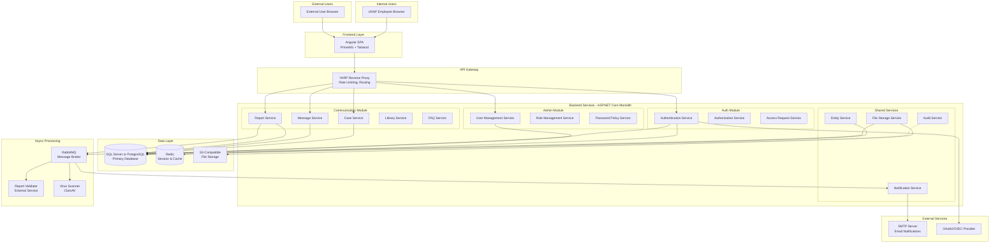

# **Section 2: High Level Architecture**

## **Technical Summary**

The UKNF Communication Platform follows a **modular monolithic architecture** with clear domain boundaries, implemented using **ASP.NET Core Web API (.NET 8/9)** and the CQRS pattern. The system comprises three primary modules (Communication, Authentication/Authorization, and Administration) that share a common infrastructure layer while maintaining logical separation. The platform uses REST API for client communication, PostgreSQL (or MSSQL) for relational data storage, and asynchronous processing via message queues for report validation and file processing. The architecture emphasizes security, audit trails, and scalability to support multiple supervised entities and UKNF employees concurrently, directly addressing the PRD's requirements for secure, efficient communication with proper role-based access control and comprehensive file management.

---

## **High Level Overview**

**Architectural Style**: **Modular Monolith**
- Single deployable unit with clear module boundaries
- Simplified deployment (Docker container) as specified in PRD requirements
- Easier development coordination for AI-assisted coding
- Clear migration path to microservices if needed

**Repository Structure**: **Monorepo**
- Single repository containing backend, frontend, infrastructure code
- Shared type definitions and contracts between frontend/backend
- Simplified version management and cross-cutting changes
- Better for AI-driven development with full context

**Service Architecture**: **Domain-Driven Design with CQRS**
- Three bounded contexts: Communication, Auth/Authorization, Administration
- Command/Query separation for complex operations (report validation, file processing)
- Shared kernel for common entities (User, Entity, Audit)
- Event-driven communication between modules via internal event bus

**Primary User Flow**:
1. External user authenticates → selects entity context → accesses communication features
2. Internal UKNF employee authenticates → manages entities/users → handles reports/messages
3. Asynchronous workflows: Report validation, file scanning, notification delivery
4. Real-time requirements: Message notifications, bulletin board updates

**Key Architectural Decisions**:
- **Modular Monolith over Microservices**: PRD requires Docker Compose deployment; monolith reduces operational complexity while maintaining clear boundaries
- **CQRS with MediatR**: Separates read-heavy operations (dashboards, lists) from write operations (report submission, case management) using MediatR pattern
- **ASP.NET Core Web API**: Clean, modern REST API with built-in dependency injection and middleware pipeline
- **Entity Framework Core**: ORM for data access with migration support and LINQ queries
- **Synchronous REST + Asynchronous Messaging**: REST for user-facing operations, message queue for background processing
- **PostgreSQL or MSSQL**: PRD prefers MSSQL; both supported via EF Core with minimal configuration changes

---

## **High Level Project Diagram**

---

## **Architectural and Design Patterns**

**1. Domain-Driven Design (DDD) with Bounded Contexts**
- Each module (Communication, Auth, Admin) represents a bounded context
- Shared kernel for common entities (User, Entity, Audit logs)
- Anti-corruption layers between contexts
- _Rationale:_ Aligns with PRD's clear module separation; enables parallel AI-assisted development of independent modules; reduces coupling and improves maintainability

**2. Command Query Responsibility Segregation (CQRS) with MediatR**
- Commands: Report submission, message sending, case creation (write-optimized)
- Queries: Dashboard data, report lists, user searches (read-optimized, potentially cached)
- MediatR library for in-process messaging and handler routing
- Separate read models for complex aggregations
- _Rationale:_ Required by PRD; MediatR is the de facto standard for CQRS in .NET; optimizes performance for read-heavy operations; simplifies complex business logic validation

**3. Repository Pattern with Unit of Work**
- Abstract data access behind repository interfaces
- Entity Framework Core DbContext as Unit of Work
- Domain entities mapped to database tables
- _Rationale:_ Standard .NET pattern; enables AI to generate consistent data access code; facilitates testing with in-memory database or mocks

**4. Event-Driven Architecture (Internal)**
- Domain events for cross-module communication (e.g., "ReportValidated", "AccessRequestApproved")
- MediatR notifications for in-process event handling
- Eventual consistency for non-critical operations
- _Rationale:_ Decouples modules; supports audit logging; enables async notifications without tight coupling

**5. API Gateway Pattern with YARP**
- YARP (Yet Another Reverse Proxy) as single entry point
- Centralized authentication, rate limiting, CORS
- Request routing to appropriate endpoints
- _Rationale:_ Microsoft's official reverse proxy for .NET; simplifies frontend integration; centralizes security; provides observability point

**6. Strategy Pattern for File Validation**
- Pluggable validators for different report types
- External virus scanning integration
- Configurable validation rules via FluentValidation
- _Rationale:_ PRD requires flexible report validation; FluentValidation provides clean, testable validation; supports multiple report formats

**7. Saga Pattern for Complex Workflows**
- Orchestration for multi-step processes using MassTransit or custom orchestrators
- Compensation logic for failures
- _Rationale:_ Ensures data consistency in distributed workflows; handles long-running processes like report validation (up to 24 hours per PRD)

**8. Multitenancy Pattern (Entity-Based)**
- Row-level security for entity data isolation
- Middleware for entity context resolution
- Query filters in EF Core for automatic data scoping
- _Rationale:_ PRD requires users to select entity context; EF Core global query filters ensure automatic data isolation; critical for security compliance

**9. Middleware Pipeline Pattern**
- ASP.NET Core middleware for cross-cutting concerns (authentication, logging, exception handling)
- Custom middleware for audit logging and entity context injection
- _Rationale:_ Built-in .NET pattern; clean separation of concerns; easy to test and maintain

---

## **Updated Rationale:**

1. **.NET 8/9 Selection**: Latest LTS version with excellent performance, native Docker support, and modern C# language features. Aligns with PRD's .NET backend option.

2. **MediatR for CQRS**: Industry-standard library in .NET ecosystem for implementing CQRS. Provides clean separation between commands/queries and their handlers, making code generation via AI prompts straightforward.

3. **Entity Framework Core**: Microsoft's official ORM with excellent support for both MSSQL and PostgreSQL. Provides migrations, LINQ queries, and change tracking out of the box.

4. **YARP Gateway**: Microsoft's modern reverse proxy built on ASP.NET Core. Lightweight, performant, and easy to configure. Alternative to Ocelot with better long-term support.

5. **Built-in Dependency Injection**: .NET Core has excellent DI container built-in, eliminating need for third-party solutions. Supports constructor injection, scoped/transient/singleton lifetimes.
