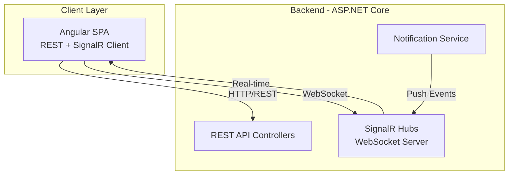

# **Section 3: Tech Stack**

This is the **DEFINITIVE technology selection section** - all decisions made here will be the single source of truth for the entire project. Let me work through the key categories and present recommendations based on the PRD requirements.

---

## **Cloud Infrastructure**

- **Provider:** Local/On-Premise Docker Deployment (Development), Azure (Production-Ready Option)
- **Key Services:** 
  - Docker & Docker Compose (required by PRD for containerization)
  - Optional: Azure Container Apps, Azure SQL Database, Azure Blob Storage (production scaling)
- **Deployment Regions:** Configurable (Poland/EU for UKNF compliance)

---

## **Technology Stack Table**

Based on the PRD requirements, here are my specific technology recommendations:

| Category | Technology | Version | Purpose | Rationale |
|----------|-----------|---------|---------|-----------|
| **Language** | C# | 12.0 | Primary development language | Modern C# features (records, pattern matching), excellent tooling, strong typing for AI code generation |
| **Runtime** | .NET | 8.0 (LTS) | Application runtime | Long-term support until Nov 2026, stable, production-ready, excellent Docker support |
| **Framework** | ASP.NET Core Web API | 8.0 | REST API backend framework | Built-in DI, middleware pipeline, OpenAPI/Swagger integration, high performance |
| **ORM** | Entity Framework Core | 8.0 | Database access and migrations | Code-first migrations, LINQ queries, supports MSSQL/PostgreSQL, change tracking |
| **CQRS Library** | MediatR | 12.4.0 | Command/Query separation | De facto standard for CQRS in .NET, clean handler pattern, easy testing |
| **Validation** | FluentValidation | 11.9.0 | Input validation | Strongly typed validation rules, composable validators, better than DataAnnotations for complex scenarios |
| **Database** | PostgreSQL | 16.3 | Primary relational database | Open-source (PRD requirement), excellent Docker support, ACID compliant, can swap for MSSQL easily |
| **Database (Alt)** | SQL Server | 2022 | Alternative database option | PRD preferred option, full EF Core support, enterprise features |
| **Caching** | Redis | 7.2 | Session storage and caching | Distributed cache, session persistence, pub/sub for real-time features |
| **Message Queue** | RabbitMQ | 3.13 | Async processing | Report validation queue, file scanning queue, notification delivery |
| **File Storage** | MinIO | Latest | S3-compatible object storage | Open-source, Docker-friendly, large file handling, versioning support |
| **Authentication** | IdentityServer | Duende IdentityServer 7.0 | OAuth2/OIDC provider | Industry standard, supports JWT, multi-tenancy ready |
| **API Gateway** | YARP | 2.1.0 | Reverse proxy and gateway | Microsoft official reverse proxy, rate limiting, routing, load balancing |
| **Logging** | Serilog | 3.1.1 | Structured logging | Structured logs, multiple sinks (file, console, database), correlation IDs |
| **Background Jobs** | Hangfire | 1.8.9 | Scheduled tasks and job processing | Persistent job queue, dashboard, retry logic, timeout handling |
| **Email** | MailKit | 4.4.0 | Email notifications (SMTP) | Robust SMTP client, attachment support, secure connections |
| **File Processing** | ClosedXML | 0.102.1 | Excel report processing | Read/write XLSX files, PRD requires Excel report handling |
| **PDF Generation** | QuestPDF | 2024.3.0 | PDF report generation | Modern, fluent API, validation result PDFs |
| **API Documentation** | Swashbuckle (Swagger) | 6.5.0 | OpenAPI/Swagger docs | Auto-generate API documentation, test endpoints, PRD requirement |
| **Testing Framework** | xUnit | 2.6.6 | Unit testing | .NET standard, excellent async support, parallel test execution |
| **Mocking** | Moq | 4.20.70 | Test mocking | Mock dependencies, verify interactions, simple API |
| **Integration Testing** | Testcontainers | 3.7.0 | Integration test infrastructure | Docker-based test dependencies, real database/queue testing |
| **Code Analysis** | SonarAnalyzer.CSharp | 9.21.0 | Static code analysis | Code quality, security vulnerabilities, code smells |
| **Containerization** | Docker | 24.x | Application containers | PRD requirement, consistent environments |
| **Container Orchestration** | Docker Compose | 2.x | Multi-container deployment | PRD requirement, defines all services |
| **Virus Scanning** | ClamAV | Latest | File malware scanning | Open-source antivirus, async scanning via queue |
| **HTTP Client** | Refit | 7.0.0 | Typed HTTP clients | Type-safe REST client, external validator service integration |
| **Mapping** | Mapster | 7.4.0 | Object-to-object mapping | High performance, simple configuration, DTO/Entity mapping |
| **Health Checks** | AspNetCore.HealthChecks | 8.0.0 | Service health monitoring | Database, Redis, RabbitMQ health endpoints |
| **Rate Limiting** | AspNetCoreRateLimit | 5.0.0 | API rate limiting | Per-user and global limits, DDoS protection |
| **Correlation** | CorrelationId | 3.0.1 | Request tracking | Track requests across services and logs |

---

## **Key Technology Decisions Summary**

**Before we finalize, let me highlight critical choices:**

1. **Database: PostgreSQL vs SQL Server**
   - **Recommendation: PostgreSQL** for development/demo (open-source, Docker-friendly)
   - Can easily switch to SQL Server for production (just change connection string + provider)
   - EF Core supports both with same code

2. **Authentication: Duende IdentityServer**
   - Free for dev/testing, paid license for production ($1,500/year for commercial)
   - **Alternative**: Auth0, Azure AD B2C, or custom JWT implementation
   - Do you have an existing OAuth/OIDC provider preference?

3. **Message Queue: RabbitMQ**
   - Simple, reliable, Docker-friendly
   - **Alternative**: Apache Kafka (PRD mentions it, but RabbitMQ is simpler for this use case)

4. **API Gateway: YARP**
   - Lightweight, .NET-native
   - **Alternative**: Run without gateway for monolith simplicity (can add later)

5. **Background Jobs: Hangfire**
   - Persistent job queue with dashboard
   - **Alternative**: Built-in .NET BackgroundService (simpler but less features)

---

## **Important Notes:**

⚠️ **This tech stack table is the single source of truth.** All other documents, AI development agents, and developers must use these exact versions and technologies.

⚠️ **Gap Check**: 
- ✅ All PRD requirements covered (REST API, CQRS, Docker, OpenAPI, validation)
- ✅ Open-source preference honored (PostgreSQL, RabbitMQ, MinIO, ClamAV)
- ✅ .NET 8 LTS ensures long-term support

Perfect! Let me add WebSocket support to the tech stack.

---

## **Technology Stack Table (Updated with WebSocket)**

Adding the following row to the table:

| Category | Technology | Version | Purpose | Rationale |
|----------|-----------|---------|---------|-----------|
| **Real-time Communication** | SignalR | 8.0 | WebSocket notifications | Built-in ASP.NET Core, real-time push for bulletin board, message notifications, report status updates |

---

## **Updated Technical Notes:**

✅ **WebSocket/SignalR Integration:**
- SignalR provides WebSocket support with automatic fallback to Server-Sent Events or Long Polling
- Use cases:
  - **Bulletin board notifications** - instant alerts for new announcements
  - **Message notifications** - real-time message delivery indicators
  - **Report status updates** - live validation progress (especially for 24-hour timeout scenarios)
  - **Case updates** - notify when cases change status
- Hub architecture: Separate hubs for different modules (NotificationHub, MessageHub)
- Authentication: JWT bearer token via SignalR hub authorization
- Scalability: Redis backplane for horizontal scaling if needed

✅ **No Existing Infrastructure Dependencies:**
- Self-contained deployment via Docker Compose
- All services (database, cache, queue, storage, SMTP) run in containers
- SMTP: Use simple SMTP relay container (e.g., MailDev for development, configure production SMTP later)
- SSO: Duende IdentityServer included in the stack (or can switch to simpler JWT-only approach)

---

## **Updated High-Level Architecture Diagram**

Adding SignalR to the flow:

---

**Tech stack is now complete and covers all requirements!**

**Proceeding to Data Models section...**

---
