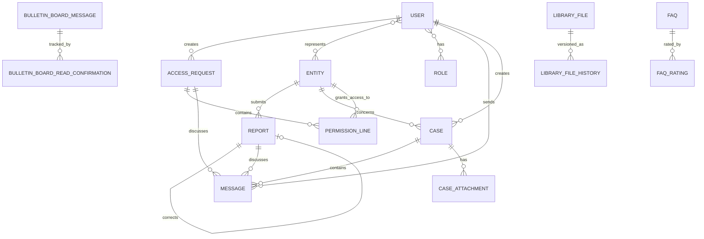

# **Section 4: Data Models**

Now let's define the core data models based on the PRD requirements. I'll identify the key business entities across the three modules.

---

## **Core Domain Entities:**

Based on the PRD functional requirements, here are the primary data models:

---

## **1. User**

**Purpose:** Represents both internal (UKNF employees) and external (entity representatives) users in the system.

**Key Attributes:**
- `Id`: Guid - Unique identifier
- `FirstName`: string - User's first name (required)
- `LastName`: string - User's last name (required)
- `Email`: string - Email address (unique, required)
- `Phone`: string - Phone number with international format validation
- `Pesel`: string - National ID (encrypted, last 4 digits visible)
- `UserType`: enum (Internal, External) - Distinguishes UKNF employees from entity users
- `IsActive`: bool - Account status
- `PasswordHash`: string - Securely hashed password
- `MustChangePassword`: bool - Force password change flag
- `LastLoginDate`: DateTime? - Audit trail
- `CreatedDate`: DateTime - Account creation timestamp
- `UpdatedDate`: DateTime - Last modification timestamp

**Relationships:**
- Many-to-Many with `Entity` (via `UserEntity` join table - external users can represent multiple entities)
- One-to-Many with `AccessRequest` (user's access requests)
- Many-to-Many with `Role` (via `UserRole` join table)
- One-to-Many with `Message` (messages sent/received)

---

## **2. Entity**

**Purpose:** Represents supervised financial entities in the UKNF system.

**Key Attributes:**
- `Id`: long - Database identifier
- `UknfCode`: string(250) - UKNF-generated code (immutable, indexed)
- `EntityType`: string(250) - Type of entity (e.g., "Loan Institution")
- `Name`: string(500) - Official entity name (required)
- `Lei`: string(20) - Legal Entity Identifier
- `Nip`: string(10) - Tax identification number
- `Krs`: string(10) - National court register number
- `Street`: string(250) - Address
- `BuildingNumber`: string(250)
- `PremisesNumber`: string(250)
- `PostalCode`: string(250)
- `City`: string(250)
- `Phone`: string(250) - International format validated
- `Email`: string(500) - Contact email
- `UknfRegistrationNumber`: string(100) - UKNF register ID
- `EntityStatus`: string(250) - Status (e.g., "Entered", "Deleted")
- `Category`: string(500) - Entity category
- `Sector`: string(500) - Entity sector
- `SubSector`: string(500) - Entity sub-sector
- `IsCrossBorder`: bool - Cross-border entity flag
- `CreatedDate`: DateTime
- `UpdatedDate`: DateTime

**Relationships:**
- Many-to-Many with `User` (entity representatives)
- One-to-Many with `Report` (entity's reports)
- One-to-Many with `Case` (cases concerning this entity)
- One-to-Many with `EntityHistory` (change versioning)
- One-to-Many with `AccessRequest` (access requests for this entity)

---

## **3. Report**

**Purpose:** Represents financial reports submitted by entities (e.g., quarterly reports in XLSX format).

**Key Attributes:**
- `Id`: Guid - Unique identifier
- `EntityId`: long - Submitting entity (foreign key)
- `UserId`: Guid - User who submitted (foreign key)
- `FileName`: string(500) - Original file name
- `FileStorageKey`: string(500) - Object storage key
- `FileSize`: long - File size in bytes
- `ReportType`: string(250) - Report category (e.g., "Quarterly", "Annual")
- `ReportingPeriod`: string(100) - Period identifier (e.g., "Q1_2025")
- `ValidationStatus`: enum - Status (Working, Transmitted, Ongoing, Successful, ValidationErrors, TechnicalError, TimeoutError, ContestedByUKNF)
- `ValidationResultFileKey`: string(500) - Storage key for validation result PDF
- `UniqueValidationId`: string(100) - Confirmation ID after submission
- `IsArchived`: bool - Archival status
- `IsCorrectionOf`: Guid? - References original report if this is a correction
- `SubmittedDate`: DateTime - Submission timestamp
- `ValidationStartedDate`: DateTime? - Validation process start
- `ValidationCompletedDate`: DateTime? - Validation completion
- `ErrorDescription`: string(max) - Technical/validation error details
- `ContestedDescription`: string(max) - UKNF contest reason
- `CreatedDate`: DateTime
- `UpdatedDate`: DateTime

**Relationships:**
- Many-to-One with `Entity` (report belongs to entity)
- Many-to-One with `User` (submitted by user)
- One-to-Many with `Message` (messages related to report)
- One-to-One with `Report` (correction relationship)

---

## **4. Message**

**Purpose:** Two-way communication between internal and external users, used in multiple contexts.

**Key Attributes:**
- `Id`: Guid - Unique identifier
- `Subject`: string(500) - Message subject
- `Body`: string(max) - Message content
- `SenderId`: Guid - User who sent the message
- `MessageStatus`: enum - Status (AwaitingUknfResponse, AwaitingUserResponse, Closed)
- `ContextType`: enum - Where message is used (AccessRequest, Case, Report, Standalone)
- `ContextId`: Guid? - ID of related context (CaseId, ReportId, etc.)
- `EntityId`: long? - Related entity
- `ParentMessageId`: Guid? - For threaded conversations
- `SentDate`: DateTime
- `ReadDate`: DateTime? - When message was read
- `IsReadByRecipient`: bool

**Relationships:**
- Many-to-One with `User` (sender)
- Many-to-Many with `User` (recipients via `MessageRecipient` join table)
- Many-to-One with `Message` (parent message for threading)
- One-to-Many with `MessageAttachment` (file attachments)
- Polymorphic relationship with context (Case, Report, AccessRequest)

---

## **5. Case**

**Purpose:** Administrative cases concerning supervised entities.

**Key Attributes:**
- `Id`: Guid - Unique identifier
- `CaseNumber`: string(100) - Human-readable case number (auto-generated)
- `Title`: string(500) - Case title
- `Description`: string(max) - Case description
- `EntityId`: long - Entity concerned (foreign key)
- `CreatedByUserId`: Guid - User who created the case
- `AssignedToUserId`: Guid? - UKNF employee handling the case
- `Category`: enum - Category (RegistrationDataChange, StaffChange, EntityCall, SystemEntitlements, Reporting, Other)
- `Priority`: enum - Priority (Low, Medium, High)
- `Status`: enum - Status (Draft, New, Ongoing, ToBeCompleted, Cancelled, Completed)
- `CancellationReason`: string(max) - Reason if cancelled
- `CreatedDate`: DateTime
- `UpdatedDate`: DateTime
- `CompletedDate`: DateTime?

**Relationships:**
- Many-to-One with `Entity` (case concerns entity)
- Many-to-One with `User` (creator)
- Many-to-One with `User` (assigned handler)
- One-to-Many with `Message` (case conversation)
- One-to-Many with `CaseAttachment` (documents)
- One-to-Many with `CaseHistory` (status changes)

---

## **6. AccessRequest**

**Purpose:** Manages external user access requests with permission lines for different entities.

**Key Attributes:**
- `Id`: Guid - Unique identifier
- `UserId`: Guid - Requesting user
- `Status`: enum - Status (Working, New, Accepted, Blocked, Updated)
- `SubmittedDate`: DateTime? - When submitted for approval
- `ReviewedByUserId`: Guid? - UKNF employee or entity admin who reviewed
- `ReviewedDate`: DateTime?
- `CreatedDate`: DateTime
- `UpdatedDate`: DateTime

**Relationships:**
- Many-to-One with `User` (requesting user)
- One-to-Many with `PermissionLine` (multiple entity permissions)
- One-to-Many with `Message` (communication about request)

---

## **7. PermissionLine**

**Purpose:** Individual permission grant for a user-entity combination.

**Key Attributes:**
- `Id`: Guid - Unique identifier
- `AccessRequestId`: Guid - Parent access request
- `EntityId`: long - Entity for which permissions are granted
- `HasReportingAccess`: bool - Reporting module access
- `HasCasesAccess`: bool - Cases module access
- `IsEntityAdministrator`: bool - Entity admin privileges
- `IsBlocked`: bool - Permission blocked status
- `EntityEmailForNotifications`: string(500) - Entity-specific notification email
- `GrantedByUserId`: Guid? - Who granted the permission
- `GrantedDate`: DateTime?

**Relationships:**
- Many-to-One with `AccessRequest`
- Many-to-One with `Entity`

---

## **8. BulletinBoardMessage**

**Purpose:** Announcements published by UKNF to external users.

**Key Attributes:**
- `Id`: Guid - Unique identifier
- `Title`: string(500) - Announcement title
- `Content`: string(max) - HTML content (WYSIWYG editor)
- `Category`: string(250) - Category (e.g., "General Information", "Events")
- `Priority`: enum - Priority (Low, Medium, High)
- `PublishedByUserId`: Guid - UKNF employee who published
- `PublishedDate`: DateTime?
- `ExpiryDate`: DateTime? - When announcement expires
- `RequiresReadConfirmation`: bool - High priority messages require explicit confirmation
- `IsPublished`: bool - Publication status
- `CreatedDate`: DateTime
- `UpdatedDate`: DateTime

**Relationships:**
- Many-to-One with `User` (publisher)
- Many-to-Many with `User` (recipients via `BulletinBoardRecipient`)
- One-to-Many with `BulletinBoardReadConfirmation` (read tracking)
- One-to-Many with `BulletinBoardAttachment`

---

## **9. LibraryFile**

**Purpose:** Local file repository for templates, instructions, and shared documents.

**Key Attributes:**
- `Id`: Guid - Unique identifier
- `FileName`: string(500) - File name
- `FileStorageKey`: string(500) - Object storage key
- `FileSize`: long - File size
- `Description`: string(max) - File description
- `ReportingPeriod`: string(100)? - For report templates
- `Category`: string(250) - File categorization
- `Version`: string(50) - File version
- `IsCurrentVersion`: bool - Active version flag
- `IsArchived`: bool - Archival status
- `UploadedByUserId`: Guid - UKNF employee who uploaded
- `UploadedDate`: DateTime
- `LastUpdatedDate`: DateTime

**Relationships:**
- Many-to-One with `User` (uploader)
- Many-to-Many with `User` and `Entity` (access permissions via junction tables)
- One-to-Many with `LibraryFileHistory` (version history)

---

## **10. FAQ**

**Purpose:** Questions and answers knowledge base.

**Key Attributes:**
- `Id`: Guid - Unique identifier
- `Title`: string(500) - Question title
- `QuestionContent`: string(max) - Full question
- `AnswerContent`: string(max)? - Answer (null if unanswered)
- `Category`: string(250) - Question category
- `Tags`: string(1000) - Comma-separated tags for filtering
- `Status`: enum - Status (Submitted, Answered, Published, Archived)
- `AskedByUserId`: Guid? - Anonymous but tracked internally
- `AnsweredByUserId`: Guid? - UKNF employee who answered
- `AverageRating`: decimal? - Rating 1-5 stars
- `ViewCount`: int - Popularity tracking
- `CreatedDate`: DateTime
- `AnsweredDate`: DateTime?
- `UpdatedDate`: DateTime

**Relationships:**
- Many-to-One with `User` (answerer)
- One-to-Many with `FaqRating` (user ratings)

---

## **Supporting Entities:**

- **Role**: System roles with permissions
- **Permission**: Granular permissions
- **ContactGroup**: Groups for mass messaging
- **Contact**: Non-user contacts for notifications
- **AuditLog**: Comprehensive audit trail for all actions
- **EntityHistory**: Versioned entity data changes
- **Attachment** entities: MessageAttachment, CaseAttachment, BulletinBoardAttachment

---

## **Entity Relationship Diagram (High-Level):**

---

## **Rationale:**

1. **Multi-tenancy via Entity**: The `Entity` model is central to data isolation. Query filters in EF Core will automatically scope queries based on user's entity context.

2. **Polymorphic Relationships**: `Message` can be associated with different contexts (Case, Report, AccessRequest) via `ContextType` and `ContextId` discriminator pattern.

3. **Audit Trail**: All entities have `CreatedDate` and `UpdatedDate`. A separate `AuditLog` table tracks all modifications with before/after values.

4. **Soft Deletes**: Using flags like `IsArchived`, `IsActive` instead of physical deletes to maintain history.

5. **Versioning**: `LibraryFile` and `Entity` have explicit versioning/history tables to track changes over time as required by PRD.

6. **Performance Considerations**: Strategic indexes on foreign keys, status fields, and frequently queried fields (e.g., `UknfCode`, `Email`, `CaseNumber`).
