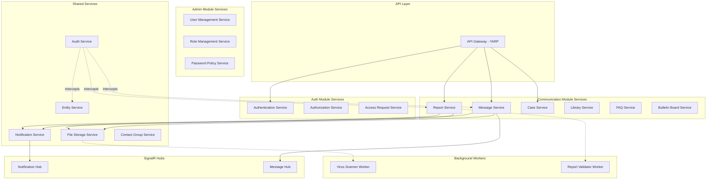

# **Section 5: Components**

Now let's define the major components/services of the system, their responsibilities, interfaces, and dependencies. This will translate the data models and architectural patterns into concrete service boundaries.

---

## **1. Authentication Service**

**Responsibility:** Manages user authentication, JWT token generation, and session management.

**Key Interfaces:**
- `POST /api/auth/login` - User login with credentials
- `POST /api/auth/logout` - User logout and token revocation
- `POST /api/auth/refresh-token` - Refresh JWT access token
- `POST /api/auth/forgot-password` - Initiate password reset
- `POST /api/auth/reset-password` - Complete password reset
- `POST /api/auth/change-password` - Change user password
- `GET /api/auth/me` - Get current authenticated user info

**Dependencies:**
- Entity Framework Core (User repository)
- Redis (session and token blacklist storage)
- Duende IdentityServer (OAuth2/OIDC flows)
- MailKit (password reset emails)
- BCrypt.Net (password hashing)

**Technology Stack:**
- ASP.NET Core Identity for user management
- JWT Bearer authentication
- Cookie-based session for external OIDC flows

---

## **2. Authorization Service**

**Responsibility:** Handles role-based and entity-context-based authorization, permission checks.

**Key Interfaces:**
- `GET /api/authorization/permissions` - Get current user permissions
- `POST /api/authorization/check-permission` - Verify specific permission
- `GET /api/authorization/entities` - Get entities user can represent
- `POST /api/authorization/select-entity` - Select entity context for session

**Dependencies:**
- User Service
- Entity Service
- Redis (entity context caching)
- Custom authorization policies and handlers

**Technology Stack:**
- ASP.NET Core Authorization policies
- Custom middleware for entity context injection
- EF Core global query filters for multi-tenancy

---

## **3. Access Request Service**

**Responsibility:** Manages external user registration and access request workflow.

**Key Interfaces:**
- `POST /api/access-requests/register` - Register new external user
- `POST /api/access-requests` - Create/submit access request
- `PUT /api/access-requests/{id}` - Update access request (draft mode)
- `POST /api/access-requests/{id}/submit` - Submit for approval
- `POST /api/access-requests/{id}/approve` - Approve request (UKNF or Entity Admin)
- `POST /api/access-requests/{id}/block` - Block permission line
- `GET /api/access-requests` - List access requests (filtered by entity, status)
- `GET /api/access-requests/{id}` - Get request details with history

**Dependencies:**
- User Service
- Entity Service
- Message Service (for request communication)
- Notification Service
- Audit Service

**Technology Stack:**
- MediatR commands/queries
- FluentValidation for PESEL, email, phone validation
- State machine pattern for status transitions

---

## **4. Report Service**

**Responsibility:** Handles report submission, validation orchestration, status tracking, and archival.

**Key Interfaces:**
- `POST /api/reports/upload` - Upload report file (chunked upload support)
- `GET /api/reports` - List reports (filtered by entity, status, period, register type)
- `GET /api/reports/{id}` - Get report details
- `GET /api/reports/{id}/validation-result` - Download validation result PDF
- `POST /api/reports/{id}/contest` - UKNF contests report
- `POST /api/reports/{id}/archive` - Archive report
- `POST /api/reports/{id}/correction` - Submit correction to existing report
- `GET /api/reports/calendar` - Get reporting calendar/schedule
- `GET /api/reports/missing-entities` - Entities that haven't submitted for period

**Dependencies:**
- File Storage Service
- RabbitMQ (publish report validation jobs)
- External Report Validator Service (via Refit HTTP client)
- Message Service
- Notification Service
- Entity Service

**Technology Stack:**
- ClosedXML for Excel parsing
- Chunked file upload with resumable uploads
- Hangfire for timeout monitoring (24-hour deadline)
- State machine for validation status transitions

---

## **5. Message Service**

**Responsibility:** Two-way messaging between internal and external users across different contexts.

**Key Interfaces:**
- `POST /api/messages` - Send new message
- `GET /api/messages` - List messages (filtered by context, status, entity)
- `GET /api/messages/{id}` - Get message thread
- `POST /api/messages/{id}/reply` - Reply to message
- `POST /api/messages/{id}/mark-read` - Mark message as read
- `POST /api/messages/{id}/close` - Close message thread
- `POST /api/messages/mass-send` - Send to multiple entities/groups

**Dependencies:**
- File Storage Service (attachments)
- Virus Scanner Service
- Notification Service (email and SignalR)
- Contact Group Service
- Entity Service

**Technology Stack:**
- File attachment validation (PDF, DOC, XLSX, CSV, TXT, MP3, ZIP - max 100MB)
- SignalR for real-time message delivery
- Thread tracking with ParentMessageId

---

## **6. Case Service**

**Responsibility:** Administrative case management for supervised entities.

**Key Interfaces:**
- `POST /api/cases` - Create case (draft or submit)
- `PUT /api/cases/{id}` - Update case
- `POST /api/cases/{id}/submit` - Submit draft case
- `POST /api/cases/{id}/change-status` - Change case status (Ongoing, ToBeCompleted, Completed)
- `POST /api/cases/{id}/cancel` - Cancel case (if not yet opened by entity)
- `GET /api/cases` - List cases (filtered by entity, status, category, priority)
- `GET /api/cases/{id}` - Get case details with history
- `POST /api/cases/{id}/attachments` - Add attachment to case

**Dependencies:**
- Message Service (case conversation)
- File Storage Service (case documents)
- Entity Service
- Notification Service
- Audit Service (case history)

**Technology Stack:**
- State machine for case status transitions
- Cancellation logic with notification checks
- Version tracking for case modifications

---

## **7. Library Service**

**Responsibility:** File repository management for templates, instructions, and shared documents.

**Key Interfaces:**
- `POST /api/library/files` - Upload file (UKNF employees only)
- `PUT /api/library/files/{id}` - Update file metadata
- `DELETE /api/library/files/{id}` - Delete file
- `GET /api/library/files` - List files (filtered by category, version status)
- `GET /api/library/files/{id}/download` - Download file
- `POST /api/library/files/{id}/share` - Share with users/entities/groups
- `GET /api/library/files/{id}/history` - View file version history

**Dependencies:**
- File Storage Service
- Entity Service (access permissions)
- User Service
- Audit Service (version tracking)

**Technology Stack:**
- File versioning with history table
- Access control lists (ACLs) for file permissions
- Metadata indexing for search/filter

---

## **8. Bulletin Board Service**

**Responsibility:** UKNF announcements with read tracking and targeted distribution.

**Key Interfaces:**
- `POST /api/bulletin-board` - Create announcement
- `PUT /api/bulletin-board/{id}` - Edit announcement
- `POST /api/bulletin-board/{id}/publish` - Publish announcement
- `DELETE /api/bulletin-board/{id}` - Remove from publication
- `GET /api/bulletin-board` - List announcements (filtered by category, priority)
- `GET /api/bulletin-board/{id}` - Get announcement details
- `POST /api/bulletin-board/{id}/confirm-read` - User confirms reading (high priority)
- `GET /api/bulletin-board/{id}/statistics` - Read statistics (e.g., 71/100 entities)

**Dependencies:**
- File Storage Service (attachments)
- Contact Group Service (recipient targeting)
- Notification Service (SignalR for new announcements)
- Entity Service

**Technology Stack:**
- WYSIWYG content storage (sanitized HTML)
- Read confirmation tracking with timestamps
- Expiry date handling with automated unpublishing

---

## **9. FAQ Service**

**Responsibility:** Question and answer knowledge base with ratings and search.

**Key Interfaces:**
- `POST /api/faq/questions` - Submit question (anonymous)
- `POST /api/faq/questions/{id}/answer` - Add answer (UKNF employees)
- `PUT /api/faq/questions/{id}` - Edit question/answer
- `DELETE /api/faq/questions/{id}` - Delete Q&A
- `GET /api/faq/questions` - Search/list questions (filtered by category, tags, status)
- `GET /api/faq/questions/{id}` - Get question details
- `POST /api/faq/questions/{id}/rate` - Rate answer (1-5 stars)
- `GET /api/faq/categories` - Get categories and tag cloud

**Dependencies:**
- User Service (for internal tracking of asker)
- Full-text search capability (PostgreSQL full-text or separate search engine)

**Technology Stack:**
- PostgreSQL full-text search with tsvector
- Tag parsing and indexing
- Popularity sorting algorithm (views + ratings)

---

## **10. Entity Service**

**Responsibility:** Supervised entity data management with versioning and update workflows.

**Key Interfaces:**
- `POST /api/entities` - Create entity (System Admin)
- `PUT /api/entities/{id}` - Update entity data
- `GET /api/entities` - List entities (filtered by type, status, sector)
- `GET /api/entities/{id}` - Get entity details
- `GET /api/entities/{id}/users` - List users assigned to entity
- `GET /api/entities/{id}/history` - View entity change history
- `POST /api/entities/{id}/request-data-change` - External user reports data discrepancy (creates Case)
- `POST /api/entities/{id}/verify-data` - UKNF verifies and applies data changes

**Dependencies:**
- Case Service (data change requests)
- Audit Service (versioning)
- User Service

**Technology Stack:**
- Entity versioning table for historical data
- Scheduled alerts for data verification (Hangfire recurring jobs)
- Import capability for test data (CSV/Excel)

---

## **11. User Management Service**

**Responsibility:** Administrative user account management (Admin Module).

**Key Interfaces:**
- `POST /api/admin/users` - Create user account
- `PUT /api/admin/users/{id}` - Edit user account
- `DELETE /api/admin/users/{id}` - Delete user account
- `GET /api/admin/users` - List all users (internal and external)
- `POST /api/admin/users/{id}/reset-password` - Admin resets user password
- `POST /api/admin/users/{id}/force-password-change` - Force password change on next login
- `POST /api/admin/users/{id}/deactivate` - Deactivate user account

**Dependencies:**
- Authentication Service
- Role Management Service
- Notification Service (password reset emails)

**Technology Stack:**
- ASP.NET Core Identity administration
- Password generation utility

---

## **12. Role Management Service**

**Responsibility:** Role and permission management for access control.

**Key Interfaces:**
- `POST /api/admin/roles` - Create role
- `PUT /api/admin/roles/{id}` - Update role
- `DELETE /api/admin/roles/{id}` - Delete role
- `GET /api/admin/roles` - List all roles
- `GET /api/admin/roles/{id}` - Get role details with permissions
- `POST /api/admin/roles/{id}/permissions` - Assign permissions to role
- `POST /api/admin/users/{userId}/roles` - Assign roles to user
- `GET /api/admin/permissions` - List all available permissions

**Dependencies:**
- User Management Service
- Authorization Service (cache invalidation)

**Technology Stack:**
- Role-based access control (RBAC) with permission granularity
- Redis cache invalidation on role changes

---

## **13. Password Policy Service**

**Responsibility:** Configure and enforce password policies.

**Key Interfaces:**
- `GET /api/admin/password-policy` - Get current policy
- `PUT /api/admin/password-policy` - Update policy settings
- `POST /api/admin/password-policy/validate` - Validate password against policy

**Dependencies:**
- User Management Service

**Technology Stack:**
- Configurable policy: min length, complexity, uniqueness, history depth, change frequency
- Password strength validator with regex rules

---

## **14. File Storage Service**

**Responsibility:** Centralized file storage, retrieval, and management.

**Key Interfaces:**
- `POST /api/files/upload` - Upload file with chunked support
- `GET /api/files/{key}` - Download file
- `DELETE /api/files/{key}` - Delete file
- `POST /api/files/{key}/virus-scan` - Queue file for virus scanning

**Dependencies:**
- MinIO (S3-compatible storage)
- RabbitMQ (async virus scanning queue)
- Virus Scanner Service

**Technology Stack:**
- Resumable chunked uploads for large files (>100MB)
- Pre-signed URLs for direct browser downloads
- File metadata indexing

---

## **15. Notification Service**

**Responsibility:** Unified notification delivery via email and real-time push.

**Key Interfaces:**
- `POST /api/notifications/send` - Send notification (internal API)
- `GET /api/notifications/user` - Get user's notifications
- `POST /api/notifications/{id}/mark-read` - Mark notification as read

**Dependencies:**
- MailKit (SMTP email delivery)
- SignalR (real-time push to connected clients)
- Contact Group Service (for mass notifications)
- Template engine for email formatting

**Technology Stack:**
- SignalR NotificationHub
- Email templates with Razor syntax
- Notification queue with retry logic (Hangfire)

---

## **16. Audit Service**

**Responsibility:** Comprehensive audit logging of all system actions.

**Key Interfaces:**
- `POST /api/audit/log` - Log audit event (internal API)
- `GET /api/audit/logs` - Query audit logs (admin only)
- `GET /api/audit/entity/{entityId}/history` - Entity-specific audit trail
- `GET /api/audit/user/{userId}/activity` - User activity log

**Dependencies:**
- All services (audit interceptor)

**Technology Stack:**
- EF Core SaveChanges interceptor for automatic change tracking
- Structured logging with Serilog
- Correlation IDs for request tracing
- Stores: User, Timestamp, Action, Entity Type, Entity ID, Before/After JSON

---

## **17. Contact Group Service**

**Responsibility:** Manage contact groups and contacts for mass communication.

**Key Interfaces:**
- `POST /api/contact-groups` - Create contact group
- `PUT /api/contact-groups/{id}` - Update contact group
- `GET /api/contact-groups` - List contact groups
- `POST /api/contact-groups/{id}/contacts` - Add contact to group
- `DELETE /api/contact-groups/{id}/contacts/{contactId}` - Remove contact
- `POST /api/contacts` - Create contact (non-user recipient)

**Dependencies:**
- Entity Service (entity-based grouping)
- User Service

**Technology Stack:**
- Flexible recipient types: selected entities, contact groups, entity types, selected users

---

## **18. Virus Scanner Service**

**Responsibility:** Async virus scanning for uploaded files.

**Key Interfaces:**
- Internal queue consumer (listens to RabbitMQ)
- Updates file scan status in database

**Dependencies:**
- ClamAV (antivirus engine)
- File Storage Service
- RabbitMQ

**Technology Stack:**
- Background worker (IHostedService)
- ClamAV integration via TCP socket
- Quarantine logic for infected files

---

## **19. Report Validator Worker**

**Responsibility:** Process report validation queue and integrate with external validator.

**Key Interfaces:**
- Internal queue consumer (listens to RabbitMQ)
- Calls external validation service
- Updates report status and generates result PDF

**Dependencies:**
- External Report Validator (via Refit HTTP client)
- Report Service
- File Storage Service (store validation result)
- Notification Service
- Hangfire (24-hour timeout monitoring)

**Technology Stack:**
- Background worker
- Retry policies with Polly
- Timeout tracking with status updates

---

## **Component Diagram**

---

## **Rationale:**

1. **Service Granularity**: Each service aligns with a PRD functional area. Services are cohesive (single responsibility) but not micro-services (avoiding distributed complexity).

2. **Cross-Cutting Concerns**: Audit Service uses EF Core interceptors to automatically log changes across all entities without polluting business logic.

3. **Async Processing**: Report validation and virus scanning are CPU/time-intensive operations that run asynchronously via RabbitMQ workers, keeping API responses fast.

4. **Real-time Updates**: SignalR hubs provide WebSocket connections for instant notifications (bulletin board, messages, report status changes).

5. **Separation of Reads/Writes**: MediatR command handlers perform writes with validation, while query handlers optimize for read performance (potential caching layer).

6. **API Gateway**: YARP provides a single entry point, centralizing concerns like rate limiting and authentication, while allowing future service separation.

Excellent context! Thank you for clarifying. Let me adjust the approach - we're building a **self-contained demo** for the hackathon with **no external UKNF dependencies**. Everything must be mockable/self-hosted.

Let me revise the External APIs section:

---
