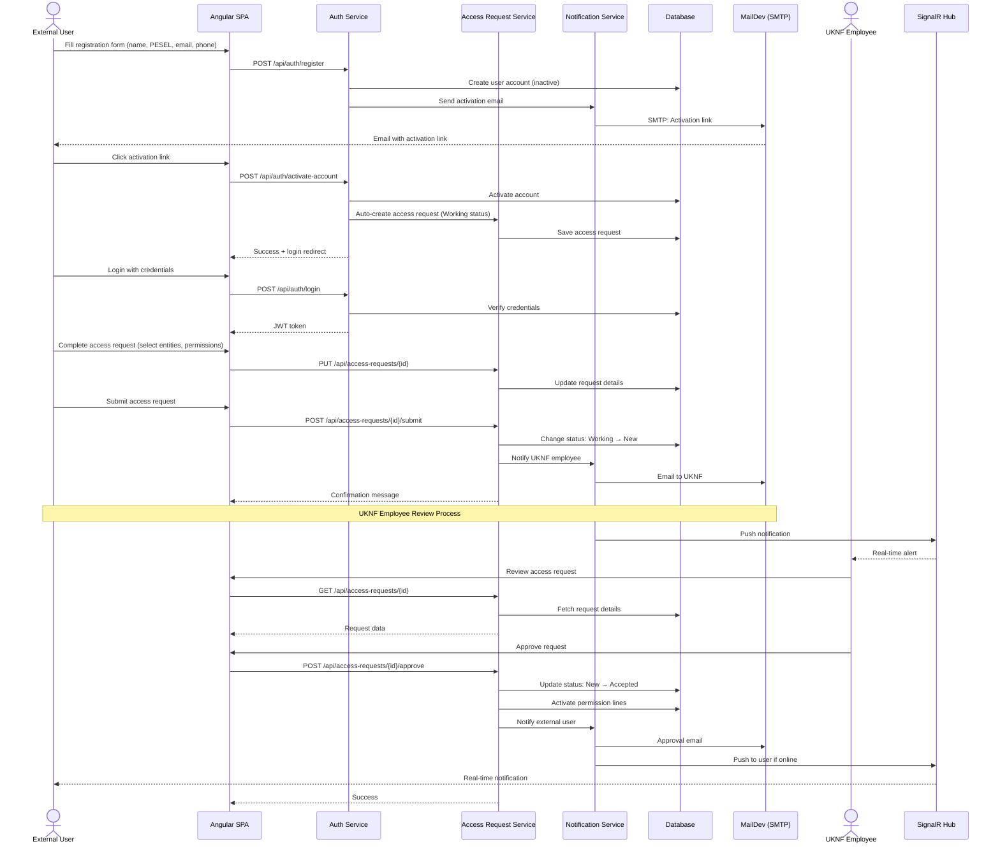
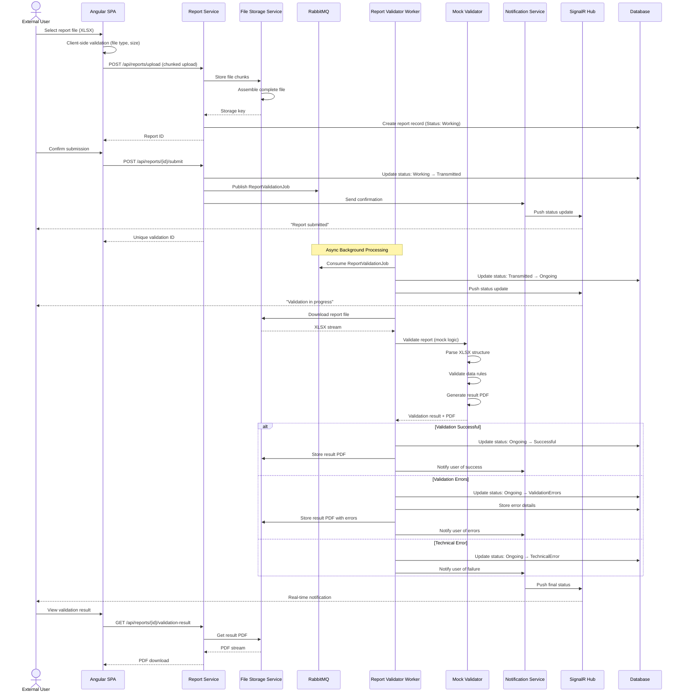
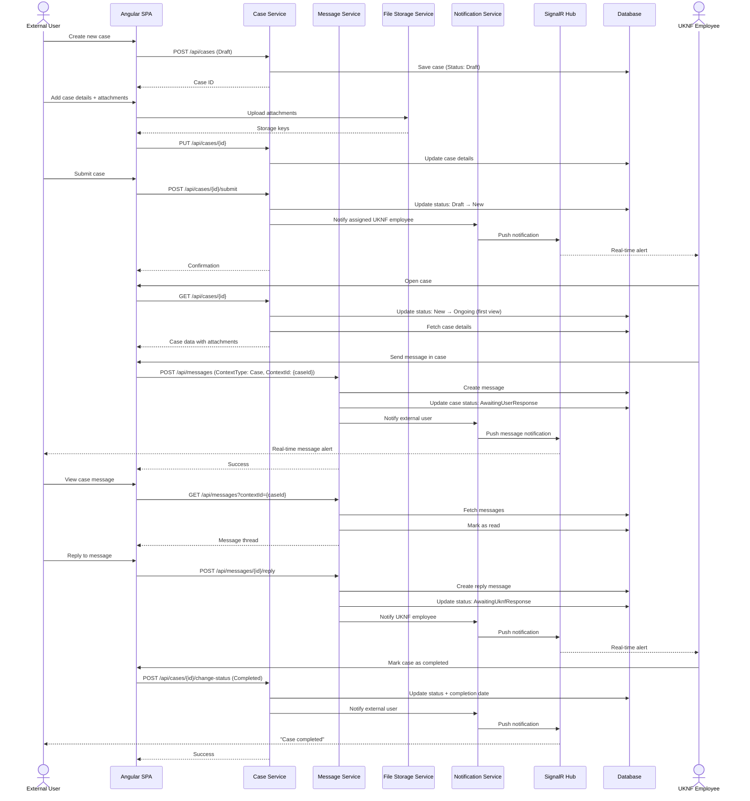
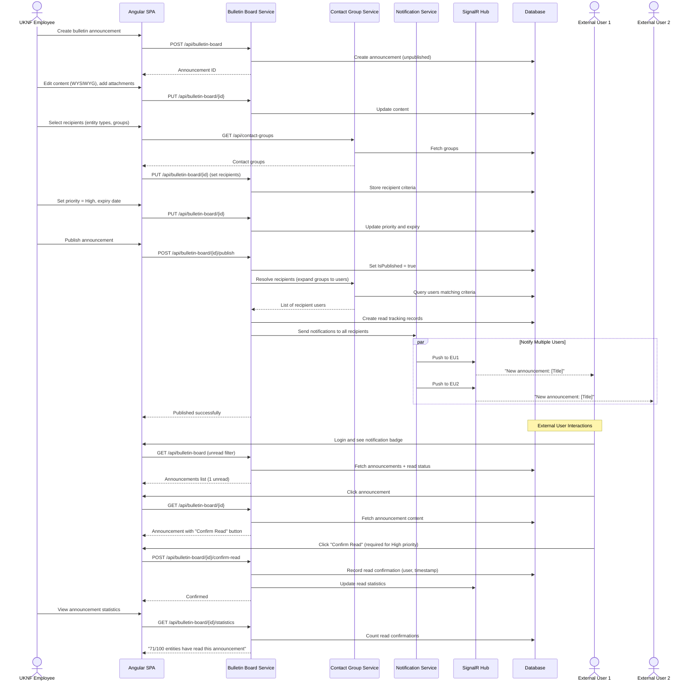
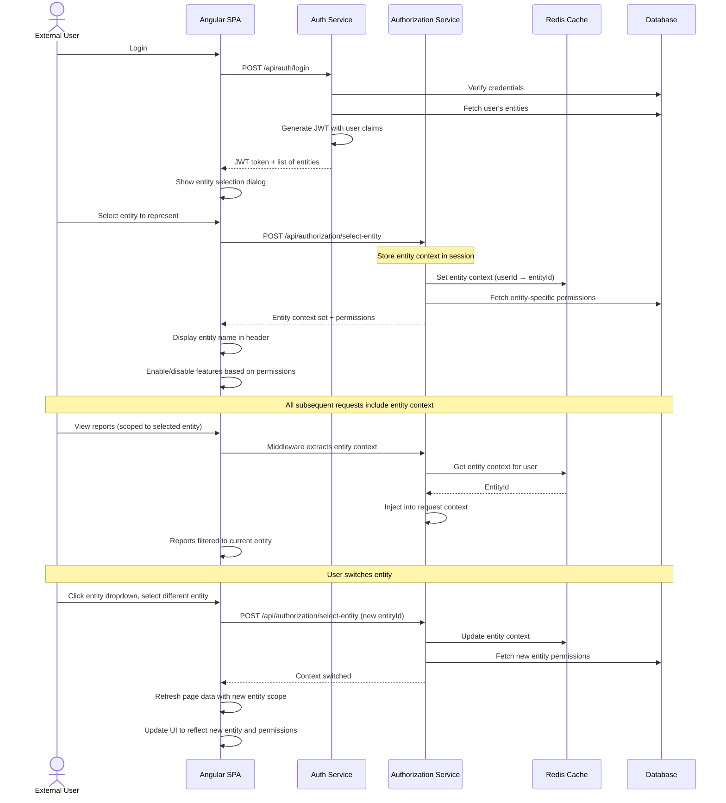
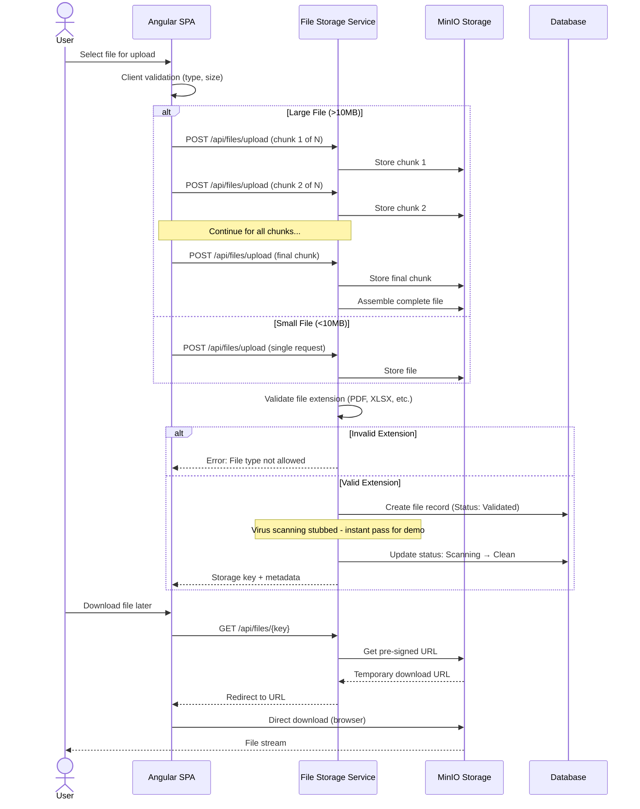

# **Section 7: Core Workflows**

Let me illustrate the key system workflows using sequence diagrams to show how components interact for critical user journeys.

---

## **Workflow 1: External User Registration and Access Request**

This workflow shows the complete onboarding process for a new external user (entity representative).

---

## **Workflow 2: Report Submission and Validation**

This demonstrates the async report validation process with status updates.

---

## **Workflow 3: Case Management with Messages**

Shows the case lifecycle with integrated messaging.

---

## **Workflow 4: Bulletin Board with Read Confirmation**

Demonstrates mass announcement distribution with read tracking.

---

## **Workflow 5: Entity Context Selection (Multi-tenancy)**

Shows how users representing multiple entities switch context.

---

## **Workflow 6: File Upload with Virus Scanning (Simplified)**

Shows file handling with validation (virus scanning stubbed for hackathon).

---

## **Rationale:**

1. **Real-time Updates**: SignalR hub integration shown in multiple workflows - critical for UX (report status, messages, notifications)

2. **Async Processing**: Report validation and file operations are queued via RabbitMQ, keeping API responses fast

3. **Multi-tenancy**: Entity context selection workflow demonstrates how row-level security works

4. **Error Handling**: Alternative paths shown (validation failures, technical errors) to demonstrate robust error handling

5. **Security**: All workflows go through authentication/authorization layers with JWT tokens

6. **Hackathon-Appropriate**: Workflows focus on demonstrating PRD requirements without unnecessary complexity
